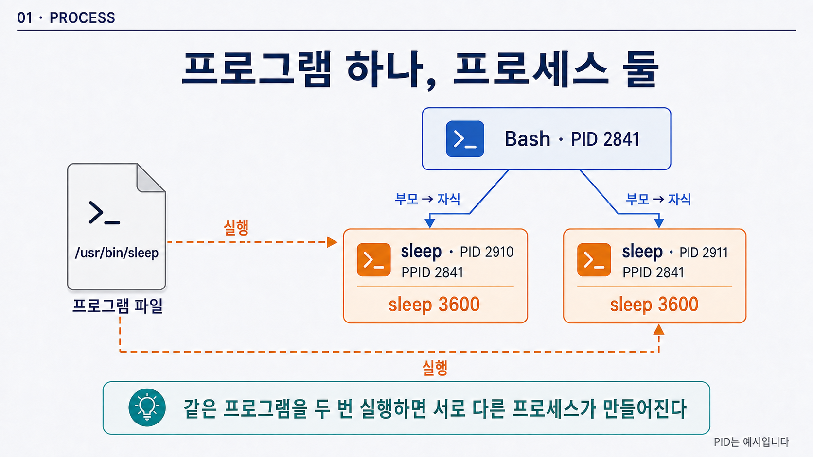
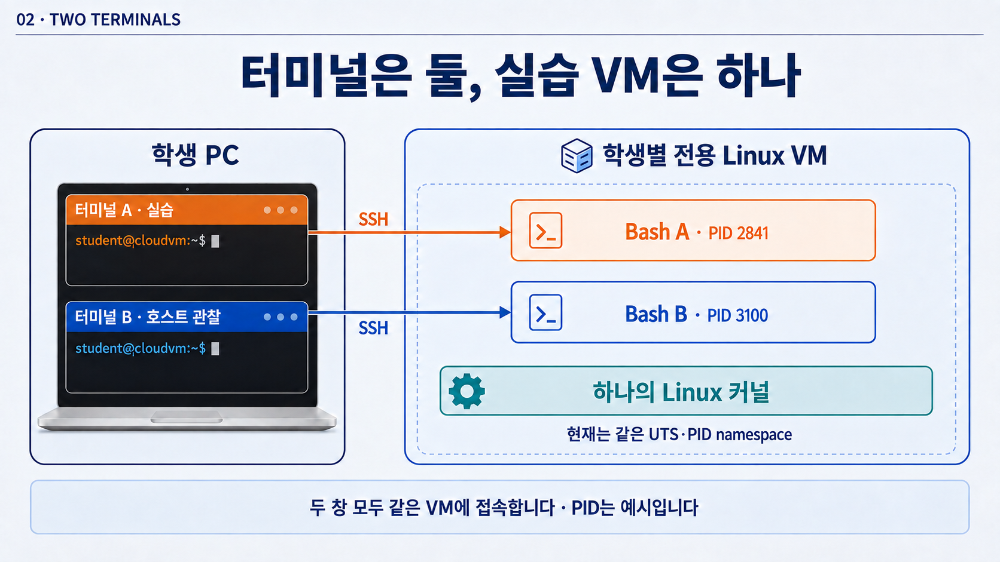
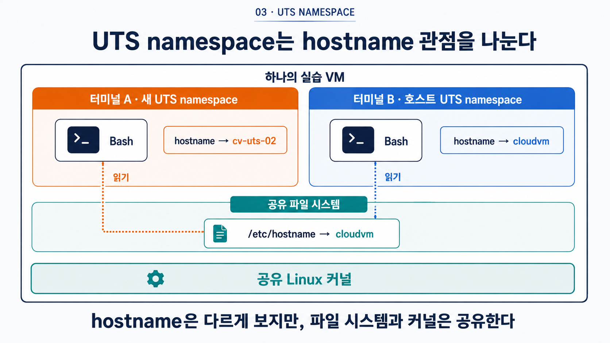
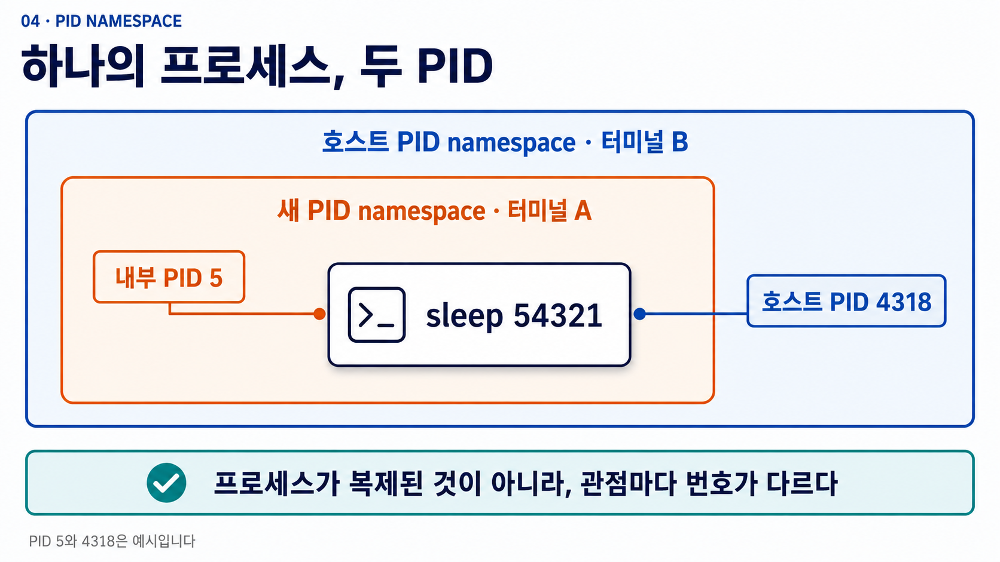
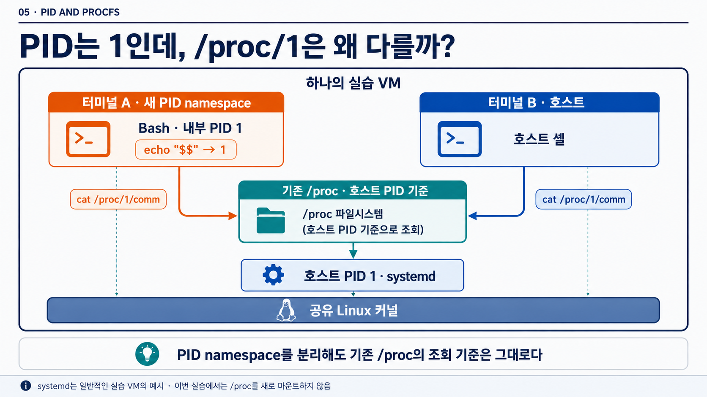

# 2주차 실습 — 컨테이너의 출발점은 프로세스다

[전체 주차 목록](../README.md)

학생별 전용 Linux VM의 Bash에서 교수자와 함께 명령 01~74를 순서대로 실행합니다. 명령 블록 하나를 실행한 뒤 결과를 확인하고 다음으로 넘어갑니다. GitHub에서는 이 문서를 읽기만 하면 되며, 저장소를 복제하거나 스크립트를 실행할 필요는 없습니다.

- **터미널 A:** 실습을 수행하는 SSH 창. 0~1장은 이 창만 사용합니다.
- **터미널 B:** 2.1에서 같은 VM에 추가로 접속하는 SSH 창. 호스트 관찰용으로 유지합니다.
- 각 명령 제목의 **실행할 터미널**을 먼저 확인합니다. 전체 문서를 한 번에 붙여넣지 않습니다.
- PID와 namespace 식별값은 각자의 결과를 기록합니다. 예시 숫자와 같을 필요는 없습니다.

## 바로 이동

| 단계 | 내용 | 명령 번호 |
| --- | --- | --- |
| [0](#lab-0) | 터미널과 기본 명령 | 01~08 |
| [1](#lab-1) | 셸과 두 sleep 프로세스 | 09~22 |
| [2](#lab-2) | 실습 환경과 기준값 기록 | 23~30 |
| [3](#lab-3) | UTS namespace와 hostname 비교 | 31~46 |
| [4](#lab-4) | PID namespace의 내부·호스트 비교 | 47~64 |
| [5](#lab-5) | PID와 기존 /proc의 관점 비교 | 65~67 |
| [6](#lab-6) | 프로세스와 namespace 정리 | 68~74 |

[막혔을 때 확인할 사항](#troubleshooting)

---

## 실습에서 확인할 질문과 진행 순서

실습은 다음 질문에 순서대로 답하도록 구성합니다. 각 단계에서 명령 전체를 외우기보다 **무엇을 비교하고 출력의 어느 부분을 볼 것인지**에 집중합니다.

| 순서 | 확인할 질문 | 관찰 대상 |
| ---: | --- | --- |
| 0 | 터미널에서 현재 사용자·위치·hostname을 어떻게 확인하는가? | 프롬프트, `whoami`, `pwd`, `hostname` |
| 1 | 셸도 프로세스인가? 같은 프로그램을 두 번 실행하면 무엇이 두 개가 되는가? | 셸의 PID, 두 `sleep` 프로세스의 PID와 PPID |
| 2 | namespace를 만들기 전의 기준 상태는 무엇인가? | hostname, 현재 셸 PID, UTS·PID namespace 식별값 |
| 3 | UTS namespace만 만들면 무엇이 바뀌고 무엇이 그대로인가? | 내부·외부 hostname, UTS와 PID namespace 식별값, `/etc/hostname` |
| 4 | 같은 프로세스가 내부와 호스트에서 서로 다른 PID로 보이는가? | PID namespace 내부 PID와 호스트 PID |
| 5 | PID 관점을 나누었는데 `/proc/1`은 왜 호스트 프로세스를 가리키는가? | 터미널 A의 `echo "$$"`, A·B의 `cat /proc/1/comm` |
| 6 | 실습에서 만든 프로세스와 namespace를 어떻게 안전하게 정리하는가? | `kill`, `wait`, `exit`, 최종 상태 확인 |

실습 결과의 PID와 namespace 식별값은 학생마다 다를 수 있습니다. 예시 숫자를 그대로 맞추는 것이 아니라, **적용 전과 적용 후의 값이 같은지 다른지**, **내부와 외부에서 무엇이 다르게 보이는지**를 비교해야 합니다.


<a id="lab-0"></a>

## 0. **실습 준비: 터미널에서 현재 사용자·위치·hostname을 어떻게 확인하는가?**

### 0.1 **터미널과 셸을 구분한다**

**실행 위치:** 지금 SSH로 접속한 창을 **터미널 A**라고 부릅니다. 0장과 1장의 명령은 이 창에서만 실행합니다. 터미널 B는 2.1에서 같은 VM에 별도로 접속하여 엽니다.

실습의 장·절 번호는 기존 흐름을 따라가며, 각 명령 제목에는 **01번부터 이어지는 명령 번호**와 **실행할 터미널**을 표시합니다. 예를 들어 `(터미널 A·B 각각)`이면 두 창에서 각각 한 번 실행하고, `(터미널 A)`이면 A에서만 실행합니다.

**확인할 원리:** 셸도 Linux 커널이 관리하는 프로세스이며, 터미널은 그 셸과 상호작용하는 화면입니다.

Linux 서버에는 데스크톱 화면이 없는 경우가 많습니다. 이때 사용자는 터미널에서 명령을 입력하여 시스템의 상태를 확인하고 작업을 수행합니다.

터미널을 열면 보통 다음과 비슷한 한 줄이 보입니다.

```text
student@cloudvm:~$
```

이 한 줄을 **프롬프트**라고 합니다. 프롬프트는 명령을 입력할 준비가 되었다는 표시입니다.

- `student`는 현재 사용자 이름입니다.
- `cloudvm`은 현재 시스템의 호스트 이름입니다.
- `~`는 사용자의 홈 디렉터리를 뜻합니다.
- 마지막의 `$`는 일반 사용자 셸이라는 표시로 자주 사용됩니다.

환경에 따라 프롬프트의 모양은 다를 수 있습니다. 중요한 것은 프롬프트 자체를 명령어와 함께 복사하지 않는 것입니다. 이 자료의 코드 블록에는 학생이 실제로 입력할 명령만 적습니다.

터미널은 화면이고, 그 안에서 명령을 해석하는 프로그램은 **셸(shell)**입니다. 이번 실습에서는 Bash 셸을 기준으로 합니다. 셸 역시 Linux에서 실행 중인 하나의 프로세스입니다. 프로세스 실습에서 현재 셸의 PID를 직접 확인합니다.

---

### 0.2 **현재 사용자와 작업 위치를 확인한다**

**확인 목적:** 같은 명령도 사용자 권한과 현재 디렉터리에 따라 결과가 달라질 수 있으므로 실습의 기준 상태를 먼저 확인합니다.

명령은 언제나 어떤 사용자 권한과 어떤 디렉터리에서 실행됩니다. 같은 명령이라도 위치와 권한이 다르면 결과가 달라질 수 있습니다. 따라서 실습을 시작할 때는 다음 세 가지를 먼저 확인하는 습관을 들입니다.


#### 01. (터미널 A) **현재 사용자 확인**

```bash
whoami
```

#### 02. (터미널 A) **현재 작업 디렉터리 확인**

```bash
pwd
```

#### 03. (터미널 A) **현재 hostname 확인**

```bash
hostname
```

각 명령의 목적은 다음과 같습니다.

- `whoami`는 현재 명령을 실행하는 사용자를 보여 줍니다.
- `pwd`는 현재 작업 디렉터리의 절대 경로를 보여 줍니다.
- `hostname`은 현재 프로세스가 보고 있는 호스트 이름을 보여 줍니다.

예상되는 출력은 다음과 비슷합니다.

```text
student
/home/student
cloudvm
```

사용자 이름과 호스트 이름은 실습 환경에 따라 달라집니다.

`pwd`는 **print working directory**의 약자입니다. 여기서 작업 디렉터리는 셸이 현재 기준으로 삼고 있는 디렉터리를 뜻합니다. 출력된 `/home/student`처럼 `/`부터 시작하는 경로를 **절대 경로**라고 합니다.

이번 주에는 실습용 폴더나 파일을 만들지 않습니다. 이후 명령은 현재 위치에 의존하지 않도록 구성되어 있으므로, 별도의 디렉터리로 이동할 필요가 없습니다.

---

### 0.3 **명령어 도움말을 찾는다**

**확인 목적:** 명령을 암기하는 대신, 필요한 상태를 확인할 명령과 옵션을 스스로 찾는 방법을 익힙니다.

처음 보는 명령을 만났을 때는 도움말을 찾을 수 있어야 합니다.

#### 04. (터미널 A) **`sleep` 도움말 확인**

```bash
sleep --help
```

`--help`는 많은 Linux 명령이 제공하는 긴 형태의 도움말 옵션입니다. 출력이 길게 나타나더라도 모두 읽을 필요는 없습니다. 명령의 기본 형식과 필요한 옵션을 찾는 데 사용합니다.

이번에는 앞부분의 `Usage`와 설명에서 `sleep`이 지정한 시간 동안 기다리는 명령이라는 점만 확인합니다. 숫자 뒤에 시간 단위를 붙일 수 있고, 단위를 생략하면 초로 해석한다는 설명도 찾아봅니다. 도움말 전체를 외우지 않습니다.

더 자세한 설명은 매뉴얼에서 확인할 수 있습니다.

#### 05. (터미널 A) **`ps` 매뉴얼 확인**

```bash
man ps
```

매뉴얼 화면에서는 방향키나 Page Up·Page Down으로 이동할 수 있고, `q`를 누르면 종료됩니다.

일부 웹 터미널이나 자동화 터미널에서는 다음 경고가 먼저 보일 수 있습니다.

```text
WARNING: terminal is not fully functional
Press RETURN to continue
```

이 경우 Enter를 한 번 누르면 매뉴얼이 열리고 `q`로 종료할 수 있습니다. 화면 전환이 계속 깨지면 `q`로 매뉴얼을 닫은 뒤 아래 대체 명령을 사용합니다. 정상적으로 읽었다면 이 단계는 건너뜁니다.

#### 06. (터미널 A) **매뉴얼 화면이 깨질 때만 일반 텍스트로 확인**

```bash
MANPAGER=cat man ps
```

이 대체 명령은 내용을 한 번에 출력하므로 `q`로 종료하지 않습니다. 터미널의 페이지 표시 기능만 우회할 뿐, 읽는 매뉴얼 내용은 같습니다.

명령어를 외우는 것보다 다음 질문을 할 수 있는 것이 중요합니다.

> 지금 무엇을 확인하려고 합니까?  
> 그 상태를 보여 주는 명령은 무엇입니까?  
> 출력의 어느 부분을 읽어야 합니까?

---

### 0.4 **정상 출력과 오류 메시지를 구분한다**

**확인 목적:** 이후 namespace 실습에서 예상과 다른 결과가 나왔을 때, 실패 원인을 출력에서 찾을 수 있어야 합니다.

명령이 정상적으로 처리한 결과는 **표준 출력**으로 전달됩니다. 문제가 생겼다는 메시지는 **표준 오류**로 전달됩니다. 두 결과가 모두 같은 터미널 화면에 표시될 수 있으므로 처음에는 구분하기 어렵습니다.

새 파일을 만드는 대신 이미 있는 hostname 설정 파일과 존재하지 않는 경로를 읽어 비교합니다. `cat`은 지정한 파일의 내용을 화면에 출력하는 명령입니다.

#### 07. (터미널 A) **존재하는 설정 파일의 정상 출력 확인**

```bash
cat /etc/hostname
```

일반적인 실습 VM에서는 호스트 이름이 출력됩니다. 예를 들어 다음과 같습니다.

```text
cloudvm
```

`/etc/hostname`은 hostname 설정을 저장하는 파일입니다. 여기서는 읽기만 하며 내용을 바꾸지 않습니다.

#### 08. (터미널 A) **존재하지 않는 파일의 오류 확인**

```bash
cat /etc/hostname-file-not-present-in-this-lab
```

두 번째 경로는 오류를 관찰하기 위해 일부러 적은, 존재하지 않는 파일 이름입니다. 일반적으로 다음과 같은 오류가 나타납니다.

```text
cat: /etc/hostname-file-not-present-in-this-lab: No such file or directory
```

첫 번째는 **파일 내용**이고, 두 번째는 **파일을 읽지 못한 이유**입니다. 둘 다 터미널에 글자가 나타나지만 의미는 다릅니다.

오류 메시지는 실패의 원인을 알려 주는 중요한 정보입니다. 오류가 나타났을 때 곧바로 같은 명령을 반복하기보다 다음 순서로 확인합니다.

1. 명령어 철자가 맞습니까?
2. 현재 작업 디렉터리가 맞습니까?
3. 파일이나 프로세스가 실제로 존재합니까?
4. 해당 작업을 수행할 권한이 있습니까?
5. 옵션과 인자의 위치가 맞습니까?

이 확인 순서는 이후 namespace, cgroup, 네트워크 실습에서도 계속 사용합니다.

---

<a id="lab-1"></a>

## 1. **셸도 프로세스인가? 같은 프로그램을 두 번 실행하면 무엇이 두 개가 되는가?**

### 1.1 **셸도 프로세스인지 확인한다**

**확인할 원리:** 실행 중인 셸은 프로세스이므로 고유한 PID와 부모 프로세스를 가집니다.

앞에서 배운 것처럼 현재 명령을 입력하고 있는 Bash 셸도 실행 중인 프로그램이므로 PID를 가집니다. 먼저 “셸도 프로세스다”라는 원리를 실제 PID로 확인합니다.

#### 09. (터미널 A) **현재 셸 PID 출력**

```bash
echo "$$"
```

`echo`는 뒤에 주어진 내용을 화면에 출력합니다. Bash에서 `$$`는 현재 셸의 PID를 뜻합니다.

예를 들어 다음과 같은 숫자가 출력될 수 있습니다.

```text
2841
```

이 숫자는 예시일 뿐이며 학생마다 다릅니다.

이제 `ps`로 현재 셸을 확인합니다.

#### 10. (터미널 A) **현재 셸의 프로세스 정보 확인**

```bash
ps -o pid,ppid,tty,stat,comm,args -p "$$"
```

이 명령은 길어 보이지만 구조를 나누면 어렵지 않습니다.

- `ps`는 현재 실행 중인 프로세스의 상태를 확인합니다.
- `-o`는 출력할 열을 직접 지정합니다.
- `pid`는 프로세스 자신의 번호입니다.
- `ppid`는 부모 프로세스의 번호입니다.
- `tty`는 연결된 터미널을 나타냅니다.
- `stat`은 프로세스의 현재 상태를 간단한 문자로 보여 줍니다.
- `comm`은 실행 중인 명령 이름입니다.
- `args`는 프로그램에 전달된 인자를 포함한 실행 명령입니다.
- `-p "$$"`는 현재 셸의 PID만 선택합니다.

예상 출력은 다음과 비슷합니다.

```text
    PID    PPID TT       STAT COMMAND         COMMAND
   2841    2839 pts/0    Ss   bash            -bash
```

여기에서 먼저 볼 것은 `PID`, `PPID`, `TTY`, `STAT`, 두 `COMMAND` 열입니다.

- `TTY`의 `pts/0`은 이 셸이 연결된 가상 터미널 번호입니다. `?`이면 터미널에 직접 연결되지 않은 서비스 프로세스일 수 있습니다.
- `STAT`의 첫 글자 `S`는 CPU를 계속 쓰는 중이 아니라 어떤 사건을 기다리며 잠든 상태를 뜻합니다. 뒤의 `s`는 이 셸이 세션의 시작점인 **세션 리더(session leader)**임을 뜻합니다. 세션은 로그인 뒤 함께 제어되는 프로세스 묶음입니다.
- 두 열의 제목이 모두 `COMMAND`로 보일 수 있지만 첫 번째는 `comm`, 두 번째는 `args`입니다. `comm`은 짧은 실행 이름(`bash`)이고, `args`는 인자를 포함한 실제 명령행(`-bash`)입니다. `-bash`의 앞 `-`는 로그인 셸로 시작되었다는 관례입니다. 여기서 로그인 셸은 로그인할 때 사용할 초기 설정을 읽도록 시작된 셸을 뜻하며, SSH 로그인 직후의 Bash가 대표적인 예입니다.

현재 셸의 PID가 2841이고 PPID가 2839라면, 이 셸도 다른 프로세스에 의해 시작되었다는 뜻입니다. SSH로 접속했다면 부모 쪽에는 SSH 세션을 관리하는 프로세스가 있을 수 있습니다.

---

**앞에서 배운 내용과 연결:** 출력된 `bash`는 컨테이너 밖에 있는 특별한 존재가 아니라 Linux 커널이 관리하는 프로세스입니다. 컨테이너 안에서 셸을 실행하더라도 기본 원리는 같습니다.

---

### 1.2 **같은 프로그램에서 두 프로세스를 만든다**

**확인할 원리:** 프로그램 파일 하나를 두 번 실행하면 서로 다른 PID를 가진 프로세스 두 개가 생기며, 셸에서 시작했다면 두 프로세스의 PPID는 현재 셸 PID와 연결됩니다.

앞에서 배운 부모·자식 관계를 직접 확인합니다. 셸에서 프로그램을 실행하면 보통 셸이 새 프로세스를 시작합니다. 이때 셸은 부모 프로세스가 되고, 새로 시작된 프로세스는 자식 프로세스가 됩니다.

```text
SSH 세션을 관리하는 프로세스
        ↓
Bash 셸
        ↓
셸에서 실행한 sleep 프로세스
```

부모와 자식이라는 표현은 프로세스가 만들어진 관계를 나타냅니다. 부모 프로세스와 자식 프로세스가 같은 프로그램이어야 하는 것은 아닙니다.

이 관계를 직접 확인하기 위해 `sleep` 프로그램을 사용합니다. `sleep 3600`은 최대 3,600초 동안 기다린 뒤 종료하는 단순한 프로그램입니다. 수업 중 자동으로 끝나지 않게 시간을 넉넉히 잡았으며, 실습 마지막에는 `kill`과 `wait`로 직접 정리합니다.

명령 끝의 `&`는 프로그램을 **백그라운드**에서 실행하고 셸이 바로 다음 명령을 받을 수 있게 합니다.

#### 11. (터미널 A) **첫 번째 `sleep` 프로세스 실행**

```bash
sleep 3600 &
```

#### 12. (터미널 A) **첫 번째 `sleep` PID 저장**

```bash
PID_A=$!
```

#### 13. (터미널 A) **두 번째 `sleep` 프로세스 실행**

```bash
sleep 3600 &
```

#### 14. (터미널 A) **두 번째 `sleep` PID 저장**

```bash
PID_B=$!
```

여기서 실습 편의를 위해 두 프로세스의 PID를 잠시 이름에 담았습니다. **`PID_A`와 `PID_B`는 두 `sleep`을 구분하는 변수 이름이며, 터미널 A·B를 뜻하지 않습니다. 두 변수 모두 지금 사용하는 터미널 A의 셸에 저장합니다.**

- `$!`는 가장 최근에 백그라운드로 시작한 프로세스의 PID입니다.
- `PID_A=$!`는 그 PID를 `PID_A`라는 셸 변수에 저장합니다.
- `PID_B=$!`도 같은 방식입니다.

명령 직후 Bash가 `[1] 2910`처럼 출력할 수 있습니다. 대괄호의 `1`은 현재 셸이 붙인 **작업 번호(job number)**이고 `2910`은 커널이 붙인 PID입니다. 작업 번호는 이 셸 안에서만 쓰는 짧은 번호이며 PID와 같은 값일 필요가 없습니다.

저장된 값을 확인합니다.

`printf`는 **형식 문자열에 맞추어 값을 출력하는 명령**입니다. 이를 형식화된 출력(formatted output)이라고 합니다. 작은따옴표 안의 `%s` 두 곳에는 뒤의 `"$PID_A"`, `"$PID_B"` 값이 순서대로 들어가고, `\n`은 줄을 바꾸라는 표시입니다. 이 문법을 외우기보다 두 PID에 이름표를 붙여 보기 좋게 출력한다고 이해하면 됩니다.

#### 15. (터미널 A) **저장한 두 PID 출력**

```bash
printf '첫 번째 sleep PID: %s\n두 번째 sleep PID: %s\n' "$PID_A" "$PID_B"
```

첫 번째 줄에는 `PID_A`, 두 번째 줄에는 `PID_B`에 저장한 번호가 표시됩니다. 두 값이 다르면 같은 프로그램에서 서로 다른 프로세스 두 개가 만들어진 것입니다. 번호가 비어 있으면 PID 저장 단계를 같은 터미널에서 수행했는지 확인합니다. 이 명령은 새 프로세스를 만들거나 PID를 바꾸는 명령이 아닙니다.

예상 출력은 다음과 비슷합니다.

```text
첫 번째 sleep PID: 2910
두 번째 sleep PID: 2911
```

같은 `sleep` 프로그램을 두 번 실행했지만 서로 다른 PID를 가진 프로세스 두 개가 만들어졌습니다.

`pgrep`를 이용하면 프로그램 이름이나 실행 명령을 기준으로 PID를 찾을 수 있습니다.

#### 16. (터미널 A) **실행 중인 `sleep` 프로세스 검색**

```bash
pgrep -a -x sleep
```

- `pgrep`는 조건에 맞는 프로세스의 PID를 찾습니다.
- `-a`는 PID뿐 아니라 전체 명령도 함께 표시합니다.
- `-x`는 이름 전체가 정확히 `sleep`인 프로세스만 찾습니다.

전용 VM에 다른 `sleep` 프로세스가 없다면 다음과 비슷하게 보입니다.

```text
2910 sleep 3600
2911 sleep 3600
```

두 프로세스의 부모 관계를 확인합니다.

#### 17. (터미널 A) **두 `sleep` 프로세스의 부모 관계 확인**

```bash
ps -o pid,ppid,stat,comm,args -p "$PID_A" -p "$PID_B"
```

#### 18. (터미널 A) **부모인 현재 셸 PID 확인**

```bash
echo "현재 셸 PID: $$"
```

예상 출력은 다음과 비슷합니다.

```text
    PID    PPID STAT COMMAND         COMMAND
   2910    2841 S    sleep           sleep 3600
   2911    2841 S    sleep           sleep 3600
현재 셸 PID: 2841
```

두 `sleep` 프로세스의 PPID가 현재 셸 PID와 같다면, 현재 셸이 두 프로세스의 부모라는 뜻입니다.



*그림 1. 점선은 프로그램 실행, 실선은 부모·자식 관계를 나타냅니다. PID는 예시이며 자신의 출력값과 비교합니다.*

실습용 프로세스를 종료합니다.

#### 19. (터미널 A) **두 `sleep` 프로세스에 종료 요청**

```bash
kill "$PID_A" "$PID_B"
```

#### 20. (터미널 A) **두 자식 프로세스의 종료 대기**

```bash
wait "$PID_A" "$PID_B"
```

`kill`은 이름과 달리 항상 강제로 제거한다는 뜻은 아닙니다. 기본적으로 프로세스에 종료 요청 신호를 보냅니다. `wait`는 현재 셸이 시작한 두 자식 프로세스가 모두 끝날 때까지 기다리고 종료 결과를 회수합니다. 두 `sleep`을 순서대로 실행한다는 뜻은 아닙니다. 이미 백그라운드에서 실행 중인 두 프로세스의 종료를 확인하는 것입니다. 종료 여부는 아래의 프로세스 목록과 셸의 작업 목록에서도 확인합니다.

여러 PID를 지정한 `wait`의 종료 상태는 마지막에 지정한 PID, 여기서는 `PID_B`의 결과입니다. `kill`의 기본 종료 신호로 끝난 자식을 `wait`하면 Bash가 종료 상태 143을 반환할 수 있습니다. `143 = 128 + 15`이고 15는 기본 종료 신호인 `SIGTERM` 번호입니다. 이번 순서에서는 실패가 아니라 “요청한 종료 신호로 자식이 끝났고 셸이 그 결과를 회수했다”는 뜻입니다. 화면에 숫자가 자동으로 출력되지는 않으며, 바로 확인하고 싶을 때만 `echo "$?"`를 실행합니다.

#### 21. (터미널 A) **두 프로세스의 종료 여부 확인**

```bash
ps -p "$PID_A" -p "$PID_B"
```

#### 22. (터미널 A) **백그라운드 작업 정리 여부 확인**

```bash
jobs -l
```

`ps`에는 헤더만 보이거나 대상 프로세스가 출력되지 않고, `jobs -l`에는 실행 중인 실습 작업이 남지 않아야 합니다. `jobs`는 **현재 셸이 시작한 백그라운드 작업**만 보여 주는 Bash 내장 명령입니다. `-l`은 작업 번호와 함께 PID도 표시합니다.

`jobs -l` 또는 셸의 알림에 `Done`이 보이면 작업이 정상 종료되었다는 뜻이고, `Terminated`가 보이면 종료 신호를 받아 끝났다는 뜻입니다. 이번에는 우리가 `kill`을 보냈으므로 `Terminated`가 잠깐 보일 수 있으며 오류가 아닙니다. 마지막에 아무 작업도 남지 않으면 성공입니다.

> 두 `sleep`이 이미 끝났거나 변수가 비었다면 명령 11부터 명령 14까지 다시 실행해 새 PID를 저장합니다. 예시 PID를 직접 입력하지 않습니다.

> PID는 프로세스의 영구적인 이름이 아닙니다. 프로세스가 종료되면 그 PID는 나중에 다른 프로세스에 다시 사용될 수 있습니다. PID를 볼 때는 항상 어느 시점의 어느 프로세스인지 함께 확인해야 합니다.

---

**앞에서 배운 내용과 연결:** `sleep` 프로그램 파일은 하나이지만 실행 상태는 두 개입니다. 컨테이너가 격리하는 대상도 프로그램 파일 자체가 아니라, 이렇게 실제로 실행 중인 프로세스와 그 실행 환경입니다.


---

<a id="lab-2"></a>

## 2. **namespace를 만들기 전의 기준 상태는 무엇인가?**

### 2.1 **Namespace 실습을 시작하기 전에**

**확인할 원리:** namespace는 새 컴퓨터나 새 커널을 만드는 것이 아니라, 프로세스가 보는 특정 자원의 관점을 나눕니다.

Namespace 실습은 다음 절차로 진행합니다.

```text
분리 전 기준값 기록
    ↓
UTS namespace만 생성
    ↓
내부와 외부의 hostname 비교
    ↓
PID namespace 생성
    ↓
같은 프로세스의 내부 PID와 호스트 PID 비교
    ↓
PID 관점과 /proc 관점이 어긋나는 현상 확인
    ↓
프로세스와 namespace 정리
```

이번 실습은 **학생별 전용 VM**에서 수행합니다. 이 교재에서 **호스트**는 SSH로 접속한 이 VM의 기본 실행 환경을 뜻합니다. 공유 서버나 중요한 개인 서버에서 실험하지 않습니다.

지금까지 사용한 창은 **터미널 A**입니다. A를 닫지 않은 채 **내 컴퓨터에서** 새 터미널 탭이나 창을 열고, 같은 VM에 접속하는 SSH 명령을 한 번 더 실행합니다. 두 번째로 접속한 창을 **터미널 B**라고 부릅니다. 이미 접속한 Ubuntu 셸 안에서 다시 `ssh`를 실행하는 것이 아닙니다.

**터미널 A는 변화를 만드는 창**, **터미널 B는 바깥에서 비교하는 창**으로 사용합니다. A에서는 잠시 뒤 새 namespace를 만들고, B는 실습이 끝날 때까지 호스트 셸에 그대로 둡니다. 창 이름을 `A-실습`, `B-호스트`로 표시해 두면 좋습니다.

지금은 두 창 모두 아직 호스트 셸입니다. 같은 VM에 접속했어도 각 창에서 서로 다른 Bash 프로세스가 실행되므로 **셸 PID는 서로 다릅니다.** 반면 아직 namespace를 나누지 않았으므로 두 창이 사용하는 UTS·PID namespace는 같습니다.

숫자 PID와 namespace 식별값은 예시와 일치시킬 필요가 없습니다. 뒤의 명령에서 **누구의 값을 확인하는지**, **이전 값과 같은지 다른지**를 비교합니다. 지금은 명령과 오류를 미리 외우지 않고 다음 절부터 한 단계씩 진행합니다. 화면 상태별 안내는 문서 맨 뒤의 **[참고] 실습 중 막혔을 때 확인할 사항**에서 필요할 때만 찾아봅니다.

> **안전 약속:** `hostname 새로운이름`은 교재에서 안내한 터미널 A의 새 UTS namespace 안에서만 실행합니다. 터미널 B나 호스트의 일반 셸에서 `sudo hostname 새로운이름`을 실행하지 않습니다.

---

### 2.2 **Namespace 실습 환경이 준비되었는지 확인한다**

**확인 목적:** 필요한 명령을 실행할 수 있는지, 두 터미널이 같은 학생 계정으로 같은 실습 VM에 접속했는지 확인합니다.

**실행 위치:** 설치 여부 확인은 **터미널 A에서 한 번만** 합니다. 같은 VM의 같은 계정을 사용하므로 B에서 반복할 필요가 없습니다. 그다음 사용자와 hostname 확인만 **A·B 각각** 수행합니다.

#### 23. (터미널 A) **필수 명령 설치 여부 확인**

```bash
command -v unshare ps pgrep sleep hostname readlink cat man
```

`command -v`는 뒤에 적은 명령들을 실제로 실행하는 대신, 현재 셸에서 **어떤 실행 파일로 찾을 수 있는지** 보여 줍니다. 예를 들어 `/usr/bin/unshare`는 `unshare` 프로그램의 경로입니다. **여기서 확인하는 결과는 PID나 namespace 식별값이 아니라 각 명령의 실행 경로입니다.**

입력한 이름의 순서대로 다음과 비슷한 여덟 경로가 출력되어야 합니다. `/bin`과 `/usr/bin` 등 경로의 일부는 환경에 따라 다를 수 있습니다.

```text
/usr/bin/unshare
/usr/bin/ps
/usr/bin/pgrep
/usr/bin/sleep
/usr/bin/hostname
/usr/bin/readlink
/usr/bin/cat
/usr/bin/man
```

어떤 이름에 해당하는 결과가 빠져 있다면, 그 명령을 현재 환경에서 찾지 못한 것입니다. 직접 패키지를 설치하기보다 출력 화면을 교수자에게 보여 줍니다.

이제 다음 두 명령은 **터미널 A와 터미널 B에서 각각** 실행합니다.

#### 24. (터미널 A·B 각각) **두 터미널의 사용자 확인**

```bash
whoami
```

두 창 모두 자신의 학생 계정 이름이 나와야 합니다. 예를 들어 두 창 모두 `student1`입니다.

#### 25. (터미널 A·B 각각) **두 터미널의 hostname 확인**

```bash
hostname
```

두 창 모두 같은 실습 VM의 hostname이 나와야 합니다. 예를 들어 두 창 모두 `vm1`입니다. 이름만 같다고 반드시 같은 VM인 것은 아니므로, 두 SSH 연결에서 같은 접속 주소와 VM 대상을 선택했는지도 함께 확인합니다.

---



*그림 2. SSH 접속 후 사용하는 셸을 중심으로 단순화했습니다. 실제 접속을 처리하는 sshd 등의 중간 과정은 생략했습니다. 두 Bash는 독립된 세션이며, 아직 namespace를 분리하기 전입니다.*

### 2.3 **분리하기 전의 기준 상태를 기록한다**

**[기본·필수 · 적용 전 관찰]**

**확인할 원리:** 적용 전의 값을 남겨야 나중에 무엇이 바뀌었고 무엇이 그대로인지 판단할 수 있습니다.

**실행 위치:** 이 절의 다섯 명령은 모두 **터미널 A의 호스트 셸에서만** 실행합니다. 아직 `unshare`를 실행하지 않은 상태입니다. B는 그대로 두며, 이 절의 기록을 B에서 한 번 더 만들 필요는 없습니다.

내 컴퓨터의 **메모장, VS Code 또는 평소 사용하는 메모 앱**을 하나 엽니다. Linux 안에서 파일을 만들 필요는 없습니다. 아래 항목을 메모 앱에 복사해 두고, 명령 결과를 하나씩 채웁니다. 이 기록은 다음 단계에서도 계속 사용합니다.

```text
[분리 전 기준값: 터미널 A]
호스트 hostname:
터미널 A의 호스트 셸 PID:
호스트 UTS namespace 식별값:
호스트 PID namespace 식별값:
```

#### 26. (터미널 A) **호스트의 기준 hostname 기록**

```bash
hostname
```

출력된 이름을 메모의 `호스트 hostname`에 적습니다.

#### 27. (터미널 A) **호스트 셸의 기준 PID 기록**

```bash
echo "$$"
```

출력된 번호를 `터미널 A의 호스트 셸 PID`에 적습니다. 터미널 B의 셸 PID가 이 번호와 달라도 정상입니다. 두 창의 Bash는 별개의 프로세스이기 때문입니다.

#### 28. (터미널 A) **호스트 셸의 기준 프로세스 정보 확인**

```bash
ps -o pid,ppid,stat,comm,args -p "$$"
```

`PID`가 방금 기록한 번호와 같고 명령 이름이 `bash`인지 확인합니다. 이 표 전체를 메모에 옮길 필요는 없습니다.

**다음 두 명령을 읽기 위한 준비: namespace 식별값과 링크**

지금부터 확인할 **UTS namespace 식별값**은 hostname 자체가 아니라, **어느 UTS namespace인지 구분하는 번호표**입니다. 예를 들어 `uts:[4026531838]`은 UTS namespace 하나를 가리킵니다. 대괄호의 숫자는 프로세스의 PID가 아니라 namespace를 구분하는 값입니다. hostname이 우연히 같아도 서로 다른 UTS namespace일 수 있으므로, 실제로 새 namespace가 만들어졌는지 보려면 이 식별값을 비교해야 합니다.

Linux에서는 이 정보를 `/proc/<PID>/ns/` 아래의 **링크**로 보여 줍니다. `<PID>`는 그대로 입력하는 글자가 아니라 조회할 프로세스의 번호를 넣는 자리이고, `ns`는 namespace 관련 링크가 모여 있는 디렉터리입니다.

**심볼릭 링크(symbolic link)**는 다른 대상을 가리키는 경로로, 바탕화면의 바로가기를 떠올리면 이해하기 쉽습니다. 실제 파일 내용을 복사해 두는 것이 아니라 “어느 대상을 가리키는가”를 알려 줍니다.

`readlink`는 심볼릭 링크가 가리키는 대상을 확인하는 명령입니다. **일반적인 심볼릭 링크에서는 파일이나 디렉터리의 경로가 출력**되지만, `/proc/<PID>/ns/` 아래의 링크에서는 **해당 프로세스가 속한 namespace의 종류와 식별값**이 출력됩니다. 예를 들어 `/proc/<PID>/ns/uts`와 `/proc/<PID>/ns/pid`는 커널이 제공하는 특수한 namespace 링크이므로, `uts:[4026531838]` 또는 `pid:[4026531836]`처럼 표시될 수 있습니다.

여기서 `uts:[4026531838]`은 “경로”가 아니라, **이 프로세스가 식별값 `4026531838`인 UTS namespace에 속해 있다**는 뜻입니다. 실습에서는 숫자 자체를 외우는 것이 아니라, 같은 종류의 namespace에서 **식별값이 같으면 같은 namespace, 다르면 다른 namespace**라고 비교하면 됩니다.

다만 지금은 PID를 직접 입력하지 않고 **`/proc/self`**를 사용합니다. `self`는 “이 경로를 지금 읽고 있는 프로세스 자신”을 가리키는 특별한 링크입니다. 터미널 A에서 `readlink /proc/self/ns/uts`를 실행하면 다음과 같은 일이 일어납니다.

```text
터미널 A의 Bash
    ↓ readlink 프로그램을 자식 프로세스로 실행
readlink 프로세스가 /proc/self/ns/uts를 읽음
    ↓ self는 이 readlink 프로세스 자신을 가리킴
readlink가 속한 UTS namespace 식별값 출력
```

**여기서 `self`는 Bash를 직접 가리키는 것이 아닙니다.** 그러나 이번 명령의 `readlink` 자식은 부모 Bash와 같은 UTS·PID namespace에서 실행됩니다. 따라서 이 방법으로 현재 셸과 같은 namespace의 식별값을 확인할 수 있습니다.

| 경로 | 누구의 무엇을 확인하는가? |
| --- | --- |
| `/proc/1234/ns/uts` | 이 `/proc`에서 PID 1234로 보이는 프로세스가 속한 UTS namespace |
| `/proc/self/ns/uts` | 지금 이 경로를 읽는 프로세스 자신이 속한 UTS namespace |
| `/proc/self/ns/pid` | 지금 이 경로를 읽는 프로세스 자신이 속한 PID namespace |

이제 의미를 알고 다음 명령을 실행합니다.

#### 29. (터미널 A) **호스트 UTS namespace 식별값 기록**

```bash
readlink /proc/self/ns/uts
```

예를 들어 `uts:[4026531838]`이 출력되면 그 문자열 전체를 메모의 `호스트 UTS namespace 식별값`에 적습니다.

#### 30. (터미널 A) **호스트 PID namespace 식별값 기록**

```bash
readlink /proc/self/ns/pid
```

예를 들어 `pid:[4026531836]`이 출력되면 그 문자열 전체를 메모의 `호스트 PID namespace 식별값`에 적습니다.

같은 VM에서 동시에 관찰하는 **같은 종류의 namespace 링크**를 비교합니다. UTS는 UTS끼리, PID는 PID끼리 비교하며, 값이 같으면 같은 namespace를 가리킵니다. 이 번호는 외우거나 예시와 맞출 필요가 없고, 재실습할 때는 그때의 값을 다시 기록합니다.

기록 예시는 다음과 같습니다.

```text
[분리 전 기준값: 터미널 A]
호스트 hostname: cloudvm
터미널 A의 호스트 셸 PID: 2841
호스트 UTS namespace 식별값: uts:[4026531838]
호스트 PID namespace 식별값: pid:[4026531836]
```

터미널 B도 아직 같은 호스트 UTS·PID namespace를 사용하므로, 뒤에서 B 자신의 namespace를 조회하면 이 기준 식별값과 같아야 합니다. **셸의 PID는 창마다 다르고, namespace 식별값은 같을 수 있다는 점을 구분합니다.**

---

<a id="lab-3"></a>

## 3. **UTS namespace만 만들면 무엇이 바뀌고 무엇이 그대로인가?**

### 3.1 **hostname만 다른 공간을 만든다**

**[기본·필수 · 기능 적용]**

**확인할 원리:** UTS namespace만 새로 만들면 UTS 관점은 바뀌지만 PID와 파일 시스템 관점은 자동으로 바뀌지 않습니다.


이제 **터미널 A에서만 새 UTS namespace를 만들고, 그 안에서 사용할 Bash를 시작**합니다. 목표는 새 컴퓨터를 만드는 것이 아니라, 이 Bash와 그 자식들이 보는 hostname만 호스트와 따로 바꿀 수 있게 하는 것입니다. PID와 파일 시스템은 이번 명령에서 분리하지 않습니다.

터미널 B는 호스트 셸에 그대로 둡니다. 터미널 A의 원래 SSH 셸도 없어지지 않고 안쪽 Bash가 끝날 때까지 기다리므로, 나중에 `exit`를 한 번 입력하면 원래 셸로 돌아옵니다.

#### 31. (터미널 A) **새 UTS namespace 셸 실행**

```bash
sudo unshare --uts /bin/bash --noprofile --norc
```

명령을 나누어 읽어 봅시다.

- `sudo`는 이 명령을 관리자 권한으로 실행합니다.
- `unshare`는 지정한 종류의 새 namespace를 만들고 그 안에서 프로그램을 실행합니다.
- `--uts`는 새 UTS namespace를 만듭니다.
- `/bin/bash`는 새 namespace 안에서 실행할 프로그램입니다.
- `--noprofile`은 로그인용 초기 설정 파일을 읽지 않도록 하고, `--norc`는 대화형 Bash의 `.bashrc` 초기 설정을 읽지 않도록 합니다. 여기서는 초기 설정의 영향을 줄인 단순한 Bash를 사용합니다.

처음 `sudo`를 사용할 때 VM 계정의 비밀번호를 물을 수 있습니다. 비밀번호를 입력하는 동안 글자나 `*`가 보이지 않는 것이 정상입니다. 비밀번호를 묻지 않도록 준비된 VM도 있습니다.

명령이 성공하면 프롬프트가 다음처럼 바뀔 수 있습니다.

```text
bash-5.2#
```

`bash`는 실행 중인 셸 이름이고 `5.2`는 Bash 버전입니다. `sudo`로 관리자 권한의 Bash를 시작했기 때문에 끝이 일반 사용자의 `$`가 아니라 `#`로 표시될 수 있습니다. 앞서 보던 `student@cloudvm:~$` 같은 꾸밈은 셸 초기 설정에서 만들어지는 경우가 많습니다. 이번에는 그 설정을 읽지 않아 **Bash의 단순한 기본 프롬프트**가 보이는 것입니다. 버전이나 표시 모양은 환경에 따라 달라도 됩니다.

**프롬프트가 바뀐 것 자체가 namespace 분리의 증거는 아닙니다.** 실제로 새 UTS namespace인지 아래 식별값을 비교한 뒤 hostname을 바꿉니다.

또한 `unshare`는 기존 공간에 재접속하는 명령이 아니라 **실행할 때마다 선택한 종류의 새 namespace를 만드는 명령**입니다. UTS의 경우 `unshare` 프로세스 자신이 새 UTS namespace를 사용한 다음, `exec`로 실행 프로그램을 Bash로 교체할 수 있습니다. `exec`는 자식 프로세스를 추가하는 것이 아니라 같은 프로세스의 프로그램을 바꾸는 동작이므로 이 경우에는 `--fork`가 필요하지 않습니다. 원래 SSH 셸을 Bash로 교체한다는 뜻은 아닙니다.

**만든 namespace는 언제 사라질까요?** 보통 그 안의 프로세스가 살아 있는 동안 유지되며, 프로세스와 그 namespace를 붙잡고 있는 다른 참조가 모두 없어지면 사라집니다. 여기서 참조는 “아직 이 namespace를 사용하고 있다”고 커널이 추적하는 연결을 뜻합니다. 이번 실습처럼 별도로 보존하지 않은 UTS namespace에서는 마지막 내부 셸이 종료되면 namespace도 정리됩니다. 식별값을 메모장에 적어 두는 것은 namespace를 보존하는 참조가 아닙니다.

UTS 같은 namespace는 연결을 별도로 유지해 보존하고 `nsenter`로 다시 사용할 수도 있습니다. 지금은 **`unshare`는 새로 만들기, `nsenter`는 이미 유지되고 있는 namespace에 들어가기**라는 차이만 알아 둡니다. 보존 방법은 이번 주에 실습하지 않습니다.

#### 32. (터미널 A) **새 공간의 초기 hostname 확인**

```bash
hostname
```

#### 33. (터미널 A) **새 공간의 UTS namespace 확인**

```bash
readlink /proc/self/ns/uts
```

#### 34. (터미널 A) **새 공간의 PID namespace 확인**

```bash
readlink /proc/self/ns/pid
```

새 UTS namespace는 처음 생성될 때 부모의 호스트 이름을 이어받으므로 `hostname`은 아직 기존 이름을 보여 줄 수 있습니다. 그러나 UTS namespace 식별값은 호스트에서 기록한 값과 달라야 합니다.

PID namespace 식별값은 2.3의 호스트 기준값과 같아야 합니다. 이번 명령에서는 UTS namespace만 새로 만들었기 때문입니다. 메모에 `[UTS만 분리한 터미널 A]`라고 적고, 현재 UTS 식별값과 PID 식별값을 남깁니다. **UTS 식별값이 호스트 기준값과 다른 것을 확인한 뒤에만** 다음 hostname 변경 명령을 실행합니다.

이제 UTS namespace 내부의 호스트 이름을 바꿉니다.

#### 35. (터미널 A) **UTS namespace 내부 hostname 변경**

```bash
hostname cv-uts-01
```

#### 36. (터미널 A) **변경한 hostname 확인**

```bash
hostname
```

예상 결과는 다음과 같습니다.

```text
cv-uts-01
```

호스트 이름은 바뀌었지만 파일 시스템은 아직 분리하지 않았습니다. 다음 명령을 실행합니다.

#### 37. (터미널 A) **공유 중인 hostname 설정 파일 확인**

```bash
cat /etc/hostname
```

`/etc/hostname`에는 원래 호스트 이름이 그대로 보일 수 있습니다.

```text
cloudvm
```

두 결과가 다른 이유를 생각해 봅시다.

- `hostname`은 현재 프로세스가 속한 UTS namespace의 런타임 호스트 이름을 확인합니다.
- `/etc/hostname`은 호스트 파일 시스템에 있는 설정 파일입니다.
- UTS namespace만 새로 만들었으므로 파일 시스템은 여전히 공유합니다.

---

### 3.2 **내부와 외부에서 hostname을 비교한다**

**[기본·필수 · 내부·외부 비교]**

**확인할 원리:** 같은 Linux 커널을 사용하더라도 서로 다른 UTS namespace에 속한 프로세스는 다른 hostname을 볼 수 있습니다.


터미널 A의 UTS namespace 셸을 종료하지 않은 상태에서 터미널 B로 이동합니다.

터미널 B에서 다음 명령을 실행합니다.

#### 38. (터미널 B) **호스트 관점의 hostname 확인**

```bash
hostname
```

#### 39. (터미널 B) **호스트 관점의 UTS namespace 확인**

```bash
readlink /proc/self/ns/uts
```

터미널 B에서는 원래 호스트 이름과 원래 UTS namespace 식별값이 보여야 합니다.

```text
cloudvm
uts:[4026531838]
```

터미널 A에서는 다음과 같이 보입니다.

```text
cv-uts-01
uts:[4026533001]
```

식별값은 예시와 다르게 나옵니다. 확인해야 할 것은 다음 두 가지입니다.

1. 터미널 A와 B의 `hostname` 결과가 다릅니다.
2. 터미널 A와 B의 UTS namespace 식별값도 다릅니다.

PID namespace도 비교합니다. 터미널 B에서 다음 명령을 실행합니다.

#### 40. (터미널 B) **호스트 관점의 PID namespace 확인**

```bash
readlink /proc/self/ns/pid
```

이 값은 터미널 A에서 확인한 PID namespace 식별값 및 2.3의 호스트 기준값과 같아야 합니다. UTS namespace를 나누었다고 PID 관점까지 자동으로 나뉘지는 않습니다.

---

### 3.3 **UTS namespace 안의 변경 범위를 확인한다**

**[기본·필수 · 값 변경]**

**확인할 원리:** UTS namespace 안에서 바꾼 hostname은 같은 UTS namespace의 프로세스에게만 보이고 호스트에는 남지 않습니다.


터미널 A로 돌아가 호스트 이름을 다시 변경합니다.

#### 41. (터미널 A) **UTS namespace 내부 hostname 재변경**

```bash
hostname cv-uts-02
```

#### 42. (터미널 A) **재변경한 hostname 확인**

```bash
hostname
```

터미널 A에서는 새 값이 보입니다.

```text
cv-uts-02
```

터미널 B에서 다시 확인합니다.

#### 43. (터미널 B) **호스트 hostname 유지 여부 확인**

```bash
hostname
```

호스트 이름은 여전히 원래 값이어야 합니다.

UTS namespace 안의 여러 프로세스는 같은 UTS 값을 공유하지만, 다른 UTS namespace의 프로세스에는 변경이 보이지 않습니다. 이것이 namespace가 제공하는 **분리된 관점**입니다.



*그림 3. `cloudvm`은 원래 호스트 이름의 예시입니다. `hostname`의 실행 결과와 공유 파일 `/etc/hostname`의 내용을 구분합니다.*

터미널 A에서 UTS namespace 셸을 종료합니다.

#### 44. (터미널 A) **UTS namespace 셸 종료**

```bash
exit
```

원래 셸로 돌아온 뒤 확인합니다.

#### 45. (터미널 A) **일반 사용자 셸 복귀 확인**

```bash
whoami
```

#### 46. (터미널 A) **원래 hostname 복귀 확인**

```bash
hostname
```

일반 사용자와 원래 호스트 이름이 보이면 정상적으로 돌아온 것입니다. `exit`를 한 번 더 입력하면 SSH 접속 자체를 닫을 수 있으므로 여기서는 더 입력하지 않습니다. 이번 실습은 UTS namespace를 별도로 보존하지 않았고 남겨 둔 자식 프로세스도 없으므로, 내부 셸과 다른 참조가 정리되면 방금 만든 namespace도 사라집니다. 다음 장에서는 이 namespace에 재입장하는 것이 아니라 새 UTS·PID namespace를 만듭니다.

---

<a id="lab-4"></a>

## 4. **같은 프로세스가 내부와 호스트에서 서로 다른 PID로 보이는가?**

### 4.1 **PID가 다르게 보이는 공간을 만든다**

**[기본·필수 · 기능 적용]**

**확인할 원리:** 새 PID namespace의 첫 프로세스는 내부 PID 1을 받지만, 호스트에서는 호스트 PID로도 식별됩니다.

**실행 위치:** 3.3에서 원래 일반 사용자 셸로 돌아온 **터미널 A**입니다. 터미널 B는 계속 호스트 셸에 둡니다.

이번에는 UTS와 PID namespace를 각각 새로 만들고, 새 PID namespace의 첫 프로세스로 Bash를 실행합니다. UTS를 함께 분리하는 이유는 내부 hostname을 바꾸어도 호스트에 영향을 주지 않도록 하기 위해서입니다. `--pid`만 선택하면 hostname을 분리하지 않으므로, 이 교재의 hostname 변경 단계까지 따라 할 때는 `--uts`를 빼면 안 됩니다.


**왜 이번에는 `--fork`가 필요할까요?**

앞의 UTS 실습에서는 `unshare` 프로세스 자신이 새 UTS namespace를 사용한 뒤 `exec`로 Bash가 되었습니다. 반면 `--pid`는 `unshare` 자신의 PID namespace를 바꾸지 않습니다. **새 PID namespace는 그 이후에 생성하는 자식 프로세스부터 적용됩니다.** 프로그램만 Bash로 교체하는 `exec`로는 새 자식이 생기지 않으므로 Bash 자신이 새 PID namespace에 들어가지 않습니다.

`--fork`는 `unshare`가 자식 프로세스를 하나 만들게 합니다. 이 자식이 새 PID namespace의 첫 프로세스로 PID 1을 받고, `exec`로 Bash를 실행합니다. 부모 `unshare`는 바깥 PID namespace에서 이 Bash가 끝나기를 기다립니다.

따라서 **UTS는 `--fork` 없이도 분리할 수 있지만, Bash를 새 PID namespace 안에서 실행하려는 실습에서는 일반적으로 `--pid`와 `--fork`를 함께 사용합니다.**

#### 47. (터미널 A) **새 UTS·PID namespace 셸 실행**

```bash
sudo unshare --uts --pid --fork /bin/bash --noprofile --norc
```

`--uts`는 hostname의 관점을, `--pid`는 자식이 사용할 PID 관점을 분리합니다. `--fork`는 그 자식을 실제로 만들며, 뒤의 `/bin/bash --noprofile --norc`는 자식에서 실행할 프로그램과 그 옵션입니다. 두 명령 모두 끝에는 Bash가 실행되지만, **이번에는 새 자식을 만드는 과정이 추가된 것**입니다.

여기서 `--uts`와 `--pid`의 나열 순서는 작업의 실행 순서를 지정하는 것이 아닙니다. 분리할 종류를 함께 선택한 것입니다. `--mount-proc`는 아직 사용하지 않으므로 기존 `/proc`는 그대로 두고 관찰합니다.

명령이 실패했다면 다음으로 넘어가지 않습니다. 성공하여 안쪽 Bash가 시작된 뒤에만 내부 hostname을 정합니다.

#### 48. (터미널 A) **PID 실습 공간의 hostname 설정**

```bash
hostname cv-pid-lab
```

현재 셸이 보는 PID와 부모 PID를 차례로 확인합니다.

#### 49. (터미널 A) **PID namespace 내부 셸 PID 확인**

```bash
echo "$$"
```

#### 50. (터미널 A) **PID namespace 내부 부모 PID 확인**

```bash
echo "$PPID"
```

예상 결과는 다음과 같습니다.

```text
1
0
```

새 Bash는 내부 PID 1입니다. 부모 `unshare`는 바깥 PID namespace에 있기 때문에, 안쪽 Bash는 자신의 PID 체계로 부모 번호를 표현할 수 없어 PPID를 `0`으로 봅니다. **여기서 0은 “부모가 실제로 PID 0이다” 또는 “부모가 아예 없다”는 뜻이 아니라, 이 PID namespace 안에서 표현할 수 있는 부모 PID가 없다는 표시입니다.**

이제 namespace 자체의 식별값을 확인합니다.

#### 51. (터미널 A) **PID 실습 공간의 UTS namespace 확인**

```bash
readlink /proc/self/ns/uts
```

#### 52. (터미널 A) **PID 실습 공간의 PID namespace 확인**

```bash
readlink /proc/self/ns/pid
```

두 값 모두 2.3에서 기록한 **호스트의 같은 종류 식별값**과 달라야 합니다. 메모에 다음 항목을 추가합니다. 3장의 이미 종료한 UTS namespace가 아니라 **지금 살아 있는 새 namespace의 값**을 적습니다.

```text
[UTS·PID를 함께 분리한 터미널 A]
내부 Bash PID: 1
내부 Bash PPID: 0
새 UTS namespace 식별값:
새 PID namespace 식별값:
```

여기서도 `self`는 각 `readlink` 프로세스 자신입니다. 그 자식이 현재 Bash와 같은 UTS·PID namespace를 사용하므로 새 식별값이 나옵니다. **`/proc/self`로 실제 자신을 선택하는 것과 `/proc/1`처럼 고정된 숫자로 대상을 선택하는 것은 다릅니다.** 이 차이는 5장에서 직접 확인합니다.

---

### 4.2 **같은 프로세스의 내부 PID와 호스트 PID를 비교한다**

**[기본·필수 · 내부·외부 비교]**

**확인할 원리:** 프로세스가 두 개 생기는 것이 아니라, 하나의 프로세스에 PID namespace 계층별 번호가 대응합니다.


터미널 A의 새 PID namespace 안에서 `sleep`을 만들고, B에서 같은 프로세스를 찾습니다. **이 절은 B → A → B 순서로 창을 바꿉니다.** 먼저 터미널 B에서 이전 실습의 같은 명령이 남아 있지 않은지 확인합니다.

#### 53. (터미널 B) **이전 `sleep 54321` 프로세스 잔존 여부 확인**

```bash
pgrep -a -f '^sleep 54321$'
```

여기서는 **검색 결과가 없는 것이 정상**입니다. 뒤에서 새로 만드는 `sleep`을 하나로 구분하기 위한 사전 확인입니다. 출력이 있다면 이전 실습 또는 다른 작업의 프로세스일 수 있으므로 새로 시작하지 말고 교수자와 함께 확인합니다. 출처를 모르는 PID를 임의로 종료하지 않습니다.

이제 터미널 A에서 실행합니다.

#### 54. (터미널 A) **PID namespace 내부에서 `sleep` 실행**

```bash
sleep 54321 &
```

바로 다음 명령으로 방금 만든 백그라운드 프로세스의 PID를 저장합니다. 사이에 다른 백그라운드 작업을 시작하지 않습니다.

#### 55. (터미널 A) **내부에서 보이는 `sleep` PID 저장**

```bash
NS_SLEEP_PID=$!
```

#### 56. (터미널 A) **내부 `sleep` PID 출력**

```bash
printf 'namespace 안에서 본 sleep PID: %s\n' "$NS_SLEEP_PID"
```

`NS_SLEEP_PID`에는 바로 앞의 `sleep`을 **터미널 A의 새 PID namespace에서 부르는 번호**가 저장되어 있습니다. `printf`의 `%s` 자리에 그 값을 넣고 `\n`에서 줄을 바꾸어, 번호에 설명을 붙여 출력합니다. 새 PID를 만들거나 호스트 PID로 변환하는 명령은 아닙니다.

`54321`은 다른 `sleep` 프로세스와 구분하기 위해 사용한 대기 시간입니다. 실제로 54321초를 기다릴 필요는 없으며 실습이 끝나기 전에 종료합니다.

예상 출력은 다음과 비슷합니다.

```text
namespace 안에서 본 sleep PID: 5
```

반드시 2나 5가 나와야 하는 것은 아닙니다. 앞에서 실행한 명령들도 자식 프로세스를 만들었다면 다른 번호가 나옵니다. 메모의 `[UTS·PID를 함께 분리한 터미널 A]` 아래에 `sleep 내부 PID:` 항목을 추가해 지금 숫자를 적습니다. 번호가 비어 있다면 A에서 실행·저장 단계를 수행했는지 확인합니다.

터미널 A를 그대로 둔 채 터미널 B에서 같은 프로세스를 찾습니다.

#### 57. (터미널 B) **호스트에서 같은 `sleep` 프로세스 검색**

```bash
pgrep -a -f '^sleep 54321$'
```

명령을 나누어 읽어 봅시다.

- `pgrep`는 조건에 맞는 프로세스의 PID를 찾습니다.
- `-a`는 PID와 전체 실행 명령을 함께 출력합니다.
- `-f`는 프로그램 이름만이 아니라 전체 명령행을 대상으로 찾습니다.
- `^sleep 54321$`은 실행 명령 전체가 정확히 `sleep 54321`인 대상을 의미합니다.

예상 출력은 다음과 비슷합니다.

```text
4318 sleep 54321
```

터미널 A에서는 같은 프로세스를 PID 5로 보았지만, 호스트인 터미널 B에서는 PID 4318로 보고 있습니다. 호스트의 상위 PID namespace에서는 그 아래 namespace에서 만들어진 프로세스도 호스트 PID로 관찰할 수 있습니다. **다음 단계로 넘어가기 전에 검색 결과가 정확히 한 줄인지 확인합니다.** 0줄이거나 여러 줄이면 값을 저장하지 말고 A의 실행 상태와 이전 작업부터 확인합니다.

호스트 PID를 변수에 저장하고 자세히 확인합니다.

#### 58. (터미널 B) **호스트에서 보이는 `sleep` PID 저장**

```bash
HOST_SLEEP_PID="$(pgrep -f '^sleep 54321$')"
```

`$(...)`는 안쪽 명령의 출력 결과를 가져오는 표기입니다. 여기서는 `pgrep`가 찾은 **호스트 PID 한 개**를 `HOST_SLEEP_PID`라는 변수에 저장합니다. 이 변수는 B의 셸에 있으며 A의 `NS_SLEEP_PID`가 자동으로 전달된 것이 아닙니다.

#### 59. (터미널 B) **호스트 `sleep` PID 출력**

```bash
echo "$HOST_SLEEP_PID"
```

방금 검색에서 본 PID와 같은지 확인하고, 메모에 `sleep 호스트 PID:`로 적습니다.

#### 60. (터미널 B) **호스트 관점의 `sleep` 프로세스 정보 확인**

```bash
ps -o pid,ppid,stat,comm,args -p "$HOST_SLEEP_PID"
```

예상 출력은 다음과 비슷합니다.

```text
4318
    PID    PPID STAT COMMAND         COMMAND
   4318    4312 S    sleep           sleep 54321
```

이제 **터미널 B에서** 그 `sleep`이 속한 namespace를 확인합니다. 아래 `/proc/$HOST_SLEEP_PID/`는 B 자신의 정보가 아니라, 방금 찾은 `sleep`의 호스트 PID에 해당하는 정보를 선택합니다. 예를 들어 변수가 `4318`이면 `/proc/4318/`을 조회합니다.

#### 61. (터미널 B) **`sleep` 프로세스의 UTS namespace 확인**

```bash
sudo readlink "/proc/$HOST_SLEEP_PID/ns/uts"
```

#### 62. (터미널 B) **`sleep` 프로세스의 PID namespace 확인**

```bash
sudo readlink "/proc/$HOST_SLEEP_PID/ns/pid"
```

출력된 두 식별값은 **4.1에서 터미널 A에 대해 기록한 새 UTS·PID namespace 식별값**과 각각 같아야 합니다.

이유는 `sleep`이 A의 안쪽 Bash가 만든 자식이고, 따로 namespace를 나누지 않았으므로 **부모 Bash와 같은 UTS·PID namespace를 사용하기 때문**입니다. A에서 실행한 `readlink` 자식도 같은 namespace를 사용했습니다.

B에서 명령을 실행한다고 항상 B 자신의 namespace가 출력되는 것은 아닙니다. **`/proc/self/ns/...`는 읽는 프로세스 자신의 소속을, `/proc/$HOST_SLEEP_PID/ns/...`는 지정한 `sleep`의 소속을 묻습니다.** 따라서 B는 호스트에 그대로 있으면서도 A 안의 `sleep`이 속한 새 namespace 식별값을 읽을 수 있습니다. `readlink`는 관찰만 하며 B를 그 namespace로 이동시키지 않습니다.

여기서 `sudo`는 namespace를 새로 만들기 위해 붙인 것이 아닙니다. `sleep`은 `sudo unshare` 안에서 시작되어 `root` 소유로 실행되므로, B의 일반 사용자에게 제한될 수 있는 **그 프로세스의 namespace 링크를 읽을 권한**을 얻기 위해 사용합니다. 빈 출력만으로 namespace가 사라졌다고 판단하지 않습니다. 예상한 `sleep`이 아직 있는지와 조회 권한을 확인해야 합니다.

이번에는 **같은 터미널 B에서 조회 대상을 `self`로 바꿉니다.** B가 실행한 `readlink` 자신은 B의 호스트 셸과 같은 namespace에 있으므로, 다음 두 결과는 2.3의 호스트 기준값과 같아야 합니다.

#### 63. (터미널 B) **호스트 셸의 UTS namespace 재확인**

```bash
readlink /proc/self/ns/uts
```

#### 64. (터미널 B) **호스트 셸의 PID namespace 재확인**

```bash
readlink /proc/self/ns/pid
```

같은 B에서 실행했어도 **누구를 조회했는지**에 따라 결과가 다릅니다.

| 명령을 실행한 곳 | `/proc`에서 선택한 대상 | UTS·PID namespace 식별값 |
| --- | --- | --- |
| 터미널 A의 안쪽 Bash | `self`: A가 실행한 `readlink` | A의 새 namespace 값 |
| 터미널 B의 호스트 Bash | `$HOST_SLEEP_PID`: A가 만든 `sleep` | A의 새 namespace 값 |
| 터미널 B의 호스트 Bash | `self`: B가 실행한 `readlink` | 원래 호스트 namespace 값 |

앞의 두 행이 같은 것은 조회 대상 프로세스들이 같은 namespace를 사용하기 때문입니다. **PID 번호는 관점에 따라 달라도 실제 프로세스와 그 namespace 객체가 복제되는 것은 아닙니다.**

정리하면 다음 관계가 됩니다.

| 관찰 위치 | 같은 `sleep 54321`을 부르는 PID |
| --- | ---: |
| 터미널 A의 새 PID namespace 내부 | `$NS_SLEEP_PID`에 저장된 내부 PID |
| 터미널 B의 호스트 PID namespace | `$HOST_SLEEP_PID`에 저장된 호스트 PID |

프로세스가 두 개 생긴 것이 아닙니다. 하나의 `sleep` 프로세스에 PID namespace 계층별 번호가 대응합니다.

---



*그림 4. 상자는 PID namespace의 계층을 나타냅니다. `sleep`은 하나이며, PID 숫자는 예시입니다.*

<a id="lab-5"></a>

## 5. **PID 관점을 나누었는데 `/proc/1`은 왜 호스트 프로세스를 가리키는가?**

### 5.1 **PID 관점과 `/proc` 관점의 차이를 확인한다**

**[기본·필수 · 한계 발견]**

**확인할 원리:** PID namespace를 새로 만들어도 기존 `/proc`가 자동으로 그 namespace 기준으로 바뀌지는 않습니다.

**실행 위치:** 먼저 **터미널 A의 새 UTS·PID namespace 안쪽 Bash**에서 확인합니다. 4장에서 만든 Bash와 `sleep`을 아직 종료하지 않습니다. 마지막 비교 명령만 B에서 실행합니다.

#### 65. (터미널 A) **PID namespace 내부 셸 PID 재확인**

```bash
echo "$$"
```

다음과 같이 `1`이 나옵니다. 이것은 **새 PID namespace에서 현재 Bash를 부르는 PID**입니다.

```text
1
```

같은 `1`을 이번에는 `/proc` 경로에 넣어 읽어 봅시다. `cat`은 파일 내용을 출력하며, `comm`은 그 프로세스의 짧은 명령 이름을 보여 주는 항목입니다.

#### 66. (터미널 A) **기존 `/proc/1`이 가리키는 프로세스 이름 확인**

```bash
cat /proc/1/comm
```

일반적인 Ubuntu 실습 VM에서는 다음과 같이 나올 수 있습니다.

```text
systemd
```

**`systemd`는 무엇일까요?** Ubuntu가 부팅될 때 호스트 PID 1로 실행되어 시스템의 여러 서비스를 시작하고 관리하는 프로그램입니다. PID 1에서 이런 초기화·관리 역할을 하는 프로그램을 `init`이라고 부르며, systemd는 그 역할을 수행하는 구현 중 하나입니다. 환경에 따라 호스트 PID 1의 이름이 `init` 또는 다른 이름일 수도 있습니다.

앞에서 `ps`의 두 `COMMAND` 열에 `systemd`와 `/sbin/init`이 함께 보였다면, 첫 번째는 **짧은 명령 이름**, 두 번째는 **실행 명령행에 표시된 경로**입니다. 일반적인 Ubuntu에서는 `/sbin/init` 경로로 systemd가 실행될 수 있으므로 두 이름은 서로 다른 프로세스 두 개를 뜻하지 않습니다. `cat /proc/1/comm`은 그중 짧은 이름만 출력합니다.

이 결과는 원래 **호스트에서 호스트 PID 1을 조회할 때** 자연스럽게 기대하는 결과입니다. 그런데 지금 A의 Bash도 내부 PID가 1이라고 했습니다. Bash가 systemd로 바뀐 것일까요? 그렇지 않습니다.

```text
터미널 A의 현재 Bash
    echo "$$" → 1
    새 PID namespace에서의 PID 1

터미널 A에 그대로 남아 있는 기존 /proc
    /proc/1/comm → systemd
    호스트 PID namespace에서의 PID 1
```

`echo "$$"`는 이 Bash가 새 PID namespace에서 가진 번호를 보여 주지만, `/proc/1`의 숫자는 **현재 마운트된 procfs의 기준**으로 해석됩니다. `unshare`에서 PID namespace만 분리하고 `/proc`를 새로 준비하지 않았으므로, `/proc/1`은 여전히 호스트 PID 1을 가리킵니다.

호스트 쪽과 직접 비교해 봅시다. A의 안쪽 Bash는 그대로 두고 **터미널 B로 이동**합니다.

#### 67. (터미널 B) **호스트의 `/proc/1`과 같은 결과인지 비교**

```bash
cat /proc/1/comm
```

A와 같은 호스트 PID 1의 이름이 나와야 합니다. **두 터미널의 PID namespace는 다르지만, 두 곳에서 사용하는 기존 `/proc`는 같은 호스트 PID 기준**이기 때문입니다.

| 확인 위치와 명령 | 실제로 확인하는 대상 | 일반적인 실습 결과 |
| --- | --- | --- |
| A에서 `echo "$$"` | 새 PID namespace에서의 A의 Bash PID | `1` |
| A에서 `cat /proc/1/comm` | 기존 호스트 `/proc`에서의 PID 1 이름 | `systemd` 등 |
| B에서 `cat /proc/1/comm` | 호스트 `/proc`에서의 PID 1 이름 | A의 `cat` 결과와 같음 |

여기서도 **조회 기준**을 구분해야 합니다. 앞의 `/proc/self/ns/pid`는 실제 `readlink` 프로세스 자신의 namespace 소속을 읽었습니다. 반면 지금의 `/proc/1/comm`은 기존 `/proc`의 **고정된 1번 프로세스**를 선택합니다. 따라서 앞에서 새 PID namespace 식별값을 읽은 것과, 지금 호스트 PID 1의 이름을 읽는 것은 모순이 아닙니다.

`ps`는 `/proc`를 이용하므로 이 상태에서 실행한 `ps -p "$$"`나 전체 프로세스 목록도 새 PID namespace의 목록과 맞지 않을 수 있습니다. **호스트 목록이 반드시 길게 출력되어야 성공한 실습은 아닙니다.** `ps`가 비거나 `sleep`이 보이지 않는다는 이유만으로 `sleep`이 종료되었다고 판단하지 않습니다. 그 존재는 앞에서 터미널 B의 `pgrep`와 `ps`로 확인했습니다. 빈 출력의 세부 원인을 이 관찰만으로 특정할 수는 없습니다.

이번 단계의 성공 기준은 **A에서는 Bash의 PID가 1인데, A의 `/proc/1/comm`은 B와 같은 호스트 PID 1의 이름을 보여 준다**는 관계입니다.

> **PID namespace를 분리해도 기존 `/proc`의 관점은 자동으로 바뀌지 않습니다. 내부 PID와 프로세스 정보 조회의 기준을 맞추려면 그 PID namespace에 맞는 procfs가 필요합니다.**

이번 주에는 **`/proc`를 새로 마운트하지 않습니다.** Mount namespace와 새 `/proc`는 3주차의 핵심 실습입니다. 지금은 정리 단계로 넘어갑니다.

---



*그림 5. `echo "$$"`는 현재 Bash의 PID를, `cat /proc/1/comm`은 현재 마운트된 procfs 기준의 PID 1 이름을 확인합니다. 이번 단계에서는 새 procfs를 마운트하지 않았습니다.*

<a id="lab-6"></a>

## 6. **실습에서 만든 프로세스와 namespace를 어떻게 안전하게 정리하는가?**

### 6.1 **프로세스와 namespace를 정리한다**

**[기본·필수 · 정리]**

**확인할 원리:** 이번 실습처럼 별도로 보존하지 않은 namespace는 관련 프로세스와 다른 참조가 모두 정리되면 사라집니다. 먼저 자식 `sleep`을 정리한 뒤 PID 1 역할의 Bash를 종료합니다.


먼저 터미널 A에서 실습용 `sleep` 프로세스를 종료합니다.

#### 68. (터미널 A) **실습용 `sleep` 프로세스에 종료 요청**

```bash
kill "$NS_SLEEP_PID"
```

#### 69. (터미널 A) **실습용 자식 프로세스의 종료 대기**

```bash
wait "$NS_SLEEP_PID"
```

`wait`는 셸이 해당 자식 프로세스의 종료를 확인하고 정리할 때까지 기다리는 Bash 내장 명령입니다.

`kill` 직후라면 `[1]+ Terminated sleep 54321`이 보이거나 `wait`의 종료 상태가 143일 수 있습니다. 이번에는 우리가 보낸 `SIGTERM`으로 종료된 것이므로 정상입니다. `wait`가 끝나 프롬프트가 돌아왔고, 터미널 B의 명령 73에서 해당 프로세스가 없으면 정리가 완료된 것입니다.

`wait`가 끝났다면 Bash가 해당 자식 프로세스의 종료를 확인한 것입니다. 기존 `/proc`에서는 내부 PID를 `ps -p`에 그대로 넣었을 때 호스트의 같은 번호를 조회할 수 있으므로, 최종 확인은 터미널 B에서 수행합니다.

터미널 A에서 PID 1 역할의 Bash를 종료합니다.

#### 70. (터미널 A) **PID namespace 셸 종료**

```bash
exit
```

새 PID namespace의 PID 1인 Bash가 종료되면 커널은 그 안에 남아 있는 다른 프로세스들도 종료시킵니다. 그 뒤 해당 PID namespace에서는 새 프로세스를 만들 수 없습니다. UTS namespace를 참조로 보존해 다시 사용하는 경우와 달리, **PID 1이 종료된 PID namespace를 그대로 살려 재사용할 수는 없습니다.** 관련 프로세스와 다른 참조까지 없어지면 namespace 객체도 정리됩니다.

원래 일반 사용자 셸로 돌아왔는지 아래에서 확인합니다. `exit`는 여기서 한 번만 입력합니다. 한 번 더 입력하면 원래 SSH 셸까지 종료할 수 있습니다.

#### 71. (터미널 A) **일반 사용자 셸 복귀 확인**

```bash
whoami
```

#### 72. (터미널 A) **원래 hostname 복귀 확인**

```bash
hostname
```

터미널 B에서 실습용 `sleep`이 남아 있지 않은지 확인합니다.

#### 73. (터미널 B) **실습용 `sleep` 프로세스 종료 확인**

```bash
pgrep -a -f '^sleep 54321$'
```

아무것도 출력되지 않아야 합니다.

호스트 이름도 확인합니다.

#### 74. (터미널 B) **호스트 hostname 최종 확인**

```bash
hostname
```

원래 호스트 이름이 보이면 UTS namespace 변경이 호스트에 남지 않은 것입니다.

이번 주에는 mount, cgroup, Network namespace나 가상 인터페이스를 만들지 않았습니다. 따라서 별도로 해제할 mount·cgroup·네트워크 자원은 없습니다.

이번 주에는 파일이나 폴더도 만들지 않았으므로 삭제할 실습 파일은 없습니다. 터미널 A가 원래 일반 사용자 셸로 돌아왔고, B의 검색에서 실습 `sleep`이 남지 않으며 호스트 이름도 그대로이면 정리를 마친 것입니다.

---

## 이번 실습에서 실제로 달라진 것

UTS namespace와 PID namespace를 만들었지만 모든 것이 분리된 것은 아닙니다.

| 확인 대상 | 이번 주에 분리되었습니까? | 관찰한 결과 |
| --- | --- | --- |
| hostname 관점 | 예 | UTS namespace 안에서만 다른 이름을 봄 |
| PID 관점 | 예 | 같은 프로세스가 내부와 호스트에서 다른 PID로 보임 |
| Linux 커널 | 아니오 | 모든 프로세스가 같은 호스트 커널을 사용함 |
| 파일 시스템 | 아니오 | `/etc/hostname` 등 호스트 파일을 그대로 봄 |
| `/proc`의 프로세스 정보 관점 | 아직 아님 | A의 `/proc/1/comm`도 B와 같은 호스트 PID 1 이름을 보여 줌 |
| CPU·메모리 제한 | 아니오 | 별도의 사용량 제한을 설정하지 않음 |
| 네트워크 | 아니오 | 호스트 네트워크 환경을 그대로 사용함 |

이 표에서 중요한 것은 namespace가 “컨테이너를 한 번에 만드는 기능”이 아니라, 컨테이너를 구성하는 프로세스의 관점을 자원 종류별로 나누는 기능이라는 점입니다. UTS namespace는 hostname을, PID namespace는 PID 관점을 나눕니다. 각 기능은 자신의 대상만 바꿉니다.

---


<a id="troubleshooting"></a>

## [참고] 실습 중 막혔을 때 확인할 사항

이 표는 **처음부터 외우는 내용이 아닙니다.** 관련 명령을 배운 뒤 화면 상태가 헷갈리거나 중간에 연결이 끊겼을 때만 찾아봅니다. 터미널 A는 실습 단계에 따라 호스트 셸일 수도, 새 namespace의 안쪽 셸일 수도 있습니다. `#`나 `$` 모양만으로 판단하지 않습니다.

| 화면에서 보이는 상태 | 의미 또는 가능한 원인 | 다음 행동 |
| --- | --- | --- |
| A의 프롬프트가 `bash-5.2#`처럼 바뀜 | 초기 설정을 줄인 관리자 Bash일 수 있음. 이것만으로 namespace 분리 성공을 증명하지는 않음 | 3.1 또는 4.1의 namespace 식별값 확인 단계와 메모를 비교 |
| B에 일반 사용자 프롬프트가 보임 | 호스트를 관찰하는 셸을 유지하고 있는 상태 | B에서는 `unshare`나 hostname 변경을 하지 않고, B로 표시된 조회만 수행 |
| `unshare: Operation not permitted` | 권한이나 VM의 보안 정책 때문에 namespace 생성이 거부되었을 수 있음 | `sudo`를 포함해 명령을 맞게 입력했는지 확인. 실패한 상태에서 hostname을 변경하지 말고 교수자에게 문의 |
| `sleep 54321`의 검색 결과가 0개 | 실행 전 확인이라면 정상. 실행 후 확인이라면 아직 실행하지 않았거나 이미 끝났을 수 있음 | 실행 전의 명령 53인지 실행 후의 명령 57인지 먼저 구분. 후자라면 A의 실행·저장 단계 확인 |
| `sleep 54321`의 검색 결과가 여러 줄 | 이전 실습이나 다른 작업의 프로세스가 섞여 있음 | 아무 PID나 고르거나 모두 종료하지 않음. 교수자와 대상 확인 후 한 개일 때만 저장 |
| B의 `HOST_SLEEP_PID`가 비어 있음 | 이 B 셸에서 검색·저장하지 않았거나 대상이 종료됨 | B에서 명령 57~59를 다시 확인. A의 변수는 B로 자동 전달되지 않음 |
| B의 namespace 링크 조회가 비어 있거나 실패함 | root 소유 프로세스에 대한 권한 제한, 대상 종료, 잘못된 PID 등이 원인일 수 있음 | B에서 대상 `sleep`을 다시 확인하고 명령 61~62의 `sudo readlink` 사용. 빈 출력이나 종료 상태 1만으로 원인을 단정하지 않음 |
| A에서 `ps`에 내부 `sleep`이 보이지 않음 | 내부 PID와 기존 `/proc`의 기준이 맞지 않거나 도구의 다른 동작 조건이 있음 | 빈 목록만으로 프로세스 종료를 단정하지 않음. B의 명령 57과 명령 60에서 같은 `sleep` 확인 |
| `kill` 뒤에 `Terminated`가 보임 | 보낸 종료 신호로 프로세스가 끝났다는 작업 알림 | `wait`로 결과를 회수하고 정리 확인 단계까지 진행. 알림 자체는 오류가 아님 |
| `exit` 뒤에 SSH 연결 자체가 끝남 | 안쪽 Bash뿐 아니라 원래 SSH 셸까지 닫았을 수 있음 | 다시 접속하고 아래 안내에 따라 잔존 프로세스 확인. 새 창에서 예전 변수를 그대로 사용하지 않음 |

**SSH가 끊겼을 때:** 접속이 끊겼다고 안쪽 프로세스가 항상 즉시 종료되는 것은 아닙니다. 새로 접속한 **호스트 셸**에서 명령 53의 검색으로 실습 `sleep`이 남아 있는지 먼저 확인합니다. 남아 있으면 새 namespace를 중복 생성하지 말고 교수자와 정리합니다. 없다면 A가 호스트 셸인 것을 확인한 뒤 4.1부터 새로 진행합니다. 새 접속에서는 이전 셸의 변수 값과 작업 번호가 자동으로 복원되지 않습니다.

**`sudo` 비밀번호가 안 보일 때:** 입력 중 글자나 `*`가 표시되지 않는 것은 정상입니다. 정확히 입력하고 Enter를 누릅니다. 비밀번호를 모르면 반복해서 추측하지 말고 교수자에게 문의합니다.

**매뉴얼 화면이 깨질 때:** `Press RETURN to continue`가 보이면 Enter를 누릅니다. 계속 읽기 어렵다면 `q`로 닫은 뒤 0.3의 일반 텍스트 대체 명령을 사용합니다.
