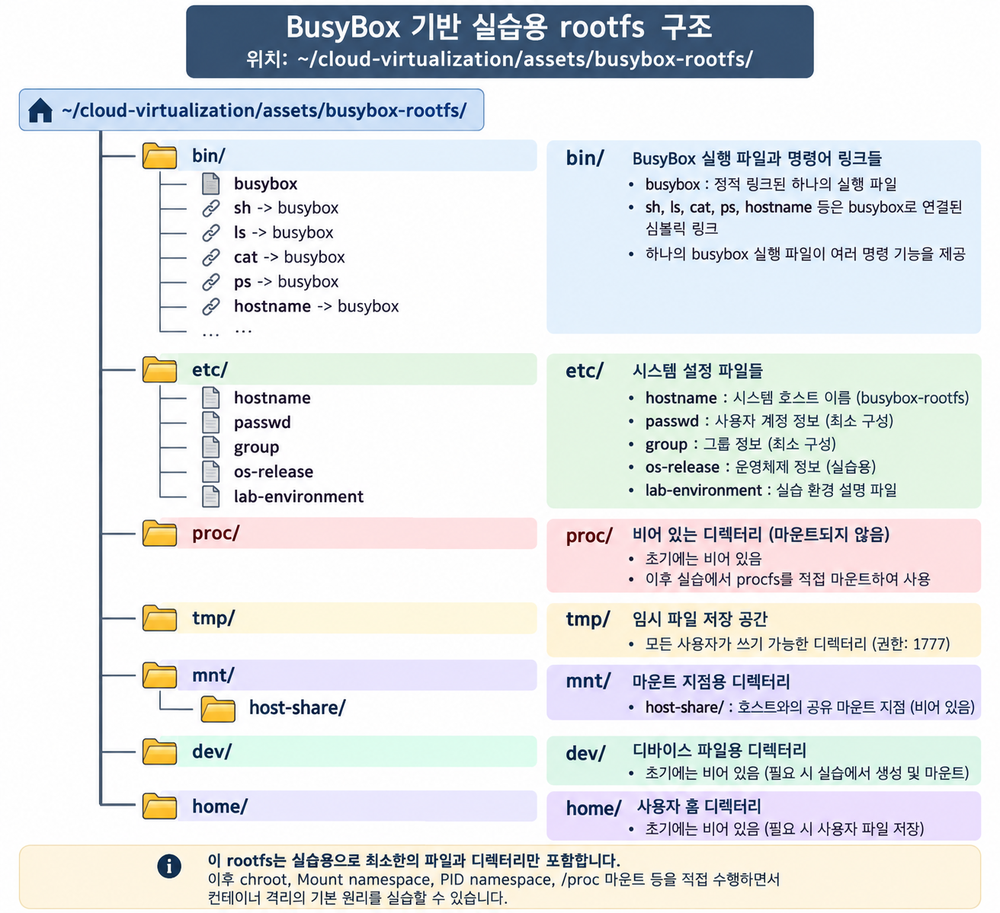
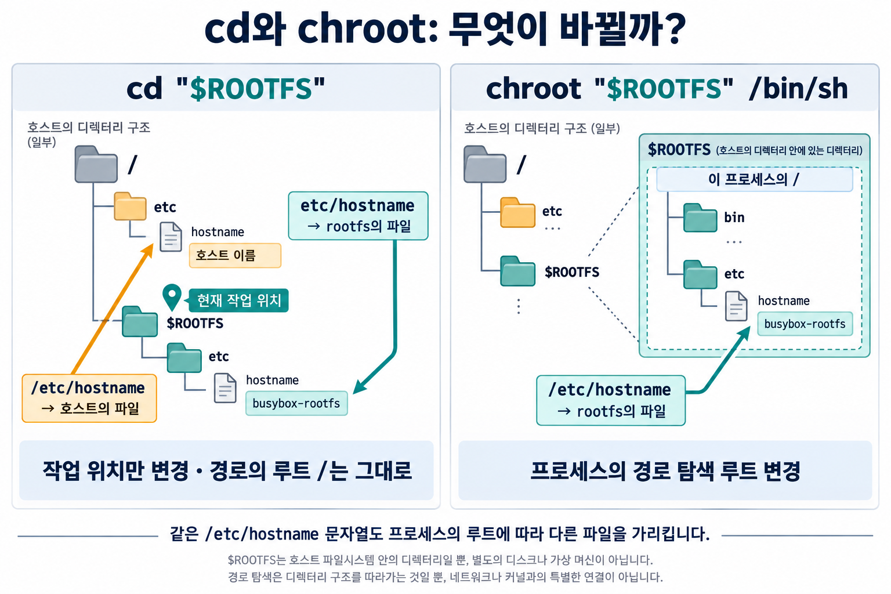
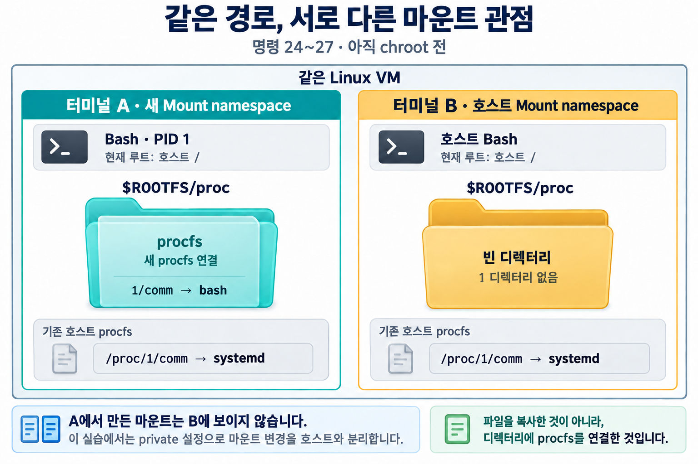
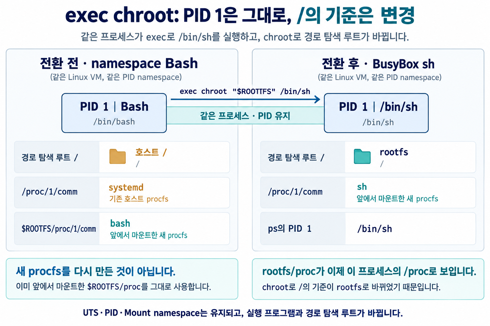

# 3주차 실습 — 프로세스에게 별도의 `/`를 보여 주다

[전체 주차 목록](../README.md) · [2주차 실습](../week02/README.md)

3주차 이론 수업에서 배운 **rootfs → `chroot` → UTS·PID·Mount namespace → procfs → 최종 `chroot`** 흐름을 직접 확인합니다.

이번 실습은 Linux 명령 자체를 많이 배우는 것이 목적이 아닙니다.  
**각 기능을 적용했을 때 프로세스가 보는 `/`, hostname, PID, `/proc`가 어떻게 달라지는지**를 비교하는 데 집중합니다.

- **터미널 A:** 실습을 진행하는 SSH 창
- **터미널 B:** 같은 VM에 별도로 접속한 호스트 관찰용 SSH 창
- 각 명령 제목에 적힌 **실행 위치**를 먼저 확인합니다.
- 호스트에서는 **Bash**, rootfs 안에서는 **BusyBox `sh`**를 사용합니다.
- PID와 출력 형식은 환경에 따라 조금 다를 수 있습니다. 문서의 숫자를 맞추지 말고 **관점의 차이**를 확인합니다.

## 처음 한 번: 실습 환경 준비

**시작 전 준비:** 아래 GitHub 준비 과정을 터미널 A의 **일반 사용자 호스트 Bash**에서 한 번 실행합니다. Ubuntu/Debian 전용이며 인터넷 연결과 `sudo` 권한이 필요합니다. 필수 도구는 VM의 공식 패키지 저장소에서 설치하고, 정적 BusyBox와 명령 링크를 갖춘 rootfs를 **`~/cloud-virtualization/assets/busybox-rootfs`**에 만듭니다. 계정이 `student45`이면 `/home/student45/cloud-virtualization/assets/busybox-rootfs`입니다. PPT의 `/home/student/rootfs`와 위치는 다르지만 새 `/`로 사용할 파일 트리라는 역할은 같습니다.

### 준비 순서

이전 실습의 안쪽 셸을 종료한 뒤 일반 사용자로 시작합니다. 아래 복사 블록에는 명령이 하나씩 있습니다. 블록을 순서대로 실행하고 오류가 없을 때 다음으로 넘어갑니다. `예상 결과:` 아래 내용은 실행하지 않고 자신의 출력과 비교합니다. `sudo`가 암호를 물으면 해당 **Linux 실습 계정 암호**를 입력합니다. 입력 중 글자나 별표가 표시되지 않습니다.

1. `curl`을 준비합니다. 이미 설치되어 있어도 실행할 수 있습니다.

패키지 목록을 갱신합니다.

```bash
sudo apt-get update
```

`curl`을 설치합니다.

```bash
sudo apt-get install -y curl
```

2. 홈 디렉터리에서 준비 스크립트를 내려받습니다.

홈 디렉터리로 이동합니다.

```bash
cd "$HOME"
```

준비 스크립트를 내려받습니다.

```bash
curl -fL \
  --connect-timeout 15 --max-time 60 --retry 1 \
  --resolve 'raw.githubusercontent.com:443:185.199.110.133' \
  -o week03-setup.sh \
  'https://raw.githubusercontent.com/choong-syu/cloud-virtualization/main/week03/setup.sh'
```

3. 일반 사용자로 준비 스크립트를 실행합니다. **앞에 `sudo`를 붙이지 않습니다.** 필요한 설치 명령만 스크립트 안에서 `sudo`를 사용합니다.

```bash
bash week03-setup.sh
```

마지막에 `준비 완료: /home/사용자/cloud-virtualization/assets/busybox-rootfs`가 나오면 준비가 끝났습니다. 준비 과정은 호스트 hostname이나 namespace·마운트를 변경하지 않습니다. 기존 rootfs가 올바르면 재사용하고, 구성이 다르면 `STOP`을 표시하여 자동 덮어쓰기를 하지 않습니다. 재실행 전에는 이전 실습 셸과 마운트를 먼저 정리합니다.



**준비된 것:** 실행할 BusyBox와 명령 링크, 실습용 설정 파일, 이후 procfs를 연결할 빈 `proc` 디렉터리입니다. 그림의 `etc/hostname`에 저장된 `busybox-rootfs`는 파일 내용이며, 현재 VM의 hostname을 변경한 것은 아닙니다. `mnt/host-share`와 `dev`도 준비된 빈 디렉터리로, 이번 01~35 실습에서는 별도 공유·장치 마운트를 하지 않습니다.


이제 SSH 창 두 개를 A·B로 나누고 [**명령 01부터**](#lab-0) 시작합니다. 아래 명령 01~35는 준비 스크립트 실행과 별개인 이론 확인 실습입니다.

---

## 실습 전체 흐름

| 단계 | 확인할 내용 | 명령 번호 |
| --- | --- | --- |
| 0 | 제공된 rootfs 확인 | 01~05 |
| 1 | `cd`와 절대·상대 경로 비교 | 06~09 |
| 2 | `chroot`만 적용했을 때의 변화 확인 | 10~17 |
| 3 | UTS·PID·Mount namespace 구성 | 18~23 |
| 4 | 새 PID 관점의 procfs를 rootfs에 마운트 | 24~27 |
| 5 | rootfs를 `/`로 전환해 관점 일치 확인 | 28~33 |
| 6 | 내부 마운트와 셸 정리 | 34~35 |

### 이번 실습의 핵심 질문

1. rootfs로 `cd`만 하면 `/`도 바뀌는가?
2. `chroot`만 하면 PID와 hostname도 분리되는가?
3. 새 PID namespace를 만들면 `/proc`도 자동으로 바뀌는가?
4. 새 procfs를 `rootfs/proc`에 마운트하면 호스트도 그 연결을 보는가?
5. 마지막에 rootfs를 `/`로 사용하면 `echo $$`, `/proc/1`, `ps`가 같은 관점을 보는가?

---

<a id="lab-0"></a>

# 0. 제공된 rootfs 확인

## 01. (터미널 A와 B) 현재 사용자와 호스트 이름 확인

**터미널 A · 호스트 Bash**

현재 사용자 이름을 확인합니다.

```bash
whoami
```

호스트 이름을 확인합니다.

```bash
hostname
```

**터미널 B · 호스트 Bash**

현재 사용자 이름을 확인합니다.

```bash
whoami
```

호스트 이름을 확인합니다.

```bash
hostname
```

예상 결과: 두 터미널의 사용자 이름이 같고, 호스트 이름도 같아야 합니다. 학교 VM의 예는 사용자 `student45`, 호스트 `vm45`입니다.

---

## 02. (터미널 A와 B) rootfs 경로를 변수에 저장

**터미널 A · 호스트 Bash**

rootfs 경로를 저장합니다.

```bash
ROOTFS="$HOME/cloud-virtualization/assets/busybox-rootfs"
```

저장한 경로를 확인합니다.

```bash
echo "$ROOTFS"
```

**터미널 B · 호스트 Bash**

B에서도 별도로 경로를 저장합니다.

```bash
ROOTFS="$HOME/cloud-virtualization/assets/busybox-rootfs"
```

저장한 경로를 확인합니다.

```bash
echo "$ROOTFS"
```

두 터미널에서 같은 전체 경로가 나와야 합니다. 아래는 계정이 `student`인 예이며, 자신의 계정 이름으로 표시됩니다.

예상 결과:

```text
/home/student/cloud-virtualization/assets/busybox-rootfs
```

`ROOTFS`는 긴 경로를 반복해서 쓰기 위한 셸 변수입니다. 이 명령만으로 `/`가 바뀌지는 않습니다. **변수는 SSH 창마다 따로 설정해야 합니다. 경로가 비어 있으면 다음으로 진행하지 않습니다.**

---

## 03. (터미널 A) rootfs의 기본 디렉터리 확인

먼저 rootfs 디렉터리 자체가 있는지 확인합니다.

```bash
ls -ld "$ROOTFS"
```

예상 결과: 권한 표시가 `d`로 시작하는 rootfs 디렉터리 정보 한 줄이 나옵니다.

그 안에 준비된 디렉터리를 모두 확인합니다.

```bash
ls "$ROOTFS"
```

예상 결과:

```text
bin  dev  etc  home  mnt  proc  tmp
```

다음 **7개 디렉터리**가 모두 있어야 합니다.

| 디렉터리 | 준비된 내용 |
| --- | --- |
| `bin/` | 정적 BusyBox 실행 파일과 명령 링크 |
| `etc/` | 실습용 설정 파일 |
| `proc/` | 아직 비어 있는 디렉터리. 명령 05에서 확인 |
| `tmp/` | 임시 파일을 저장할 디렉터리 |
| `dev/` | 장치 파일을 위한 빈 디렉터리 |
| `home/` | 사용자 파일을 위한 빈 디렉터리 |
| `mnt/` | 빈 `host-share/` 디렉터리 포함. 이번 실습에서는 사용하지 않음 |

---

## 04. (터미널 A) BusyBox와 기본 명령 링크 확인

```bash
ls -l \
  "$ROOTFS/bin/busybox" \
  "$ROOTFS/bin/sh" \
  "$ROOTFS/bin/ls" \
  "$ROOTFS/bin/cat" \
  "$ROOTFS/bin/ps" \
  "$ROOTFS/bin/hostname"
```

`sh -> busybox`, `ls -> busybox`와 같은 연결을 확인합니다.

이번 실습에서는 **준비 스크립트가 만든 정적 BusyBox rootfs를 사용**합니다.
BusyBox의 빌드 방식이나 라이브러리 의존성은 이론에서 확인했으므로 실습에서는 다시 검사하지 않습니다.

---

## 05. (터미널 A) rootfs의 `proc`가 비어 있는지 확인

```bash
ls -A "$ROOTFS/proc"
```

아무것도 출력되지 않아야 합니다.

> **빈 `proc` 디렉터리를 준비한 것과 procfs를 마운트한 것은 다릅니다.**

---

<a id="lab-1"></a>

# 1. `cd`와 절대·상대 경로 비교

## 06. (터미널 A) rootfs로 이동하고 현재 위치 확인

rootfs로 이동합니다.

```bash
cd "$ROOTFS"
```

현재 위치를 확인합니다.

```bash
pwd
```

현재 작업 디렉터리는 rootfs로 바뀌었지만, 프로세스가 절대 경로를 찾기 시작하는 `/`는 아직 호스트의 `/`입니다.

---

## 07. (터미널 A) 상대 경로로 실습용 hostname 파일 읽기

```bash
cat etc/hostname
```

앞에 `/`가 없으므로 현재 디렉터리 아래의 파일을 읽습니다.

예상 결과:

```text
busybox-rootfs
```

---

## 08. (터미널 A) 절대 경로로 hostname 파일 읽기

**터미널 A · rootfs로 이동한 호스트 Bash**

```bash
cat /etc/hostname
```

예상 결과: **호스트의 `/etc/hostname`**에 저장된 이름이 나옵니다. 명령 07의 `busybox-rootfs`와 비교합니다.

| 터미널 A에서 입력한 경로 | 실제로 읽는 파일 |
| --- | --- |
| 상대 경로 `etc/hostname` (명령 07) | `$ROOTFS/etc/hostname` |
| 절대 경로 `/etc/hostname` (명령 08) | 호스트 `/etc/hostname` |

> **`cd`는 현재 작업 위치만 바꾸며, 절대 경로의 시작점 `/`는 바꾸지 않습니다.**

---

## 09. (터미널 A) 호스트 홈 디렉터리로 복귀

```bash
cd "$HOME"
```

이제 다음 단계에서 `chroot`로 **프로세스의 `/` 자체**를 바꿉니다.

---

<a id="lab-2"></a>

# 2. `chroot`만 적용하면 무엇이 바뀌는가?

## 10. (터미널 A·호스트 Bash) rootfs를 `/`로 사용하는 BusyBox 셸 실행

```bash
sudo chroot "$ROOTFS" /bin/sh
```

성공하면 터미널 A는 **BusyBox `sh` 안**으로 들어갑니다.

| 보는 위치 | 같은 실행 파일의 경로 |
| --- | --- |
| 호스트 | `$ROOTFS/bin/sh` |
| chroot 안 | `/bin/sh` |

---

## 11. (터미널 A·BusyBox sh) 현재 `/`의 내용 확인

현재 위치를 확인합니다.

```sh
pwd
```

현재 `/`에 있는 디렉터리를 확인합니다.

```sh
ls /
```

`pwd`는 `/`를 출력하고, `ls /`에는 rootfs의 `bin`, `etc`, `proc`, `tmp` 등이 보여야 합니다.

---

## 12. (터미널 A·BusyBox sh) 같은 절대 경로로 실습용 파일 읽기

```sh
cat /etc/hostname
```

명령 08과 같은 `/etc/hostname`을 입력했지만, 이번에는 **rootfs 안의 파일**을 읽습니다.

예상 결과:

```text
busybox-rootfs
```




---

## 13. (터미널 A·BusyBox sh) chroot 이후 hostname 확인

**터미널 A · BusyBox sh**

```sh
hostname
```

예상 결과: **명령 01에서 확인한 호스트 이름**과 같아야 합니다.

> `chroot`는 `/`를 바꾸지만 **UTS namespace를 만들지는 않으므로 hostname은 아직 분리되지 않습니다.**

---

## 14. (터미널 A·BusyBox sh) 현재 셸의 PID 확인

```sh
echo "$$"
```

PID 1이 아니라 일반적인 PID가 나옵니다.

> `chroot`는 `/`를 바꾸지만 **PID namespace를 만들지는 않습니다.**

---

## 15. (터미널 A·BusyBox sh) 현재 `/proc` 확인

```sh
ls -A /proc
```

아무것도 출력되지 않아야 합니다.

rootfs의 `/proc`는 현재 **빈 디렉터리**일 뿐입니다.

---

## 16. (터미널 A·BusyBox sh) `ps` 실행

```sh
ps
```

정상적인 프로세스 목록을 만들지 못할 수 있습니다.

> `/bin/ps` 프로그램은 준비되어 있지만, `ps`가 읽을 `/proc`의 프로세스 정보가 아직 없습니다.

---

## 17. (터미널 A·BusyBox sh) chroot 셸 종료

```sh
exit
```

원래 터미널 A의 **호스트 Bash**로 돌아옵니다.

> 지금까지는 `chroot`만 따로 적용해 효과와 한계를 확인했습니다.  
> 이제 호스트 셸에서 namespace와 procfs를 함께 구성합니다.

---

<a id="lab-3"></a>

# 3. UTS·PID·Mount namespace 구성

## 18. (터미널 A·호스트 Bash) 호스트 PID 1의 이름 확인

**터미널 A · 호스트 Bash**

```bash
cat /proc/1/comm
```

일반적인 Ubuntu VM의 예입니다. 명령 23·26과 비교할 수 있도록 실제 출력값을 기억해 둡니다.

예상 결과:

```text
systemd
```

---

## 19. (터미널 A·호스트 Bash) 새 UTS·PID·Mount namespace에서 Bash 실행

```bash
sudo env ROOTFS="$ROOTFS" \
  unshare --uts --pid --mount --fork \
  /bin/bash
```

이 명령에서 이번 주 핵심은 다음 네 옵션입니다.

| 옵션 | 역할 |
| --- | --- |
| `--uts` | hostname 관점 분리 |
| `--pid` | PID 관점 분리 |
| `--mount` | mount 관점 분리 |
| `--fork` | 새 PID namespace 안에 Bash 실행 |

`env ROOTFS="$ROOTFS"`는 앞에서 정한 rootfs 경로를 새 Bash에서도 사용하기 위한 **실습용 보조 부분**입니다. 암기 대상이 아닙니다.

성공하면 터미널 A는 **새 namespace에 속한 Bash**가 됩니다.  
아직 `chroot`는 하지 않았으므로 이 Bash의 `/`는 호스트의 `/`입니다.

---

## 20. (터미널 A·새 namespace Bash) 내부 PID와 rootfs 경로 확인

현재 셸의 PID를 확인합니다.

```bash
echo "$$"
```

예상 결과:

```text
1
```

새 Bash에서도 rootfs 경로가 유지되는지 확인합니다.

```bash
echo "$ROOTFS"
```

아래는 계정이 `student`인 예입니다. 명령 02에서 확인한 자신의 경로와 같아야 합니다.

예상 결과:

```text
/home/student/cloud-virtualization/assets/busybox-rootfs
```

이 Bash는 새 PID namespace의 첫 프로세스입니다. **PID가 1이 아니거나 경로가 비어 있거나 다르면, 다음 명령을 실행하지 말고 교수자에게 알립니다.**

---

## 21. (터미널 A·새 namespace Bash) 내부 hostname 설정

```bash
hostname cv-fs-lab
```

새 UTS namespace 안의 hostname만 변경합니다.

---

## 22. (터미널 A와 B) hostname 비교

**터미널 A · 새 namespace Bash**

```bash
hostname
```

예상 결과:

```text
cv-fs-lab
```

**터미널 B · 호스트 Bash**

```bash
hostname
```

예상 결과: 명령 01에서 본 원래 호스트 이름이 나옵니다. 학교 VM에서는 `vm45`입니다.

---

## 23. (터미널 A·새 namespace Bash) 아직 기존 `/proc`를 보고 있는지 확인

```bash
cat /proc/1/comm
```

명령 18에서 본 **호스트 PID 1의 이름**이 나옵니다.

| 확인한 항목 | 현재 결과 |
| --- | --- |
| `echo "$$"` (명령 20) | `1` |
| `/proc/1/comm` (명령 23) | 호스트 PID 1의 이름 |

> **새 PID namespace를 만들었다고 `/proc`가 자동으로 바뀌지는 않습니다.**

---

<a id="lab-4"></a>

# 4. 새 PID 관점의 procfs를 준비

## 24. (터미널 A·새 namespace Bash) rootfs의 `proc`에 procfs 마운트

```bash
mount -t proc proc "$ROOTFS/proc"
```

한 문장으로 읽으면:

> **`$ROOTFS/proc` 디렉터리에 procfs를 마운트하여, 그 위치에서 새 PID namespace 관점의 프로세스 정보를 볼 수 있게 합니다.**

---

## 25. (터미널 A·새 namespace Bash) 새 procfs의 PID 1 확인

```bash
cat "$ROOTFS/proc/1/comm"
```

예상 결과:

```text
bash
```

새 PID namespace의 PID 1은 현재 Bash입니다.

---

## 26. (터미널 A·새 namespace Bash) 기존 `/proc`와 비교

```bash
cat /proc/1/comm
```

여전히 호스트 PID 1의 이름이 나옵니다.

| 확인한 파일 | PID 관점 | 결과 |
| --- | --- | --- |
| `$ROOTFS/proc/1/comm` (명령 25) | 새 PID namespace | `bash` |
| `/proc/1/comm` (명령 26) | 호스트 | `systemd` 등 |

> procfs는 준비되었지만 **아직 현재 프로세스의 `/proc`가 된 것은 아닙니다.**

---

## 27. (터미널 A와 B) 같은 `rootfs/proc` 경로의 차이 확인

**터미널 A · 새 namespace Bash**

```bash
ls -ld "$ROOTFS/proc/1"
```

예상 결과: `$ROOTFS/proc/1` 디렉터리의 정보 한 줄이 나옵니다. A에는 새 procfs가 연결되어 있습니다.

**터미널 B · 호스트 Bash**

```bash
ls -ld "$ROOTFS/proc/1"
```

아래는 계정이 `student`인 예입니다. 경로의 계정 이름과 오류 메시지 언어는 환경에 따라 달라질 수 있습니다.

예상 결과:

```text
ls: cannot access '/home/student/cloud-virtualization/assets/busybox-rootfs/proc/1': No such file or directory
```

B에서 오류가 나는 것이 **이번 비교에서는 정상**입니다. B에는 원래의 빈 `proc` 디렉터리가 보이므로 그 안에 `1`이 없습니다.

> **Mount namespace가 다르면 같은 경로라도 그 위치에 연결되어 보이는 파일 시스템이 달라질 수 있습니다.**



---

<a id="lab-5"></a>

# 5. rootfs를 `/`로 사용해 모든 관점을 맞춘다

## 28. (터미널 A·새 namespace Bash) PID 1을 유지하며 rootfs로 전환

```bash
exec chroot "$ROOTFS" /bin/sh
```

현재 PID 1 Bash가 rootfs의 BusyBox `sh`로 교체됩니다.



앞에서 `$ROOTFS/proc`에 준비한 procfs도 이제 프로세스에게 **`/proc`**로 보입니다.

---

## 29. (터미널 A·BusyBox sh) 새 `/`와 설정 파일 확인

현재 위치를 확인합니다.

```sh
pwd
```

예상 결과:

```text
/
```

실습용 hostname 파일을 읽습니다.

```sh
cat /etc/hostname
```

예상 결과:

```text
busybox-rootfs
```

---

## 30. (터미널 A·BusyBox sh) 최종 chroot 이후 hostname 확인

**터미널 A · BusyBox sh**

```sh
hostname
```

예상 결과:

```text
cv-fs-lab
```

**명령 22의 터미널 A 결과**와 비교합니다. 최종 `chroot` 이후에도 `cv-fs-lab`이 유지됩니다.

`/etc/hostname` 파일의 문자열과 현재 UTS hostname은 **서로 다른 대상**입니다.

---

## 31. (터미널 A·BusyBox sh) PID 1 유지 확인

```sh
echo "$$"
```

예상 결과:

```text
1
```

`exec`로 프로그램은 Bash에서 BusyBox `sh`로 바뀌었지만 PID는 유지되었습니다.

---

## 32. (터미널 A·BusyBox sh) `/proc/1`의 대상 확인

```sh
cat /proc/1/comm
```

예상 결과:

```text
sh
```

이제 `/proc/1`도 내부 PID 1 셸을 가리킵니다.

---

## 33. (터미널 A·BusyBox sh) 프로세스 목록 확인

```sh
ps
```

예상 결과:

```text
PID   USER     TIME  COMMAND
  1   root     0:00  /bin/sh
  2   root     0:00  ps
```

실제 `ps` 자신의 PID는 달라질 수 있습니다.

### 핵심 비교

| 확인한 항목 | 결과 |
| --- | --- |
| `echo "$$"` (명령 31) | `1` |
| `/proc/1/comm` (명령 32) | `sh` |
| `ps`의 PID 1 (명령 33) | `/bin/sh` |

> **PID namespace의 관점과 `/proc`가 제공하는 관점이 이제 서로 맞습니다.**


---

<a id="lab-6"></a>

# 6. 내부 환경 정리

## 34. (터미널 A·BusyBox sh) 내부 procfs 마운트 해제

현재 위치를 `/`로 옮깁니다.

```sh
cd /
```

안쪽 셸에서 procfs 연결을 해제합니다.

```sh
umount /proc
```

`proc` 디렉터리가 다시 비어 있는지 확인합니다.

```sh
ls -A /proc
```

`ls -A /proc`에서 아무것도 출력되지 않아야 합니다.

> procfs의 **연결만 해제**되었고, rootfs 안의 빈 `proc` 디렉터리는 그대로 남아 있습니다.

---

## 35. (터미널 A·BusyBox sh) PID 1 셸 종료

```sh
exit
```

원래 터미널 A의 호스트 Bash로 돌아옵니다. 돌아온 뒤 **A에서 아래 명령을 따로 실행**합니다. 위의 `exit`와 한꺼번에 붙여 넣지 않습니다.

```bash
whoami
```

명령 01의 일반 사용자 이름(`ubuntu`, `student45` 등)이 나오면 복귀한 것입니다. `root`가 나오면 교수자에게 현재 셸을 확인받습니다.

터미널 B는 실습 내내 호스트 Bash를 유지했습니다.

### 실습 종료 상태

| 항목 | 종료 상태 |
| --- | --- |
| 터미널 A | 원래 호스트 Bash |
| 터미널 B | 원래 호스트 Bash |
| 호스트 hostname | 변경 없음 |
| 호스트 `/proc` | 변경 없음 |
| `rootfs/proc` | 다시 빈 디렉터리 |

---

# 이번 실습에서 직접 확인한 것

| 기능 또는 재료 | 담당한 역할 | 관찰한 결과 |
| --- | --- | --- |
| rootfs | 새 `/`로 사용할 파일 트리 | BusyBox, 설정 파일, 빈 `proc` 준비 |
| `cd` | 현재 작업 디렉터리 변경 | 절대 경로의 `/`는 그대로 |
| `chroot` | 프로세스의 `/` 변경 | 같은 `/etc/hostname`이 다른 실제 파일을 가리킴 |
| UTS namespace | hostname 관점 분리 | A와 B의 hostname이 다름 |
| PID namespace | PID 관점 분리 | 내부 Bash가 PID 1 |
| procfs | PID 정보를 파일 형태로 제공 | 새 procfs의 `/1/comm`이 내부 Bash를 가리킴 |
| Mount namespace | mount 관점 분리 | 같은 rootfs/proc에서 A와 B가 다른 내용을 봄 |
| `exec chroot` | PID를 유지하며 rootfs로 전환 | `echo $$`, `/proc/1`, `ps`가 같은 내부 관점을 봄 |

## 가장 중요한 결론

- **rootfs:** 프로세스에게 보여 줄 파일 준비
- **chroot:** 어느 디렉터리를 `/`로 볼지 변경
- **UTS namespace:** hostname 관점 분리
- **PID namespace:** PID 관점 분리
- **procfs:** PID 정보를 `/proc` 형태로 제공
- **Mount namespace:** 그 mount 연결이 보이는 관점 분리

> **새로운 Linux 커널을 만든 것이 아닙니다.**  
> 같은 Linux 커널이 관리하는 프로세스에게 `/`, hostname, PID, mount에 대해 서로 다른 관점을 제공한 것입니다.

---

# [참고] 실습 중 막혔을 때

정상 흐름에서는 아래 내용을 읽을 필요가 없습니다.

| 상황 | 확인할 내용 |
| --- | --- |
| `rootfs` 경로가 없음 | 준비 스크립트가 정상적으로 끝났는지, 명령 02의 `ROOTFS` 경로가 설정되어 있는지 확인 |
| `chroot`가 `/bin/sh`를 찾지 못함 | rootfs의 `bin/busybox`, `bin/sh` 링크 확인 |
| chroot 안에서 `hostname`이 호스트와 같음 | 정상. chroot만 적용한 단계에서는 UTS namespace를 아직 분리하지 않음 |
| chroot 안에서 `ps`가 동작하지 않음 | 정상. 첫 chroot 단계의 `/proc`는 아직 비어 있음 |
| `unshare: Operation not permitted` | 다음 단계로 진행하지 말고 교수자에게 알림 |
| 명령 20의 PID가 1이 아님 | 새 PID namespace Bash에 들어왔는지 확인 |
| 명령 27에서 B에 `No such file or directory`가 나옴 | 정상. B에서는 rootfs/proc에 procfs가 마운트되어 있지 않음 |
| 명령 33에서 호스트 전체 프로세스가 보임 | procfs 마운트와 최종 chroot 단계를 다시 확인 |
| `umount /proc`가 실패함 | 강제 옵션을 사용하지 말고 교수자에게 알림 |

> **셸이 헷갈릴 때**  
> 셸이 바뀌는 지점은 명령 **10 → 17 → 19 → 28 → 35**입니다.  
> 가장 최근에 어느 전환 명령을 실행했는지부터 확인합니다.
