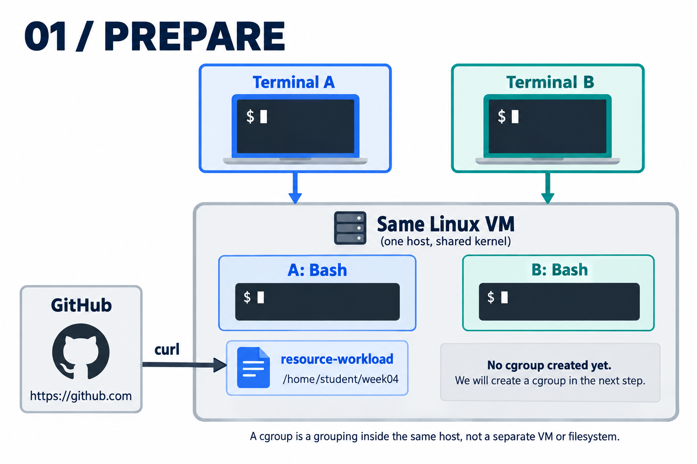
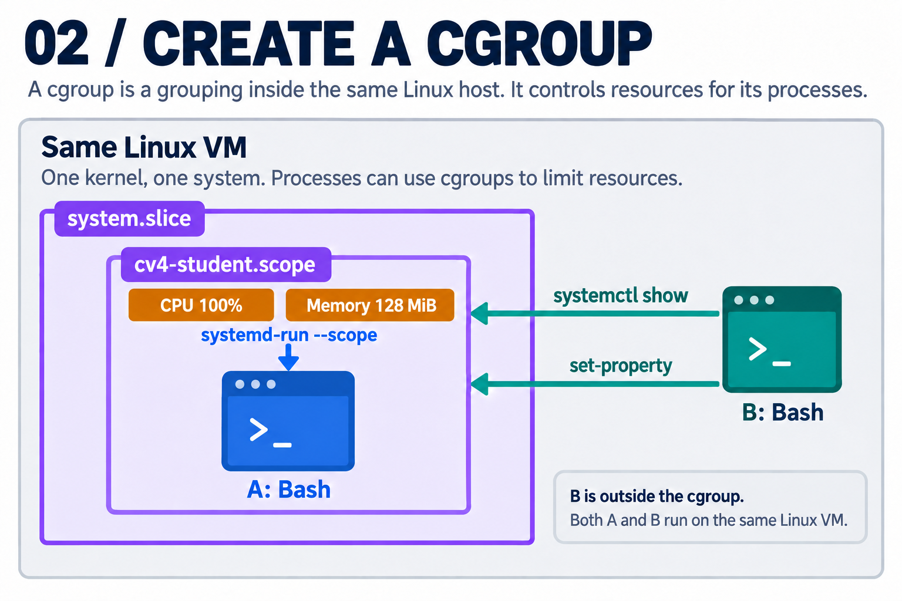
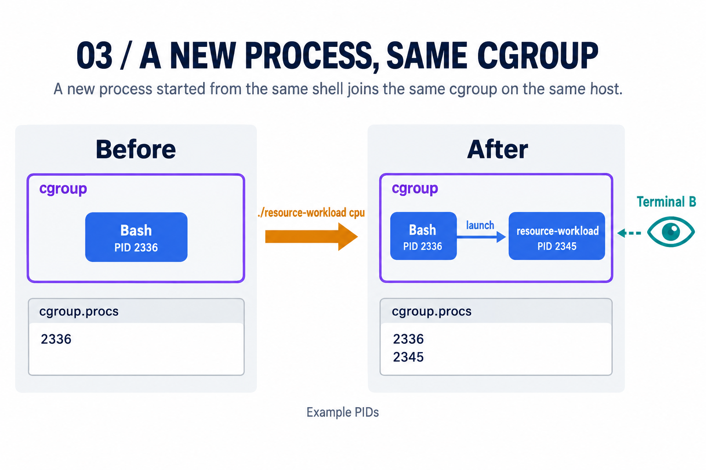
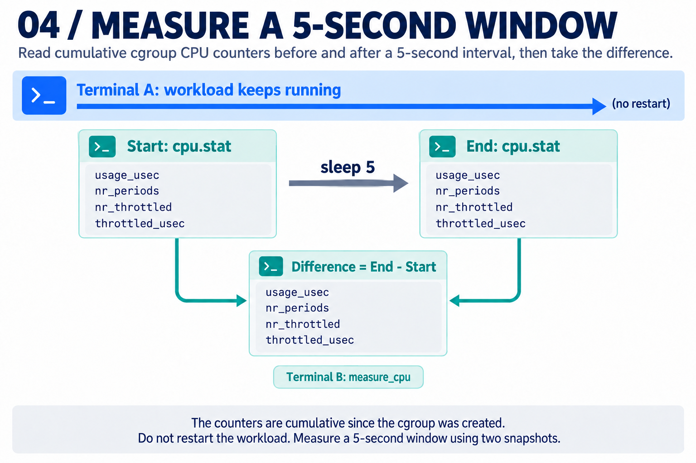
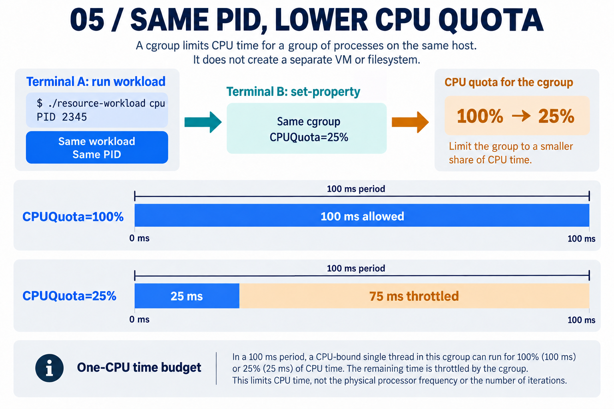
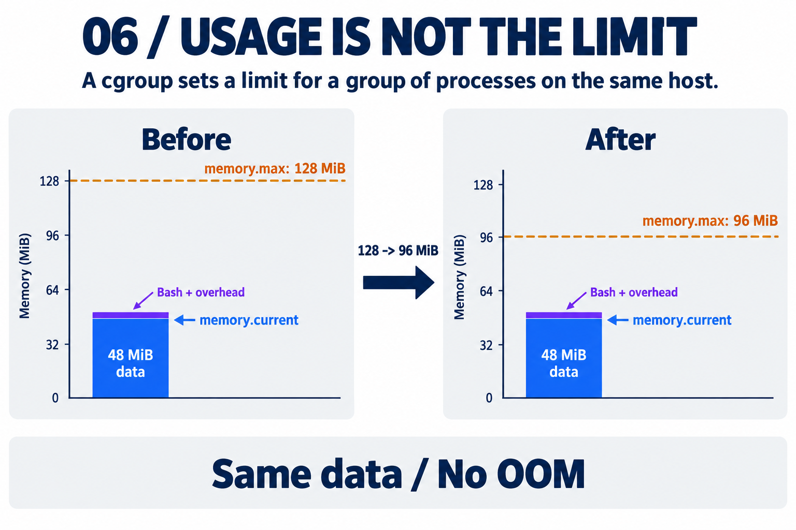
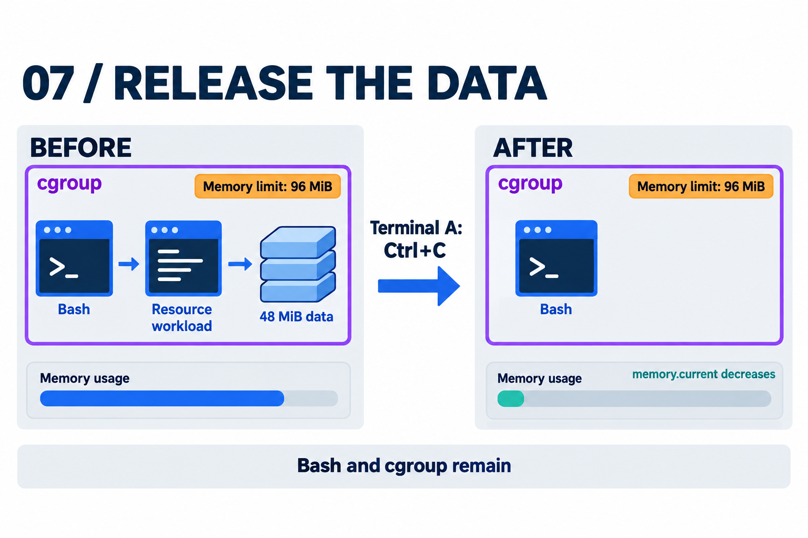
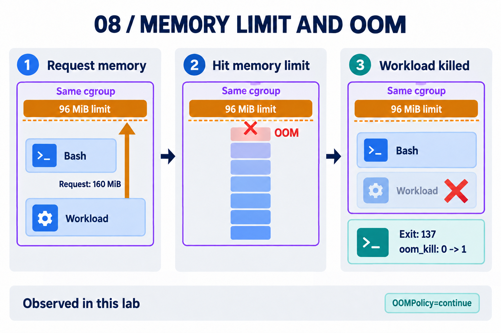
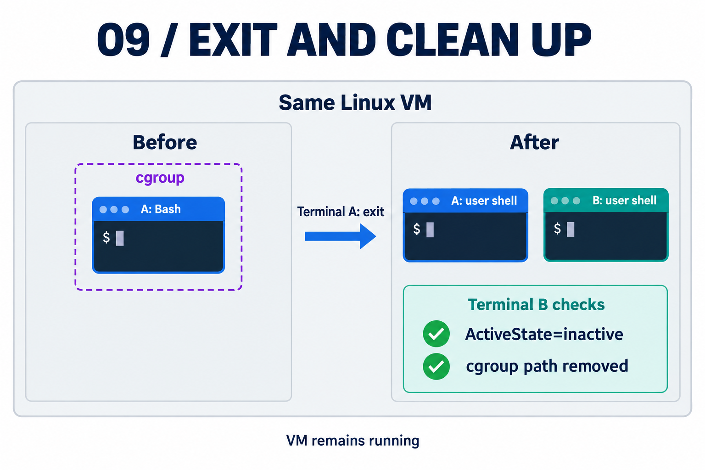

# 4주차 실습 — 프로세스의 CPU·메모리 사용을 제한하다

[전체 주차 목록](https://github.com/choong-syu/cloud-virtualization) · [3주차 실습](https://github.com/choong-syu/cloud-virtualization/blob/main/week03/README.md)

**같은 프로그램을 계속 실행하면서 CPU·메모리 한도만 바꾸고 결과를 비교**합니다. 지난주의 rootfs나 namespace를 복원하지 않고 호스트에서 진행합니다.

- **터미널 A:** 제한 그룹 안에서 Bash와 부하 프로그램을 실행합니다.
- **터미널 B:** 같은 VM의 호스트에서 한도를 변경하고 사용량을 관찰합니다.
- 각 코드 블록 위의 **명령 번호 · 터미널 · 셸 위치**를 확인한 뒤 순서대로 실행합니다. `09-01`은 9단계의 첫 명령을 뜻합니다. 준비·참고 명령은 별도 번호를 사용합니다.
- A와 B에서 모두 실행할 명령도 터미널별로 나누어 표시했습니다. 예상 출력은 입력하지 않습니다.

## 처음 한 번: 프로그램 준비



**그림 1 · 프로그램 준비.** A와 B는 같은 VM에 접속한 두 셸임. GitHub에서 실행 파일 하나를 받아 사용하며, 지난주 rootfs를 복원하지 않음.

**준비 환경:** Ubuntu/Debian Linux **x86-64** VM, systemd 253 이상, cgroup v2, 인터넷 연결, `sudo` 권한이 필요합니다. A의 **일반 사용자 Bash**에서 시작합니다.

### 1. 다운로드 도구 준비

`curl`은 파일 다운로드 도구이며, `ca-certificates`는 HTTPS 서버의 인증서를 검증할 때 사용하는 인증서 모음입니다. 이미 HTTPS 다운로드가 정상적으로 되면 아래 설치 단계는 생략합니다.

**명령 준비-01 · 터미널 A · 호스트 Bash · 일반 사용자**

```bash
sudo apt-get update
```

**명령 준비-02 · 터미널 A · 호스트 Bash · 일반 사용자**

```bash
sudo apt-get install -y curl ca-certificates
```

### 2. 실행 파일 하나 다운로드

**명령 준비-03 · 터미널 A · 호스트 Bash · 일반 사용자**

```bash
mkdir -p "$HOME/week04"
```

**명령 준비-04 · 터미널 A · 호스트 Bash · 일반 사용자**

```bash
cd "$HOME/week04"
```

**1.2.0 실행 파일**을 다운로드합니다. 아래 블록은 줄을 나눈 하나의 명령입니다.

**명령 준비-05 · 터미널 A · 호스트 Bash · 일반 사용자**

```bash
curl -fL \
  --connect-timeout 15 --max-time 60 --retry 1 \
  --resolve 'raw.githubusercontent.com:443:185.199.110.133' \
  -o resource-workload \
  'https://raw.githubusercontent.com/choong-syu/cloud-virtualization/main/week04/scripts/resource-workload-linux-x86_64'
```

다운로드가 오류 없이 끝난 뒤 실행 권한을 부여합니다.

**명령 준비-06 · 터미널 A · 호스트 Bash · 일반 사용자**

```bash
chmod +x resource-workload
```

### 3. 프로그램 확인

다운로드한 프로그램의 사용법을 확인합니다. `./`는 현재 폴더의 실행 파일을 뜻하며, `--help`는 CPU·메모리 부하를 발생시키지 않고 도움말만 출력합니다.

**명령 준비-07 · 터미널 A · 호스트 Bash · 일반 사용자**

```bash
./resource-workload --help
```

예상 결과: `resource-workload 1.2.0`과 `cpu`, `memory MiB` 사용법이 나옵니다. 1.1.0이 나오면 이전 실행 파일이므로 다운로드를 다시 확인합니다.

프로그램은 **CPU 계산 또는 메모리 보관만 수행**하며 한도를 설정하지 않습니다. [프로그램 소스](https://github.com/choong-syu/cloud-virtualization/blob/main/week04/scripts/resource-workload.c)

프로그램은 명령을 실행하면 **추가 입력 없이 바로 시작하여 최대 600초 동안 동작**하며 `Ctrl+C`로 종료할 수 있습니다.

## 실습 전체 흐름

| 단계 | 확인할 내용 | 명령 번호 |
| --- | --- | --- |
| 1 | 제한 그룹 생성과 소속 확인 | 01~08 |
| 2 | CPU 한도 100% → 25% 비교 | 09~13 |
| 3 | 48MiB 자료를 유지하며 메모리 상한 128 → 96MiB 비교 | 14~19 |
| 4 | 같은 그룹에서 메모리 한도 초과와 OOM 확인 | 20~24 |
| 5 | 종료와 자원 해제 | 25~26 |

| 용어 | 의미 |
| --- | --- |
| cgroup | 프로세스를 묶어 CPU·메모리 사용을 관리하는 Linux 기능 |
| systemd | 프로세스 그룹 생성과 한도 설정을 관리하는 프로그램 |
| unit | systemd가 관리하는 단위 |
| scope | 이미 실행된 프로세스들을 묶어 관리하는 unit의 한 종류 |
| OOM | Out Of Memory의 약자이며, 메모리가 부족한 상태를 의미함 |

---

# 1. 자원 제한 그룹 만들기



**그림 2 · 제한 그룹 생성.** A에서 시작한 새 Bash가 실습 cgroup에 속함. B는 그룹 밖에서 상태를 조회하고 한도를 변경함.

**같은 VM의 같은 계정으로 SSH 창 두 개를 열고, 각각 터미널 A와 B로 구분합니다. 두 창 모두 일반 사용자 상태에서 시작합니다.**

## 01. (터미널 A·B 각각 · 일반 사용자) 경로와 그룹 이름 저장

**먼저 터미널 A에서 실행합니다.**

**명령 01-01 · 터미널 A · 호스트 Bash · 일반 사용자**

```bash
WORK="$HOME/week04"
```

**명령 01-02 · 터미널 A · 호스트 Bash · 일반 사용자**

```bash
UNIT="cv4-$USER.scope"
```

**이어서 터미널 B에서 실행합니다.**

**명령 01-03 · 터미널 B · 호스트 Bash · 일반 사용자**

```bash
WORK="$HOME/week04"
```

**명령 01-04 · 터미널 B · 호스트 Bash · 일반 사용자**

```bash
UNIT="cv4-$USER.scope"
```

`WORK`는 실습 폴더, `UNIT`은 그룹 이름입니다. **변수는 창마다 따로 설정합니다.**

## 02. (터미널 B · 일반 사용자) 자원 관리 기능 확인

**명령 02-01 · 터미널 B · 호스트 Bash · 일반 사용자**

```bash
cat /sys/fs/cgroup/cgroup.controllers
```

예상 결과: `cpu`와 `memory`가 포함됩니다. 파일이나 항목이 없으면 교수자에게 환경을 확인받습니다.

OOM 이후 남은 Bash를 유지하는 설정에 필요한 **systemd 253 이상**인지 첫 줄에서 확인합니다.

**명령 02-02 · 터미널 B · 호스트 Bash · 일반 사용자**

```bash
systemctl --version
```

## 03. (터미널 A · 일반 사용자 → 제한 그룹의 관리자 Bash) 그룹 시작

프로그램이 있는 폴더로 이동합니다.

**명령 03-01 · 터미널 A · 호스트 Bash · 일반 사용자**

```bash
cd "$WORK"
```

한도를 설정하고 그 그룹 안에서 새 Bash를 실행합니다.

**명령 03-02 · 터미널 A · 호스트 Bash · 일반 사용자**

```bash
sudo systemd-run --scope --unit="$UNIT" \
  -p CPUQuota=100% \
  -p MemoryMax=128M \
  -p MemorySwapMax=0 \
  -p OOMPolicy=continue \
  -p TimeoutStopSec=5s \
  /bin/bash --noprofile --norc -i
```

예상 결과: A에 새 관리자 Bash 프롬프트가 나옵니다. 여기서 실행하는 프로그램도 같은 제한 그룹에 속합니다. B는 기존 셸에 그대로 둡니다.

| 설정 | 의미 |
| --- | --- |
| `CPUQuota=100%` | CPU 1개 상당의 실행 시간까지 허용 |
| `MemoryMax=128M` | 그룹 전체 메모리 상한 128MiB |
| `OOMPolicy=continue` | OOM이 발생했을 때 **systemd가 해당 unit 전체를 실패 처리하거나 정리하지 않고 계속 유지하도록 하는 정책** |
| `TimeoutStopSec=5s` | systemd가 프로세스에게 종료를 요청한 뒤, 정상적으로 종료되기를 기다리는 최대 시간 |

1MiB는 1,048,576바이트입니다. `MemorySwapMax=0`은 메모리 한도 초과 실험의 조건을 일정하게 유지하기 위한 기본 설정으로 그대로 사용합니다.

## 04. (터미널 A · 제한 그룹의 Bash) 위치와 소속 확인

**명령 04-01 · 터미널 A · 제한 그룹 Bash · 관리자**

```bash
pwd
```

예상 결과: `/home/사용자/week04`처럼 프로그램이 있는 경로입니다. 이후 프로그램은 `./resource-workload`로 실행합니다.

**명령 04-02 · 터미널 A · 제한 그룹 Bash · 관리자**

```bash
cat /proc/$$/cgroup
```

`$$`는 현재 Bash의 PID입니다. `0::` 뒤의 경로를 확인합니다.

```text
0::/system.slice/cv4-student45.scope
```

이름은 예시이며 자신의 사용자 이름으로 표시됩니다. 파일 시스템·hostname·PID 관점은 호스트와 같습니다.

`system.slice`는 systemd가 시스템 단위들을 모아 관리하는 상위 그룹입니다. 그 아래의 `cv4-사용자.scope`가 이번 실습에서 만든 그룹이며, 현재 Bash와 그 안에서 실행하는 프로그램이 여기에 속합니다.

## 05. (터미널 B · 일반 사용자) 호스트에서 같은 그룹 확인

이제 B에서 **A의 그룹이 실행 중인지, 어느 cgroup 경로를 사용하는지** 확인합니다.

**명령 05-01 · 터미널 B · 호스트 Bash · 일반 사용자**

```bash
systemctl show "$UNIT" -p ActiveState -p ControlGroup
```

| 명령 구성 | 의미 |
| --- | --- |
| `systemctl show` | systemd가 관리하는 unit의 속성을 조회함 |
| `"$UNIT"` | 앞에서 저장한 실습 그룹 이름을 조회 대상으로 지정함 |
| `-p ActiveState` | 실행 상태를 출력함. `active`이면 활성 상태임 |
| `-p ControlGroup` | 해당 unit이 사용하는 cgroup 경로를 출력함 |

`-p`는 출력할 속성을 선택하는 옵션임. 앞의 `systemd-run -p 이름=값`은 속성을 **설정**하고, 여기의 `systemctl show -p 이름`은 속성을 **조회**함.

예상 결과: `ActiveState=active`이며 `ControlGroup` 값이 A의 그룹 경로와 같습니다.

## 06. (터미널 B · 일반 사용자) 관찰 경로 저장

앞에서 확인한 경로를 변수에 저장합니다. `--value`는 `ControlGroup=`이라는 속성 이름을 빼고 **값만 출력**하며, `$(...)`는 명령의 출력값을 가져오는 표현입니다.

**명령 06-01 · 터미널 B · 호스트 Bash · 일반 사용자**

```bash
CG_REL=$(systemctl show "$UNIT" -p ControlGroup --value)
```

**명령 06-02 · 터미널 B · 호스트 Bash · 일반 사용자**

```bash
echo "$CG_REL"
```

**값이 비어 있거나 `/`만 나오면 진행하지 않습니다.** 마지막 이름이 자신의 `cv4-사용자.scope`인지 확인합니다.

**명령 06-03 · 터미널 B · 호스트 Bash · 일반 사용자**

```bash
CG="/sys/fs/cgroup$CG_REL"
```

`CG`는 이 그룹의 사용량과 한도를 읽을 파일 경로입니다.

## 07. (터미널 B · 일반 사용자) 구성원 확인

**명령 07-01 · 터미널 B · 호스트 Bash · 일반 사용자**

```bash
cat "$CG/cgroup.procs"
```

그룹에 속한 프로세스의 PID가 나옵니다. 아직 부하 프로그램을 실행하지 않았으므로 A의 Bash PID를 확인할 수 있습니다. **이 목록을 메모해 두고 09에서 부하 프로그램을 실행한 뒤의 목록과 비교합니다.** B의 관찰 셸은 이 그룹 밖에 있습니다.

## 08. (터미널 B · 일반 사용자) 적용된 한도 확인

**명령 08-01 · 터미널 B · 호스트 Bash · 일반 사용자**

```bash
cat "$CG/cpu.max"
```

**명령 08-02 · 터미널 B · 호스트 Bash · 일반 사용자**

```bash
cat "$CG/memory.max"
```

| 파일 | 출력 예 | 읽는 방법 |
| --- | --- | --- |
| `cpu.max` | `100000 100000` | 허용 시간 ÷ 기준 주기 = CPU 1개 상당 |
| `memory.max` | `134217728` | 메모리 상한 128MiB |

`cpu.max`의 시간 단위는 마이크로초입니다. 주기가 다르면 두 숫자의 비율을 비교합니다.

---

# 2. 같은 프로그램의 CPU 한도 변경

**A에서 프로그램을 한 번 실행해 둔 채 B에서 100%와 25%를 각각 측정합니다. 시작값·끝값·차이는 자동으로 출력됩니다.**

### 측정 명령 준비 — B에서 한 번만 실행

**아래 접기 영역을 열고 코드 전체를 B에 한 번 붙여 넣습니다.** 여러 명령을 묶은 함수이며, 이후에는 `measure_cpu "$CG"`만 사용합니다. 코드는 암기하지 않습니다.

<details>
<summary>측정 함수 코드 펼치기 — 처음 한 번 등록</summary>

**명령 준비-08 · 터미널 B · 호스트 Bash · 일반 사용자**

```bash
# 터미널 B에서 사용하는 조회 전용 함수임. 한도나 프로세스를 변경하지 않음.
measure_cpu() (
    local cg="${1:-}" before after key value
    local -a keys=(usage_usec nr_periods nr_throttled throttled_usec)
    local -a labels=('전체 CPU 사용 시간' '전체 CPU 제한 주기 수' 'CPU 제한이 걸린 주기 수' 'CPU 제한으로 대기한 누적 시간')
    local -a units=('μs' '회' '회' 'μs')
    local -A start=() end=()
    if [[ -z "$cg" || ! -r "$cg/cpu.stat" ]]; then
        printf '측정할 cpu.stat을 찾을 수 없습니다. CG와 그룹 실행 상태를 확인하세요.\n' >&2
        return 1
    fi
    printf '5초간 cpu.stat의 변화를 확인합니다.\n'
    before=$(cat "$cg/cpu.stat") || return 1
    while read -r key value; do
        [[ -n "$key" ]] && start["$key"]="$value"
    done <<< "$before"
    for key in "${keys[@]}"; do
        [[ ${start[$key]:-} =~ ^[0-9]+$ ]] || {
            printf '필요한 항목이 없습니다: %s\n' "$key" >&2; return 1;
        }
    done
    printf '\n[측정 시작: cpu.stat 원본]\n%s\n\n' "$before"
    printf '5초 동안 sleep\n'
    sleep 5 || return 1
    after=$(cat "$cg/cpu.stat") || return 1
    while read -r key value; do
        [[ -n "$key" ]] && end["$key"]="$value"
    done <<< "$after"
    for key in "${keys[@]}"; do
        [[ ${end[$key]:-} =~ ^[0-9]+$ ]] && (( end[$key] >= start[$key] )) || {
            printf '측정 중 그룹이나 통계가 변경되었습니다. 다시 측정하세요.\n' >&2; return 1;
        }
    done
    printf '\n[측정 종료: cpu.stat 원본]\n%s\n\n' "$after"
    printf '\n[측정 전/후 차이: 종료값 - 시작값]\n'
    for i in "${!keys[@]}"; do
        key=${keys[i]}
        printf '%s(%s)의 측정 전/후 차이는 %s%s입니다.\n' "$key" "${labels[i]}" "$((end[$key] - start[$key]))" "${units[i]}"
    done
)
```

</details>

등록만 하므로 아직 측정 결과는 나오지 않습니다. **B의 프롬프트가 돌아오면 09단계로 진행**합니다.

## 09. (터미널 A와 B) CPU 계산 시작과 추가된 PID 확인



**그림 3 · 프로세스와 PID 추가.** A의 Bash에서 실행한 부하 프로그램도 같은 cgroup에 속함. B에서 cgroup.procs와 실제 PID의 comm을 확인함. 그림의 PID는 예시임.

`cpu` 모드는 계산을 반복하며 경과 시간·PID·초당 계산 횟수를 출력합니다. 아래 명령은 **추가 Enter 없이 바로 계산을 시작**합니다.

**명령 09-01 · 터미널 A · 제한 그룹 Bash · 관리자**

```bash
./resource-workload cpu
```

첫 줄의 `pid=3030`처럼 표시된 **실제 PID를 확인**합니다. 출력이 반복되면 **A는 실행해 둔 채 B로 이동**합니다. 프로그램은 13에서 종료합니다.

**B에서** 그룹에 속한 PID 목록을 다시 읽습니다.

**명령 09-02 · 터미널 B · 호스트 Bash · 일반 사용자**

```bash
cat "$CG/cgroup.procs"
```

예를 들어 07에서 Bash PID `2446`만 보였다면, 실행 후에는 아래처럼 부하 프로그램 PID `3030`이 추가됩니다. 출력 순서는 달라질 수 있습니다.

```text
2446
3030
```

추가된 PID가 A의 출력과 같은지 확인합니다. **아래 `3030`을 자신의 실제 PID로 바꾸어** 이름을 조회합니다.

**명령 09-03 · 터미널 B · 호스트 Bash · 일반 사용자**

```bash
cat /proc/3030/comm
```

`comm`은 최대 15바이트의 짧은 이름이므로 `resource-worklo`로 표시될 수 있습니다. **Bash에서 실행한 부하 프로그램도 같은 cgroup의 한도를 적용받음**을 확인한 뒤 10단계로 진행합니다.

## 10. (터미널 B · 일반 사용자) CPU 100% 구간 자동 측정



**그림 4 · 5초 구간 측정.** A의 프로그램을 계속 실행한 채 B에서 시작값과 5초 뒤의 종료값을 읽음. 종료값 − 시작값으로 그 구간의 사용량과 제한 횟수를 계산함.

**시작 원본 → 5초 대기 → 종료 원본 → 네 항목의 차이** 순서로 출력합니다. `sleep`은 B의 측정만 기다리게 하며, A의 계산은 계속됩니다.

**명령 10-01 · 터미널 B · 호스트 Bash · 일반 사용자**

```bash
measure_cpu "$CG"
```

프롬프트가 돌아오면 **마지막 차이 네 줄을 메모장에 `CPU 100%`로 저장**하고 11단계로 진행합니다.

| 항목 | 읽는 방법 |
| --- | --- |
| `usage_usec` | 그룹이 실제로 사용한 누적 CPU 시간임. 1,000,000μs는 1초임 |
| `nr_periods` | CPU 대역폭 제어에서 집계한 누적 주기 수임. 프로그램 반복 횟수가 아님 |
| `nr_throttled` | CPU 한도를 소진하여 실행이 제한된 누적 주기 수임 |
| `throttled_usec` | CPU 한도로 실행이 제한된 누적 시간임. 화면에서는 대기한 시간으로 설명함 |

원본은 **그룹 전체의 누적값**, 차이는 이번 구간의 증가량입니다. 명령 실행 직후 측정하며, 출력 처리 때문에 간격은 5초보다 조금 길 수 있습니다.

## 11. (터미널 B · 일반 사용자) CPU 한도만 25%로 변경



**그림 5 · CPU 한도 비교.** 같은 PID를 유지한 채 CPU 시간 상한만 변경함. CPU 1개 상당 기준으로 100ms당 최대 100ms에서 25ms로 줄어들며, 계산량이 정확히 1/4이 된다는 뜻은 아님.

A의 같은 프로그램이 실행 중인 상태에서 아래 두 명령을 순서대로 실행합니다. `set-property`는 그룹 설정을 변경하며, `--runtime`은 실행 중 적용할 설정을 영구 저장하지 않도록 합니다.

**명령 11-01 · 터미널 B · 호스트 Bash · 일반 사용자**

```bash
sudo systemctl set-property --runtime "$UNIT" CPUQuota=25%
```

**명령 11-02 · 터미널 B · 호스트 Bash · 일반 사용자**

```bash
cat "$CG/cpu.max"
```

출력 예: `25000 100000`. 100ms 주기에 CPU 시간을 최대 25ms 허용한다는 뜻입니다. 확인 후 같은 B에서 12단계로 진행합니다.

## 12. (터미널 B · 일반 사용자) CPU 25% 구간 자동 측정

100%일 때 사용한 **동일한 명령을 한 번 더 실행**합니다. A의 프로그램을 재실행하지 않습니다.

**명령 12-01 · 터미널 B · 호스트 Bash · 일반 사용자**

```bash
measure_cpu "$CG"
```

프롬프트가 돌아오면 **차이 네 줄을 같은 메모장에 `CPU 25%`로 추가**합니다. 100% 결과와 나란히 남긴 뒤 13단계로 진행합니다.

## 13. (터미널 A → B) 프로그램 종료와 한도 복원

**명령 13-01 · 터미널 A · 제한 그룹 Bash — 프로그램 종료**

키보드에서 `Ctrl+C`를 한 번 누릅니다. 숫자 출력이 멈추고 Bash 프롬프트가 돌아오면 **B로 이동하여** 아래 명령을 순서대로 실행합니다. A에서 `exit`는 입력하지 않습니다.

**명령 13-02 · 터미널 B · 호스트 Bash · 일반 사용자**

```bash
sudo systemctl set-property --runtime "$UNIT" CPUQuota=100%
```

**명령 13-03 · 터미널 B · 호스트 Bash · 일반 사용자**

```bash
cat "$CG/cpu.max"
```

`100000 100000`처럼 두 숫자의 비율이 다시 1이면 복원이 끝난 것입니다.

### CPU 100%와 25% 결과 해석

메모장에 저장한 두 결과를 아래 설명과 함께 비교합니다. 다음은 검증 VM에서 얻은 **실제 측정 전후 차이**이며, 자신의 측정값과 정확히 같을 필요는 없습니다.

| 항목 | CPU 100% | CPU 25% |
| --- | ---: | ---: |
| `usage_usec` | 5,008,136μs | 1,249,905μs |
| `nr_periods` | 50회 | 50회 |
| `nr_throttled` | 1회 | 50회 |
| `throttled_usec` | 749μs | 3,748,983μs |

- **CPU 사용 시간: 약 5초 → 1.25초.** 같은 프로그램의 한도를 25%로 낮추어, 실제 CPU에서 실행한 시간이 약 1/4로 줄어든 결과임.
- **전체 주기 수: 50회 → 50회.** 한 주기는 100ms로 같고, 주기당 허용 시간만 100ms에서 25ms로 줄어듦. 프로그램 계산 횟수를 뜻하는 값은 아님.
- **제한된 주기 수: 1회 → 50회.** 25%에서는 매 주기 허용량을 소진하여 실행이 제한됨. 100%에서도 소수의 제한 사건은 발생할 수 있음.
- **제한된 시간: 약 0.000749초 → 3.75초.** CPU 한도가 프로그램을 종료시키지 않고 실행 시간을 조절한 결과임.

VM 부하와 측정 경계에 따라 수치는 달라짐. 제한 시간은 CPU별로 합산될 수 있어 항상 `5초 − CPU 사용 시간`과 같지는 않음.

두 결과를 비교한 뒤 14의 메모리 실습으로 진행합니다.

---

# 3. 메모리 사용량과 상한 비교



**그림 6 · 메모리 사용량과 상한.** 48MiB 자료를 유지한 상태에서 상한만 128MiB → 96MiB로 변경함. memory.current에는 자료 외에 Bash 등의 사용량도 포함되며, 상한을 낮춘다고 사용량이 상한까지 늘어나지 않음.

## 14. (터미널 B · 일반 사용자) 자료 생성 전 메모리 확인

**현재 사용량(`memory.current`)과 허용 상한(`memory.max`)을 비교**합니다. Bash도 메모리를 사용하므로 시작 사용량은 0이 아닐 수 있습니다.

**명령 14-01 · 터미널 B · 호스트 Bash · 일반 사용자**

```bash
cat "$CG/memory.current"
```

같은 사용량을 MiB 단위로도 확인합니다.

**명령 14-02 · 터미널 B · 호스트 Bash · 일반 사용자**

```bash
echo "$(( $(cat "$CG/memory.current") / 1024 / 1024 )) MiB"
```

소수점 아래를 버리므로 48.9MiB는 `48 MiB`, 1MiB 미만은 `0 MiB`로 표시됩니다. 두 명령은 각각 다시 읽으므로 시점에 따라 값이 조금 달라질 수 있습니다.

**명령 14-03 · 터미널 B · 호스트 Bash · 일반 사용자**

```bash
cat "$CG/memory.max"
```

메모리 상한을 MiB 단위로도 확인합니다.

**명령 14-04 · 터미널 B · 호스트 Bash · 일반 사용자**

```bash
echo "$(( $(cat "$CG/memory.max") / 1024 / 1024 )) MiB"
```

예상 결과: `128 MiB`입니다.

## 15. (터미널 A · 제한 그룹의 Bash) 48MiB 자료 생성과 보관

`memory 48`은 4MiB씩 메모리를 확보하고 데이터를 기록하여 **총 48MiB의 자료를 보관**합니다. 이 상태에서 상한만 바꿔 비교합니다.

**명령 15-01 · 터미널 A · 제한 그룹 Bash · 관리자**

```bash
./resource-workload memory 48
```

**추가 Enter 없이** `Holding 48 MiB`가 나올 때까지 기다립니다. 명령 18가 끝날 때까지 프로그램을 유지합니다.

48은 보관할 **자료 크기**이며 그룹의 상한이 아닙니다. 보관 중에는 추가 출력이 없어도 정상입니다.

## 16. (터미널 B · 일반 사용자) 현재 사용량과 사건 기록 확인

**명령 16-01 · 터미널 B · 호스트 Bash · 일반 사용자**

```bash
cat "$CG/memory.current"
```

같은 사용량을 MiB 단위로도 확인합니다.

**명령 16-02 · 터미널 B · 호스트 Bash · 일반 사용자**

```bash
echo "$(( $(cat "$CG/memory.current") / 1024 / 1024 )) MiB"
```

현재값을 기록합니다. **96MiB(`100663296`바이트)보다 작을 때만** 다음 한도 변경을 진행합니다. 그 이상이면 A에서 부하를 멈추고 교수자에게 확인받습니다.

`memory.events`는 누적 사건 기록입니다. `tee`는 **화면에 출력하면서 같은 내용을 파일에도 저장**합니다.

**명령 16-03 · 터미널 B · 호스트 Bash · 일반 사용자**

```bash
cat "$CG/memory.events" | tee "$WORK/memory-events-before.txt"
```

`oom`은 메모리 부족 사건, `oom_kill`은 OOM으로 종료된 프로세스 수입니다.

## 17. (터미널 B · 일반 사용자) 상한만 96MiB로 변경

**명령 17-01 · 터미널 B · 호스트 Bash · 일반 사용자**

```bash
sudo systemctl set-property --runtime "$UNIT" MemoryMax=96M
```

**명령 17-02 · 터미널 B · 호스트 Bash · 일반 사용자**

```bash
cat "$CG/memory.max"
```

MiB 단위로도 확인합니다.

**명령 17-03 · 터미널 B · 호스트 Bash · 일반 사용자**

```bash
echo "$(( $(cat "$CG/memory.max") / 1024 / 1024 )) MiB"
```

예상 결과: `100663296`바이트, `96 MiB`입니다. A의 프로그램과 자료는 그대로 유지합니다.

## 18. (터미널 B · 일반 사용자) 사용량과 사건 기록 비교

**명령 18-01 · 터미널 B · 호스트 Bash · 일반 사용자**

```bash
cat "$CG/memory.current"
```

같은 사용량을 MiB 단위로도 확인합니다.

**명령 18-02 · 터미널 B · 호스트 Bash · 일반 사용자**

```bash
echo "$(( $(cat "$CG/memory.current") / 1024 / 1024 )) MiB"
```

**명령 18-03 · 터미널 B · 호스트 Bash · 일반 사용자**

```bash
cat "$CG/memory.events" | tee "$WORK/memory-events-after.txt"
```

예상 결과: 현재 사용량이 상한보다 작으면 자료를 계속 보관하고 `oom`·`oom_kill`은 증가하지 않습니다. **상한을 96MiB로 바꾸어도 실제 사용량이 96MiB가 되는 것은 아닙니다.**

A에 `Stopped...`가 나오거나 Bash 프롬프트가 돌아왔다면 프로그램이 끝난 상태이므로 다시 측정합니다.

## 19. (터미널 A → B) 자료 해제 후 사용량 확인



**그림 7 · 자료 해제.** A에서 Ctrl+C로 부하 프로그램만 종료함. 자료가 해제되어 memory.current는 줄어들지만, Bash와 실습 cgroup은 다음 OOM 실험을 위해 유지됨.

**명령 19-01 · 터미널 A · 제한 그룹 Bash — 프로그램 종료**

키보드에서 `Ctrl+C`를 눌러 48MiB 프로그램만 종료합니다. **A의 Bash는 종료하지 않습니다.** 이어서 **B에서** 읽습니다.

**명령 19-02 · 터미널 B · 호스트 Bash · 일반 사용자**

```bash
cat "$CG/memory.current"
```

같은 사용량을 MiB 단위로도 확인합니다.

**명령 19-03 · 터미널 B · 호스트 Bash · 일반 사용자**

```bash
echo "$(( $(cat "$CG/memory.current") / 1024 / 1024 )) MiB"
```

예상 결과: 자료가 해제되어 사용량이 줄어듭니다. Bash 등이 남아 있으므로 0일 필요는 없습니다.

### 메모리 관찰 기록

| 항목 | 상한 변경 전 | 상한 변경 후 | 프로그램 종료 후 |
| --- | --- | --- | --- |
| 보관하도록 요청한 자료 | 48MiB | 48MiB | 해제 |
| `memory.max` | 128MiB | 96MiB | 96MiB |
| `memory.current` 실제 값 | | | |
| `oom`·`oom_kill` 변화 | 기준값 | | |

### 메모리 결과 해석

48MiB 자료를 보관하면 현재 사용량이 증가함. 상한을 128MiB에서 96MiB로 낮춰도 사용량이 그보다 작으므로 프로그램이 계속 실행됨. 프로그램을 종료하면 자료가 해제되어 사용량이 줄어듦. **현재 사용량과 허용 상한은 서로 다른 값임.**

---

# 4. 같은 그룹에서 메모리 부족과 OOM 확인



**그림 8 · OOM과 프로세스 종료.** 같은 그룹의 96MiB 상한에서 160MiB를 요청함. 이번 검증에서는 부하 프로그램이 OOM 종료되어 종료 상태 137과 oom_kill 증가가 확인됐고 Bash는 남았음. OOMPolicy=continue가 Bash 생존을 보장하는 것은 아님.

3단계의 **Bash·그룹·96MiB 상한을 유지**하고, 160MiB 요청이 OOM으로 종료되는지 확인합니다.

## 20. (터미널 B · 일반 사용자) 이어서 사용할 그룹과 상한 확인

기존 그룹이 활성 상태이고, 03에서 지정한 `OOMPolicy=continue`가 적용되어 있는지 확인합니다.

**명령 20-01 · 터미널 B · 호스트 Bash · 일반 사용자**

```bash
systemctl show "$UNIT" -p ActiveState -p OOMPolicy
```

예상 결과: `ActiveState=active`, `OOMPolicy=continue`입니다. 다르면 하단 문제 해결 안내를 확인합니다.

**명령 20-02 · 터미널 B · 호스트 Bash · 일반 사용자**

```bash
cat "$CG/memory.max"
```

**명령 20-03 · 터미널 B · 호스트 Bash · 일반 사용자**

```bash
echo "$(( $(cat "$CG/memory.max") / 1024 / 1024 )) MiB"
```

예상 결과: `100663296`바이트, `96 MiB`입니다. 3단계에서 낮춘 상한이 유지되어 있습니다.

**명령 20-04 · 터미널 B · 호스트 Bash · 일반 사용자**

```bash
cat "$CG/memory.oom.group"
```

예상 결과: `0`입니다. 그룹 전체를 한꺼번에 OOM 종료하는 커널 옵션이 꺼져 있음을 뜻합니다.

`OOMPolicy=continue`는 **systemd의 추가 정리**를 막고, `memory.oom.group=0`은 **커널의 그룹 일괄 종료**를 끈 상태입니다. 개별 프로세스의 OOM 종료를 막지는 않으며, Bash의 생존도 보장하지 않습니다. 그룹 생성 시 `OOMPolicy=kill`을 지정하면 이 값은 `1`로 설정됩니다.

## 21. (터미널 B · 일반 사용자) OOM 전 기록

프로그램을 실행하기 **전에 B에서** 기존 그룹의 사건 기록을 확인합니다.

**명령 21-01 · 터미널 B · 호스트 Bash · 일반 사용자**

```bash
cat "$CG/memory.events" | tee "$WORK/oom-before.txt"
```

첫 실행이면 보통 0입니다. 재실행한 경우에는 기존 누적값을 기준으로 **24에서 증가 여부를 비교**합니다. 저장 후 A로 이동합니다.

## 22. (터미널 A · 제한 그룹의 Bash) 160MiB 요청 즉시 시작

`memory 160`으로 자료를 4MiB씩 늘립니다. **상한은 96MiB**이므로 160MiB에 도달하기 전에 OOM으로 종료될 것으로 예상합니다.

**명령 22-01 · 터미널 A · 제한 그룹 Bash · 관리자**

```bash
./resource-workload memory 160
```

추가 Enter는 필요하지 않습니다. 프로그램이 종료되고 프롬프트가 돌아오면 **바로 23단계로 진행**합니다.

## 23. (터미널 A · 프로그램 종료 직후) 종료 상태 확인

`$?`는 **바로 직전 명령의 종료 상태**입니다. 다른 명령을 실행하면 값이 바뀌므로, 프롬프트가 돌아오면 아래 명령부터 실행하여 저장합니다.

**명령 23-01 · 터미널 A · 프로그램 종료 직후 돌아온 Bash**

```bash
OOM_RC=$?
```

저장한 종료 상태를 출력합니다.

**명령 23-02 · 터미널 A · 프로그램 종료 직후 돌아온 Bash**

```bash
echo "$OOM_RC"
```

**명령 23-03 · 터미널 A · 프로그램 종료 직후 돌아온 Bash**

```bash
whoami
```

예상 결과: 프로그램이 `Killed`로 종료되고 상태 137이 나올 수 있습니다. `root`이면 관찰용 Bash가 남아 있습니다. 일반 사용자로 돌아왔다면 Bash도 종료된 것이므로 137을 부하 프로그램만의 상태로 단정하지 않습니다.

## 24. (터미널 B · 일반 사용자) 사건 기록과 종료 연결

경로가 사라져 파일을 읽을 수 없다면 이 단계는 중단하고 “사건 기록 확인 불가”로 남긴 뒤 25단계로 진행합니다.

**명령 24-01 · 터미널 B · 호스트 Bash · 일반 사용자**

```bash
cat "$CG/memory.events" | tee "$WORK/oom-after.txt"
```

**명령 24-02 · 터미널 B · 호스트 Bash · 일반 사용자**

```bash
cat "$CG/memory.current"
```

같은 사용량을 MiB 단위로도 확인합니다.

**명령 24-03 · 터미널 B · 호스트 Bash · 일반 사용자**

```bash
echo "$(( $(cat "$CG/memory.current") / 1024 / 1024 )) MiB"
```

**21에서 저장한 시작값보다 `oom_kill`이 증가했는지와 A의 종료 결과를 함께 확인**합니다. 종료 상태 137이나 `max` 증가만으로 OOM을 확정하지 않습니다.

현재 사용량은 자료 해제 후의 값이며, 실행 중 최고값은 아닙니다.

### OOM 결과 해석

**48MiB는 유지되지만 160MiB는 상한을 초과함.** `oom_kill` 증가와 종료 상태 137이 함께 나타나면 OOM 종료로 판단할 수 있음. CPU 한도는 실행 시간을 조절하지만, 메모리 상한 초과는 프로세스 종료로 이어질 수 있음.

상한에는 Bash와 프로그램의 메모리도 포함되므로, 마지막 할당 출력이 96MiB보다 작아도 정상일 수 있음.

이제 5단계에서 남은 Bash를 종료하고 그룹 정리를 확인합니다.


---

# 5. 종료와 자원 해제



**그림 9 · 종료와 자원 해제.** A에서 남아 있는 제한 그룹 Bash를 exit로 종료함. B에서 inactive와 cgroup 경로 삭제를 확인하며, 일반 사용자 셸과 VM은 계속 사용할 수 있음.

## 25. (터미널 A · 제한 그룹의 Bash → 일반 사용자) 셸 종료

23의 `whoami` 결과가 `root`이고 제한 그룹의 Bash가 남아 있을 때만 `exit`를 실행합니다. 이미 일반 사용자로 돌아왔다면 `exit`는 생략하고 사용자 이름 확인부터 진행합니다.

**명령 25-01 · 터미널 A · 제한 그룹 Bash · 관리자**

```bash
exit
```

원래 셸로 돌아온 뒤 아래 명령을 **따로** 실행합니다.

**명령 25-02 · 터미널 A · 호스트 Bash · 일반 사용자**

```bash
whoami
```

예상 결과: 처음 접속한 일반 사용자 이름입니다.

## 26. (터미널 B · 일반 사용자) 그룹 종료 확인

**종료 여부는 `ActiveState`로 판단**합니다. `LoadState`는 unit 정의를 불러온 상태이며, `loaded`만으로 실행 중이라고 판단하지 않습니다.

**명령 26-01 · 터미널 B · 호스트 Bash · 일반 사용자**

```bash
systemctl show "$UNIT" -p LoadState -p ActiveState
```

| 결과 | 의미와 다음 행동 |
| --- | --- |
| `ActiveState=inactive` | 실행 종료. 26-02로 경로 정리를 확인함 |
| `LoadState=not-found` | unit 정의도 정리됨. 26-02로 진행함 |
| `ActiveState=active` | 프로세스가 남아 있음. A에서 부하를 멈추고 25의 Bash 종료를 확인함 |

A를 종료해도 `active`가 유지되거나 A 연결을 잃었다면 하단 문제 해결 안내를 따릅니다.

**명령 26-02 · 터미널 B · 호스트 Bash · 일반 사용자**

```bash
ls -ld "$CG"
```

`-l`은 상세 정보를 표시하고, `-d`는 디렉터리 안의 내용이 아니라 디렉터리 자체를 확인하는 옵션입니다.

예상 결과: **`No such file or directory`(그런 파일이나 디렉터리가 없습니다)**. 경로가 사라졌다는 뜻이므로 정상적인 정리 결과입니다. 디렉터리 정보가 나오면 아직 남아 있습니다. `ls`는 조회만 합니다.

다운로드한 프로그램과 측정 기록은 `~/week04`에 남습니다.

---

# 이번 실습에서 확인한 것

- cgroup의 한도는 그룹 안의 Bash와 자식 프로그램에 함께 적용됩니다.
- CPU 한도는 사용할 수 있는 CPU 시간을 정합니다.
- 메모리 현재 사용량과 허용 상한은 서로 다른 값입니다.
- 같은 그룹에서 메모리 상한을 초과시켜 사건 기록과 프로세스 종료를 함께 확인합니다.

# [참고] 실습 중 막혔을 때

| 상황 | 확인할 내용 |
| --- | --- |
| 다운로드 실패 | 다음 실행으로 넘어가지 않고 `curl` 오류와 연결 상태 확인 |
| 도움말에 1.1.0이 표시됨 | A의 부하 프로그램을 종료하고 준비-05~07로 다시 다운로드·확인 |
| `Exec format error` | `uname -m`이 `x86_64`인지 확인 |
| A에서 실행 파일을 찾지 못함 | `pwd`로 원래 사용자의 `week04` 폴더인지 확인 |
| B의 그룹 경로가 비어 있음 | A의 그룹 실행 여부와 B의 그룹 이름 확인 |
| 새 B 창을 열었음 | 01의 B 명령과 05~06에서 변수 재설정, CPU 측정은 준비-08도 다시 실행 |
| 프로그램 실행 600초가 지남 | 아래 한도 복원 후 CPU는 09부터, 메모리는 14부터 다시 측정 |
| `OOMPolicy`가 `continue`가 아님 | A의 부하와 Bash 종료 후 03~19를 다시 진행. 이 속성은 실행 중 변경할 수 없어 그룹 생성 시 지정함 |
| 종료 후에도 `active`임 | A의 부하·Bash 종료를 확인. 그래도 남으면 B에서 07-01로 남은 PID를 확인하고 참고-02로 실습 그룹 중지 |

CPU·48MiB 메모리 실습을 재측정할 때 **B에서** 초기 한도를 복원합니다.

**명령 참고-01 · 터미널 B · 호스트 Bash · 일반 사용자**

```bash
sudo systemctl set-property --runtime "$UNIT" CPUQuota=100% MemoryMax=128M
```

A에서 정상 종료할 수 없거나 종료 후에도 실습 프로세스가 남았을 때만, **B에서 해당 실습 그룹을 중지**합니다.

**명령 참고-02 · 터미널 B · 호스트 Bash · 일반 사용자**

```bash
sudo systemctl stop "$UNIT"
```

실행이 끝난 뒤 `failed` 기록만 남았을 때 사용합니다.

**명령 참고-03 · 터미널 B · 호스트 Bash · 일반 사용자**

```bash
sudo systemctl reset-failed "$UNIT"
```
