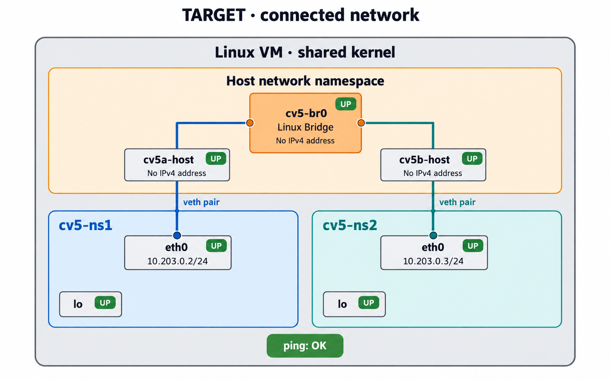
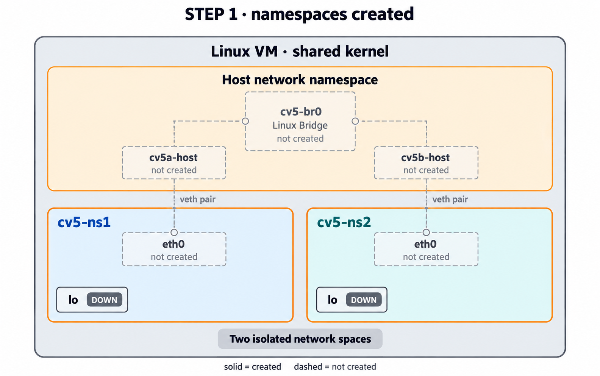
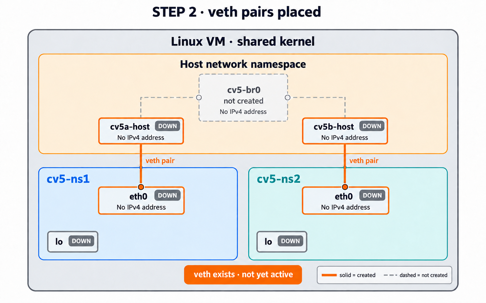
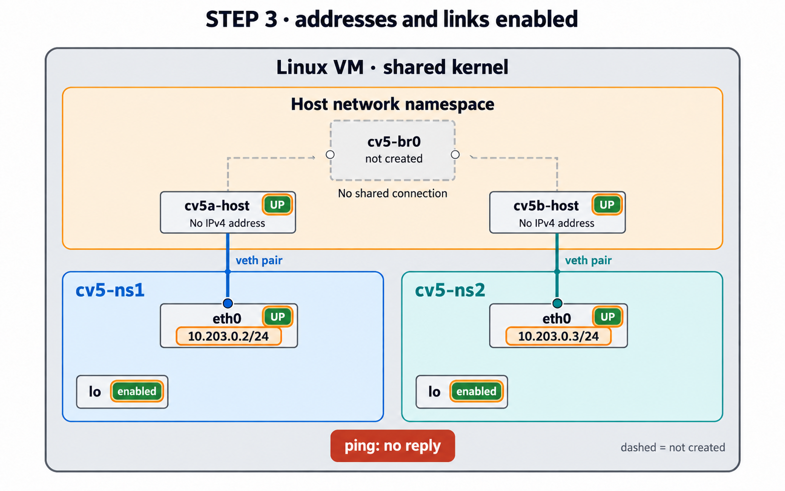
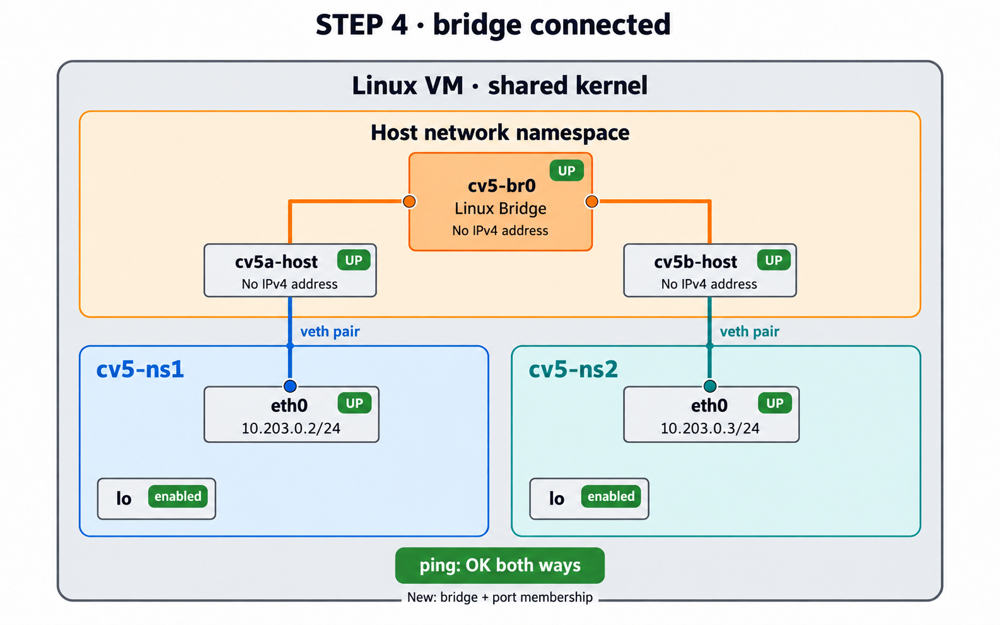
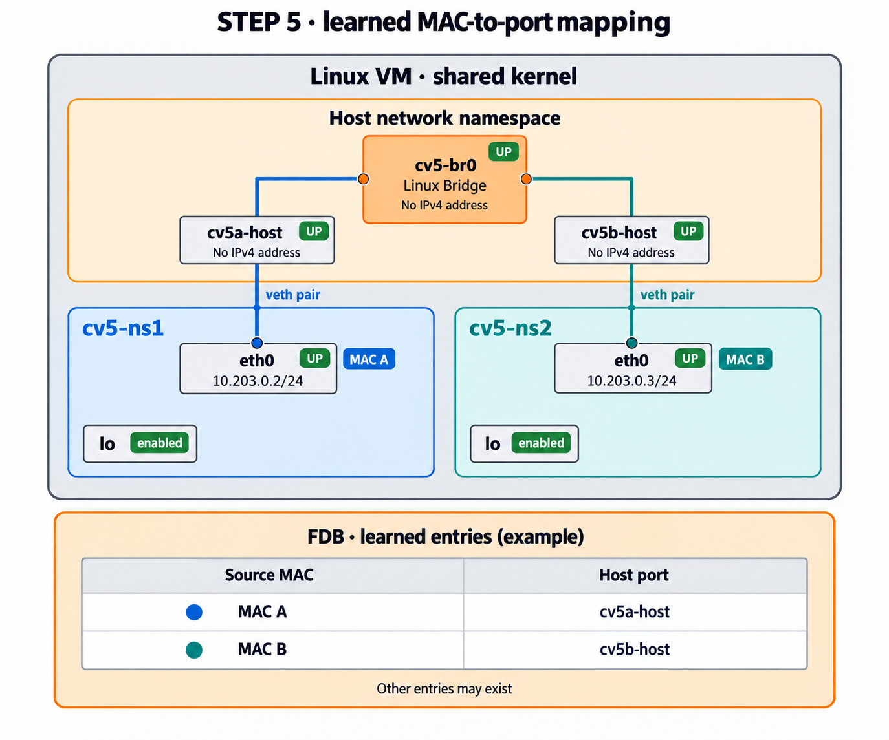
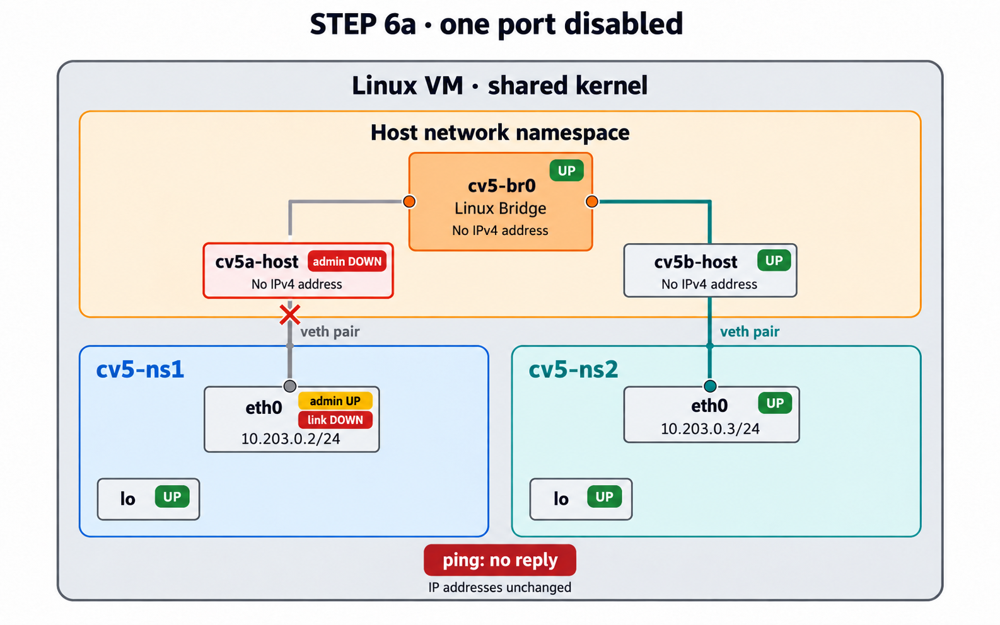
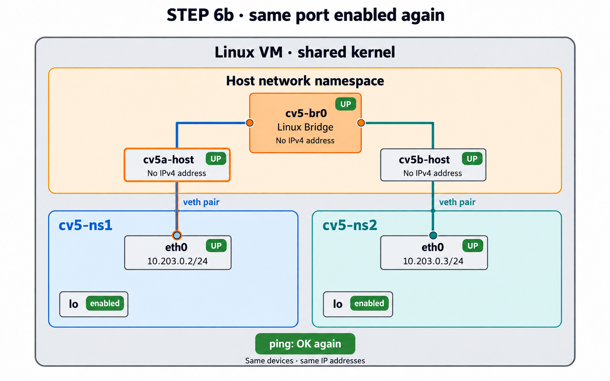
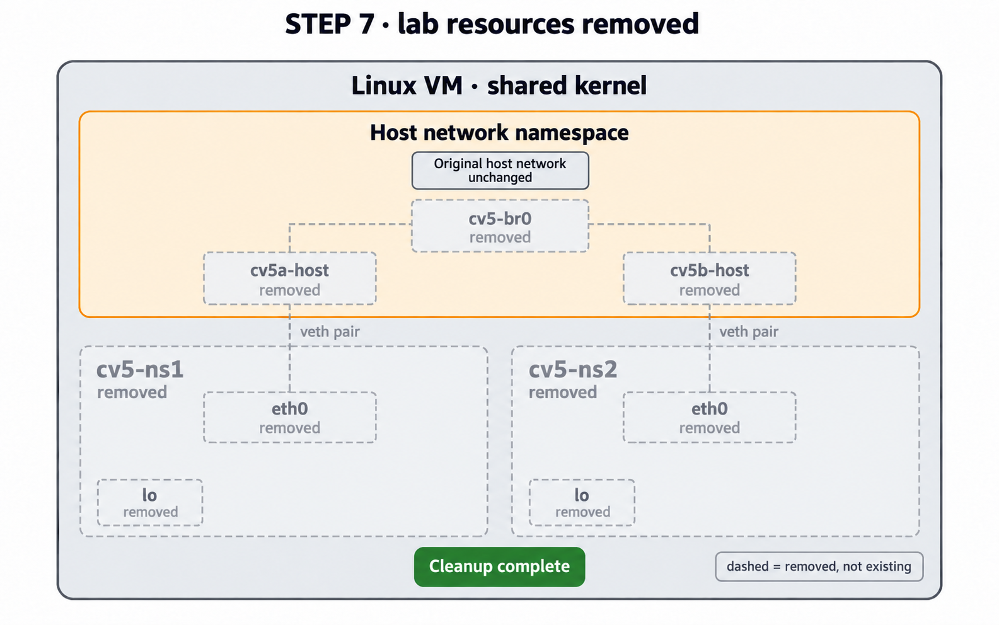
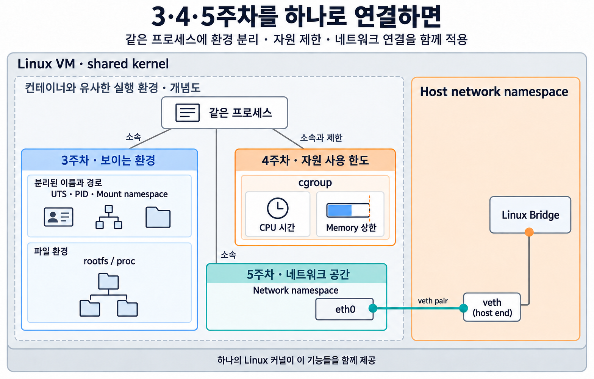

### 오늘 완성할 구조



**완성 목표:** 두 namespace의 `eth0`에서 출발한 연결이 각각 veth를 지나 호스트의 같은 bridge에서 만납니다. 큰 바깥 경계는 하나의 Linux VM이며, 안쪽 세 영역은 서로 다른 Network namespace입니다.

두 namespace의 `eth0`에만 실습용 IPv4 주소를 설정합니다. `cv5-br0`, `cv5a-host`, `cv5b-host`에는 이번 실습에서 IPv4 주소를 설정하지 않습니다.

**단계별 그림 읽기:** 같은 대상은 계속 같은 위치에 표시됩니다. 실습 단계별 그림의 회색 점선은 아직 만들지 않은 부분의 예정 위치이며, 마지막 정리 그림에서는 삭제된 대상을 뜻합니다. `UP`·`enabled`는 활성화 설정을 가리키며, `lo`의 실제 조회 상태는 `UNKNOWN`으로 보일 수 있습니다.

---

## 도입. 지난주에서 이어지는 질문

3주차에는 `unshare`를 이용하여 UTS·PID·Mount namespace를 만들고 rootfs와 `/proc`를 연결했습니다. 4주차에는 그 프로세스 묶음에 cgroup을 연결하여 CPU와 메모리 사용량을 관리했습니다.

이번에는 전체 컨테이너 환경을 다시 만드는 대신 **Network namespace만 따로 떼어 확대해서 관찰**합니다.

```text
3주차: UTS / PID / Mount namespace + rootfs
                     ↓
4주차: 위 실행 환경 + cgroup
                     ↓
5주차: Network namespace의 연결 원리를 별도로 확대
        → veth → Linux Bridge
```

실제 컨테이너 기술에서는 이 요소들이 다시 하나의 실행 환경 안에서 함께 사용됩니다.

---

## 0. 필요한 도구가 있는지 확인하기

네트워크를 만들기 전에 이번 실습에서 사용할 명령이 있는지만 확인합니다. Ubuntu의 **패키지**는 프로그램과 필요한 파일을 설치하기 위한 묶음이며, 하나의 패키지에 여러 명령이 포함될 수 있습니다.

| 확인할 명령 | 이번 실습에서 사용할 역할 | Ubuntu 패키지 |
| --- | --- | --- |
| `ip` | Network namespace·인터페이스·주소 구성과 조회 | `iproute2` |
| `bridge` | Linux Bridge의 포트와 학습 정보 조회 | `iproute2` |
| `ping` | 상대에게 요청을 보내 응답 여부 확인 | `iputils-ping` |

호스트 터미널에서 다음 세 줄을 실행합니다. 앞에 `sudo`를 붙이지 않습니다.

```bash
command -v ip
command -v bridge
command -v ping
```

**명령어 풀이**

- `command -v 명령`: 현재 셸에서 해당 명령을 찾을 수 있는지 확인합니다.
- 명령을 찾으면 실행 파일의 경로를 출력합니다. 예를 들어 `/usr/sbin/ip`, `/usr/sbin/bridge`, `/usr/bin/ping`처럼 보이며, 경로 앞부분은 환경에 따라 다를 수 있습니다.
- **각 명령의 경로가 모두 나오면 바로 1단계로 진행합니다.** 아무것도 출력되지 않는 명령이 있으면 아래 설치 안내를 확인합니다.

### 경로가 나오지 않는 도구가 있다면: 필요한 패키지 설치

먼저 설치할 수 있는 패키지 목록을 갱신합니다.

```bash
sudo apt update
```

이어서 빠진 도구에 해당하는 명령만 실행합니다.

- `ip` 또는 `bridge`가 없을 때:

```bash
sudo apt install iproute2
```

- `ping`이 없을 때:

```bash
sudo apt install iputils-ping
```

**명령어 풀이**

- `sudo`: 관리자 권한으로 뒤의 명령을 실행합니다.
- `apt`: Ubuntu의 패키지 관리 도구입니다.
- `update`: 설치 가능한 패키지 목록을 갱신합니다. 설치된 모든 프로그램을 업그레이드하는 명령은 아닙니다.
- `install 패키지명`: 지정한 패키지를 설치합니다. 계속 진행할지 묻는 경우 내용을 확인하고 `Y`를 입력한 뒤 Enter를 누릅니다.

설치가 끝나면 위의 `command -v` 세 줄을 다시 실행합니다. 모두 경로가 나오면 1단계로 진행합니다. 설치가 실패하거나 여전히 경로가 나오지 않으면 오류 메시지를 교수자에게 보여 줍니다.

패키지를 내려받을 때는 VM의 기존 패키지 저장소 연결을 사용합니다. 이번 실습에서 만들 Network namespace를 인터넷에 연결하는 과정은 아닙니다. 설치 절차는 [Ubuntu의 패키지 관리 안내](https://ubuntu.com/server/docs/how-to/software/package-management/)를 따릅니다.

이 확인은 **도구를 찾을 수 있다는 뜻**입니다. 실제 네트워크의 구성과 통신 여부는 1단계부터 직접 확인합니다.

---

## 1. 이름 있는 Network namespace 두 개 만들기

**Network namespace**는 네트워크 인터페이스, IP 주소 등 네트워크 환경을 다른 공간과 분리하는 Linux namespace입니다. 이번에는 각 공간에 보이는 장치와 주소, 그리고 공간 사이의 연결을 관찰합니다.

`unshare --net`과 `ip netns`는 모두 **Linux 커널의 같은 Network namespace 기능**을 사용합니다. 이번에는 `ip netns`로 **두 네트워크 공간에 이름을 붙여 쉽게 오가면서 네트워크 연결 과정에 집중**합니다.

#### 01. (호스트) 현재 Network namespace 식별값 확인

```bash
readlink /proc/self/ns/net
```

**명령어 풀이**

- `readlink`: 심볼릭 링크가 가리키는 대상을 보여 줍니다.
- `/proc/self`: 지금 이 명령을 실행한 프로세스 자신의 정보를 가리킵니다.
- `/proc/self/ns/net`: 현재 프로세스가 속한 Network namespace를 나타냅니다.
- 출력의 `net:[숫자]`는 Network namespace를 구분하는 식별값이며 IP 주소가 아닙니다.

자신의 호스트 값을 기록합니다.

#### 02. (호스트) 첫 번째 Network namespace 생성

```bash
sudo ip netns add cv5-ns1
```

**명령어 풀이**

- `ip`: Linux의 네트워크 장치·주소·경로·namespace 등을 조회하고 설정하는 명령입니다.
- `netns`: `ip` 명령 중 Network namespace를 관리하는 하위 명령입니다.
- `add`: 새로운 Network namespace를 만듭니다.
- `cv5-ns1`: 이번 실습에서 첫 번째 Network namespace에 붙인 이름입니다.

#### 03. (호스트) 두 번째 Network namespace 생성

```bash
sudo ip netns add cv5-ns2
```

**명령어 풀이**

- 앞 명령과 같은 방식으로 두 번째 Network namespace를 만듭니다.
- 두 namespace는 이름만 다른 것이 아니라 서로 다른 네트워크 공간입니다.

#### 04. (호스트) 만들어진 namespace 목록 확인

```bash
ip netns list
```

**명령어 풀이**

- `ip netns list`: 현재 이름을 붙여 관리하는 Network namespace 목록을 보여 줍니다.
- `cv5-ns1`, `cv5-ns2`가 각각 보여야 합니다.

#### 05. (호스트에서 각 namespace 안을 조회) 세 Network namespace 식별값 비교

```bash
printf 'host: '; readlink /proc/self/ns/net
printf 'ns1 : '; sudo ip netns exec cv5-ns1 readlink /proc/self/ns/net
printf 'ns2 : '; sudo ip netns exec cv5-ns2 readlink /proc/self/ns/net
```

**명령어 풀이**

- `printf`: 글자를 정한 형식으로 출력합니다. 여기서는 각 결과가 어느 환경의 값인지 표시합니다.
- `ip netns exec 이름 명령`: 지정한 Network namespace 안에서 뒤의 명령을 실행합니다.
- `cv5-ns1`, `cv5-ns2`: 들어갈 Network namespace의 이름입니다.
- `readlink /proc/self/ns/net`: 그 환경에서 실행된 프로세스의 Network namespace 식별값을 읽습니다.

**확인:** host, ns1, ns2의 식별값이 서로 달라야 합니다.

> `ip netns exec`는 프로그램이 **지정한 Network namespace를 사용하도록 실행**합니다. 이때 namespace별 설정 파일을 처리하기 위한 보조 Mount namespace도 생성합니다. 그러나 별도 rootfs·UTS·PID 격리나 cgroup 제한을 구성하는 것은 아닙니다. 따라서 3·4주차의 실행 환경 전체를 다시 만든 것은 아닙니다.

#### 06. (호스트에서 각 namespace 조회) 처음 보이는 네트워크 장치 확인

```bash
sudo ip netns exec cv5-ns1 ip -br link
sudo ip netns exec cv5-ns2 ip -br link
```

**명령어 풀이**

- `ip -br link`: 네트워크 인터페이스의 이름과 상태를 한 줄씩 짧게 보여 줍니다.
- `-br`: `brief`의 의미로 출력 내용을 간단히 표시합니다.
- `link`: IP 주소가 아니라 **네트워크 장치 자체**를 조회합니다.
- 새 Network namespace에서는 처음에 `lo`가 보입니다.

`lo`는 **loopback(루프백)** 인터페이스입니다. 같은 Network namespace 안에서 자기 자신과 통신할 때 사용합니다.



**현재 위치 — 명령 06까지:** 네트워크 공간 두 개를 만들었습니다. 각 공간에 실제로 존재하는 장치는 `lo`뿐이며, 점선으로 보이는 연결 장치는 이후 단계에서 만듭니다.

**지금 기록:** 명령 05의 host/ns1/ns2 식별값과 명령 06에서 처음 보인 인터페이스를 적습니다.

---

## 2. veth로 각 namespace에 연결 장치 추가하기

Network namespace를 만들었다고 해서 다른 공간으로 이어지는 장치가 자동으로 생기지는 않습니다.

**veth(virtual Ethernet) pair**는 항상 두 개가 한 쌍으로 만들어지는 가상 네트워크 인터페이스입니다. 한쪽 끝으로 들어간 Ethernet frame이 반대쪽 끝으로 전달되므로 **가상 케이블의 양 끝**처럼 생각할 수 있습니다.

### 첫 번째 namespace용 veth 만들기

#### 07. (호스트) 첫 번째 veth pair 생성

```bash
sudo ip link add cv5a-host type veth peer name cv5a-ns
```

**명령어 풀이**

- `ip link add`: 새로운 네트워크 장치를 만듭니다.
- `cv5a-host`: 첫 번째 끝의 이름입니다. 이 끝은 호스트에 남길 예정입니다.
- `type veth`: 만들 장치의 종류를 veth로 지정합니다.
- `peer name cv5a-ns`: 연결된 반대쪽 끝의 이름을 `cv5a-ns`로 정합니다.
- 이 명령 직후에는 두 끝 모두 호스트 Network namespace에 있습니다.

#### 08. (호스트) 한쪽 끝을 `cv5-ns1`로 이동

```bash
sudo ip link set cv5a-ns netns cv5-ns1
```

**명령어 풀이**

- `ip link set`: 이미 존재하는 네트워크 장치의 설정을 바꿉니다.
- `cv5a-ns`: 옮길 veth 끝입니다.
- `netns cv5-ns1`: 이 장치를 `cv5-ns1` Network namespace로 이동합니다.
- 프로세스를 옮기는 것이 아니라 **네트워크 인터페이스의 소속 공간을 바꾸는 명령**입니다.

#### 09. (`cv5-ns1`) 이동한 장치 이름을 `eth0`로 변경

```bash
sudo ip netns exec cv5-ns1 ip link set cv5a-ns name eth0
```

**명령어 풀이**

- `ip netns exec cv5-ns1`: 첫 번째 Network namespace 안에서 뒤의 명령을 실행합니다.
- `ip link set cv5a-ns name eth0`: 장치 이름을 `cv5a-ns`에서 `eth0`로 바꿉니다.
- 여기의 `eth0`는 `cv5-ns1` 안의 장치 이름입니다. 호스트의 기존 NIC 이름을 바꾸는 것이 아닙니다.

### 두 번째 namespace용 veth 만들기

#### 10. (호스트) 두 번째 veth pair 생성

```bash
sudo ip link add cv5b-host type veth peer name cv5b-ns
```

**명령어 풀이**

- 첫 번째 veth와 같은 방식으로 두 번째 쌍을 만듭니다.
- `cv5b-host`는 호스트에 남고, `cv5b-ns`는 뒤에서 `cv5-ns2`로 이동합니다.

#### 11. (호스트) 한쪽 끝을 `cv5-ns2`로 이동

```bash
sudo ip link set cv5b-ns netns cv5-ns2
```

**명령어 풀이**

- 두 번째 veth의 namespace 쪽 끝을 `cv5-ns2`로 이동합니다.

#### 12. (`cv5-ns2`) 이동한 장치 이름을 `eth0`로 변경

```bash
sudo ip netns exec cv5-ns2 ip link set cv5b-ns name eth0
```

**명령어 풀이**

- 두 번째 namespace 안에서도 내부 장치 이름을 `eth0`로 맞춥니다.
- 서로 다른 Network namespace이므로 두 공간 모두 `eth0`라는 같은 이름을 가질 수 있습니다.

#### 13. (호스트와 두 namespace) 현재 장치 위치 확인

```bash
ip -br link show cv5a-host
ip -br link show cv5b-host
sudo ip netns exec cv5-ns1 ip -br link
sudo ip netns exec cv5-ns2 ip -br link
```

**명령어 풀이**

- 호스트에서는 `cv5a-host`, `cv5b-host`가 보여야 합니다.
- `cv5-ns1`과 `cv5-ns2`에서는 각각 `lo`, `eth0`가 보여야 합니다.
- 같은 veth pair의 두 끝이 이제 **서로 다른 Network namespace에 배치**된 상태입니다.

현재 구조는 다음과 같습니다.



**현재 위치 — 명령 13까지:** 호스트 끝과 내부 `eth0`를 잇는 veth 두 쌍을 배치했습니다. `eth0`에는 아직 IPv4 주소가 없고 장치도 활성화하지 않았으며, 두 호스트 끝 사이의 bridge 연결도 없습니다.

**지금 기록:** 각 namespace에 추가된 `eth0`를 적고, 호스트 쪽 두 끝이 아직 서로 연결되지 않았음을 그림에서 확인합니다.

---

## 3. IP 주소와 인터페이스 활성화

veth를 만들었다고 IPv4 통신 준비가 끝난 것은 아닙니다. **두 namespace 안의 `eth0`에 IPv4 주소를 설정**하고, veth 양쪽 끝의 인터페이스를 활성화해야 합니다. 호스트 쪽 두 끝에는 IPv4 주소를 넣지 않습니다.

이번에는 두 namespace가 같은 IPv4 서브넷을 사용합니다.

- `cv5-ns1/eth0` → `10.203.0.2/24`
- `cv5-ns2/eth0` → `10.203.0.3/24`

`/24`는 앞의 24비트를 네트워크 부분으로 사용한다는 뜻이며, 두 주소는 같은 `10.203.0.0/24` 네트워크에 속합니다.

#### 14. (`cv5-ns1`) IP 주소 지정

```bash
sudo ip netns exec cv5-ns1 ip address add 10.203.0.2/24 dev eth0
```

**명령어 풀이**

- `ip address add`: 인터페이스에 IPv4/IPv6 주소를 추가합니다.
- `10.203.0.2/24`: 첫 번째 namespace가 사용할 IPv4 주소와 prefix 길이입니다.
- `dev eth0`: 주소를 붙일 네트워크 인터페이스를 지정합니다.

#### 15. (`cv5-ns2`) IP 주소 지정

```bash
sudo ip netns exec cv5-ns2 ip address add 10.203.0.3/24 dev eth0
```

**명령어 풀이**

- 두 번째 namespace의 `eth0`에 같은 서브넷의 다른 주소를 설정합니다.

#### 16. (두 namespace) `lo`와 `eth0` 활성화

```bash
sudo ip netns exec cv5-ns1 ip link set lo up
sudo ip netns exec cv5-ns1 ip link set eth0 up
sudo ip netns exec cv5-ns2 ip link set lo up
sudo ip netns exec cv5-ns2 ip link set eth0 up
```

**명령어 풀이**

- `ip link set 장치 up`: 지정한 네트워크 인터페이스를 사용할 수 있는 상태로 활성화합니다.
- `lo`: 각 namespace의 자기 자신 통신용 loopback입니다.
- `eth0`: 각 namespace에서 외부 연결에 사용할 veth 끝입니다.
- **주소 설정과 인터페이스 활성화는 서로 다른 설정**입니다.

#### 17. (호스트) 호스트 쪽 veth 끝 활성화

```bash
sudo ip link set cv5a-host up
sudo ip link set cv5b-host up
```

**명령어 풀이**

- veth는 양쪽 끝이 모두 정상적으로 사용할 수 있어야 합니다.
- 아직 두 호스트 쪽 끝을 서로 연결한 것은 아닙니다. 단지 장치를 활성화한 것입니다.

#### 18. (두 namespace) IPv4 주소와 인터페이스 상태 확인

```bash
sudo ip netns exec cv5-ns1 ip -4 -br address
sudo ip netns exec cv5-ns2 ip -4 -br address
```

**명령어 풀이**

- `ip -4 -br address`: 인터페이스 상태와 IPv4 주소를 짧게 보여 줍니다.
- `-4`: IPv4 정보만 조회합니다. 이번에 설정하지 않은 IPv6 주소와 구분하기 위한 옵션입니다.
- 첫 번째 `eth0`에는 `10.203.0.2/24`, 두 번째 `eth0`에는 `10.203.0.3/24`가 보여야 합니다.
- 주소가 보인다는 것은 **설정값을 확인했다는 뜻**입니다. 실제 통신 여부는 다음 ping 결과로 따로 확인합니다.

### Bridge를 만들기 전에 통신해 보기

두 namespace에 같은 서브넷의 IP 주소도 있고 각 `eth0`도 활성화되어 있습니다. 그런데 **두 veth의 호스트 쪽 끝은 아직 서로 연결되지 않았습니다.**

#### 19. (`cv5-ns1` → `cv5-ns2`) Bridge 전 ping

```bash
sudo ip netns exec cv5-ns1 ping -c 2 -W 1 10.203.0.3
```

**명령어 풀이**

- `ping`: ICMP Echo Request/Reply를 이용하여 IP 통신 가능 여부를 확인합니다.
- `-c 2`: 요청을 두 번 보낸 뒤 종료합니다.
- `-W 1`: 응답이 전혀 없을 때의 응답 대기값을 1초로 지정합니다. 응답을 받은 경우에는 다른 대기 규칙이 적용되므로, 명령 전체가 반드시 1초 안에 끝난다거나 패킷마다 고정된 1초 마감이 생긴다는 뜻은 아닙니다.
- `10.203.0.3`: 두 번째 Network namespace의 `eth0` 주소입니다.

**예상 결과: 실패가 정상입니다.**

IP 주소가 같은 서브넷에 있다는 사실만으로 **물리적·가상 연결이 자동으로 만들어지는 것은 아닙니다.** 현재 `cv5a-host`와 `cv5b-host` 사이에 Ethernet frame을 전달해 줄 장치가 없습니다.



**현재 위치 — 명령 19까지:** 주소와 활성화 설정은 끝났습니다. 아직 두 veth를 이어 주는 장치가 없어서 ping 응답을 받지 못합니다. 점선은 통신 경로가 아니라 앞으로 만들 연결의 위치입니다.

**지금 기록:** 두 `eth0`의 IPv4 설정값과 bridge 전 ping 결과를 적습니다. 응답을 받지 못했음을 확인하고, 오류 문구 자체를 외우지는 않습니다.

> 이제 필요한 질문은 “여러 veth 끝을 하나의 가상 네트워크로 묶어 줄 장치는 무엇일까?”입니다.

---

## 4. Linux Bridge로 두 namespace 연결하기

**Linux Bridge**는 여러 Ethernet 인터페이스를 하나의 Layer 2 네트워크로 연결하는 Linux 커널 기능입니다. **Layer 2(L2)**는 여기서 Ethernet frame과 MAC 주소를 다루는 계층을 뜻합니다. 개념적으로는 작은 **가상 스위치**처럼 생각할 수 있습니다.

이번에는 호스트에 남아 있는 두 veth 끝 `cv5a-host`, `cv5b-host`를 `cv5-br0`라는 bridge의 포트로 연결합니다.

#### 20. (호스트) Linux Bridge 생성

```bash
sudo ip link add cv5-br0 type bridge
```

**명령어 풀이**

- `ip link add`: 새 네트워크 장치를 만듭니다.
- `cv5-br0`: 이번 실습에서 사용할 bridge 이름입니다.
- `type bridge`: 종류가 `bridge`인 가상 네트워크 장치를 만듭니다. Bridge도 Linux에서 네트워크 인터페이스로 다뤄집니다.

#### 21. (호스트) 첫 번째 veth 끝을 bridge에 연결

```bash
sudo ip link set cv5a-host master cv5-br0
```

**명령어 풀이**

- `master cv5-br0`: `cv5a-host`를 `cv5-br0`가 관리하는 bridge 포트로 연결합니다.
- 여기서 `master`는 이 인터페이스가 어느 상위 네트워크 장치에 속하는지 지정하는 표현입니다.

#### 22. (호스트) 두 번째 veth 끝도 bridge에 연결

```bash
sudo ip link set cv5b-host master cv5-br0
```

**명령어 풀이**

- 두 번째 host-side veth도 같은 bridge에 연결합니다.
- 이제 두 veth 끝이 하나의 Layer 2 연결 영역에 속합니다.

#### 23. (호스트) bridge 활성화

```bash
sudo ip link set cv5-br0 up
```

**명령어 풀이**

- `ip link set cv5-br0 up`: 생성한 bridge를 활성화합니다.
- 이번 실습에서는 bridge에 IPv4 주소를 넣지 않습니다.
- bridge가 Ethernet frame을 전달하는 것과, 호스트가 이 bridge를 통해 IPv4 통신의 **당사자(송신자 또는 수신자)**로 참여하는 것은 서로 다른 역할입니다. 이번에는 두 namespace 사이의 전달만 확인합니다.

#### 24. (호스트) bridge와 포트 관계 확인

```bash
ip link show master cv5-br0
```

**명령어 풀이**

- `ip link show`: 네트워크 인터페이스의 정보를 보여 줍니다.
- 이 조회 명령의 `master cv5-br0`: `cv5-br0`에 속한 인터페이스만 골라 보여 줍니다. 앞의 `ip link set ... master ...`와 달리 소속을 바꾸지 않습니다.
- `cv5a-host`, `cv5b-host`가 보여야 합니다.

#### 25. (`cv5-ns1` → `cv5-ns2`) 같은 ping 다시 실행

```bash
sudo ip netns exec cv5-ns1 ping -c 2 -W 1 10.203.0.3
```

**명령어 풀이**

- 명령 19와 **완전히 같은 목적지**로 다시 ping을 보냅니다.
- IP 주소와 namespace의 `eth0` 설정은 바꾸지 않았고, 중간에 bridge 연결만 추가했습니다.

**예상 결과: 성공합니다.**

Bridge 전에는 실패했고 Bridge 후에는 성공했다는 비교가 중요합니다.

#### 26. (`cv5-ns2` → `cv5-ns1`) 반대 방향도 확인

```bash
sudo ip netns exec cv5-ns2 ping -c 2 -W 1 10.203.0.2
```

**명령어 풀이**

- 두 번째 namespace에서 첫 번째 namespace로 반대 방향의 통신도 확인합니다.
- `10.203.0.2`는 `cv5-ns1/eth0`의 주소입니다.

**예상 결과:** 응답을 받습니다.



**현재 위치 — 명령 26까지:** 가운데 bridge와 두 포트의 소속 관계를 추가해 전체 연결을 완성했습니다. 내부 IP 주소를 바꾸지 않고도 양방향 ping에 성공합니다.

**지금 기록:** bridge에 속한 두 포트 이름과 연결 후 양방향 ping 결과를 적습니다. 명령 19의 실패와 비교하여 무엇을 추가했는지 한 문장으로 설명합니다.

---

## 5. Bridge는 어떻게 어느 포트로 보낼지 알까?

Bridge는 들어온 Ethernet frame의 **출발지 MAC 주소**를 관찰하면서 어떤 MAC 주소가 어느 포트 뒤에 있는지 학습할 수 있습니다. **MAC 주소**는 Ethernet 인터페이스를 구분하는 주소로, 보통 `aa:bb:cc:dd:ee:ff`처럼 표시됩니다. 실제 숫자는 장치를 만들 때마다 달라질 수 있습니다.

이번에는 **각 namespace 안의 `eth0` MAC 주소가 어느 호스트 쪽 bridge 포트와 대응하는지** 확인합니다. IP 주소 설정, bridge 포트 소속, 실제 MAC 학습 기록은 서로 다른 관찰 대상입니다.

#### 27. (각 namespace와 호스트) 실제 MAC 주소와 Bridge의 FDB 대응

```bash
sudo ip netns exec cv5-ns1 ip -br link show eth0
sudo ip netns exec cv5-ns2 ip -br link show eth0
bridge fdb show br cv5-br0
bridge fdb show br cv5-br0 dynamic
```

**명령어 풀이**

- `ip -br link show eth0`: 해당 namespace의 `eth0` 상태와 MAC 주소를 짧게 보여 줍니다. 첫 번째 출력은 ns1, 두 번째 출력은 ns2의 값입니다.
- `bridge`: Linux Bridge의 포트·MAC 학습 상태 등을 조회하거나 설정하는 명령입니다. `iproute2` 패키지에 포함됩니다.
- `fdb`: Forwarding Database의 약자로, bridge가 MAC 주소와 포트의 관계를 관리하는 표입니다.
- `show`: 현재 기록을 조회합니다.
- `br cv5-br0`: `cv5-br0` bridge의 FDB를 확인합니다.
- `dynamic`: 동적으로 학습한 항목만 골라 보여 줍니다. 실제 출력 행에 `dynamic`이라는 단어가 항상 표시되는 것은 아닙니다.

**관찰할 대응 관계**

| 앞에서 읽은 실제 MAC 주소 | 학습 항목에서 대응해야 하는 포트 |
| --- | --- |
| `cv5-ns1/eth0`의 MAC | `dev cv5a-host` |
| `cv5-ns2/eth0`의 MAC | `dev cv5b-host` |

먼저 첫 두 명령에서 읽은 `eth0` MAC을 기록하고, 마지막 `dynamic` 조회 결과에서 **같은 값을 찾아 포트를 대응**시킵니다. MAC 주소의 숫자를 외울 필요는 없습니다. 호스트 쪽 veth 자체의 MAC 주소를 내부 `eth0`의 MAC 주소와 혼동하지 않습니다.

전체 FDB에는 bridge 자신이나 포트의 주소를 나타내는 **local/permanent 항목**도 포함될 수 있습니다. 이들은 통신으로 새로 학습했다는 증거가 아닙니다. 또한 IPv6 등의 자동 트래픽으로 ping 전부터 학습 항목이 생길 수 있으므로 **“ping 전에는 비어 있고, 후에는 정확히 두 항목만 생긴다”라고 판단하지 않습니다.**

동적 학습 항목은 시간이 지나면 사라질 수 있습니다. 원하는 MAC이 보이지 않으면 명령 25·26의 ping을 다시 수행한 직후 확인합니다. 두 포트만 있는 이번 구조에서 FDB를 읽는 것만으로 frame이 모든 포트에 전달되는 과정까지 직접 관찰했다고 할 수는 없습니다.

> IP는 “누구와 통신할 것인가”를 나타내는 주소이고, 같은 L2 네트워크에서 실제 Ethernet frame을 어느 포트로 전달할지 판단할 때는 MAC 주소 정보가 사용됩니다. 이번에는 이 연결 관계만 이해하면 충분합니다.



**현재 위치 — 명령 27까지:** 새 장치를 만드는 대신 완성된 연결에서 bridge의 학습 결과를 읽습니다. `MAC A`·`MAC B`는 각 내부 `eth0`의 실제 MAC을 대신한 기호입니다. 그림의 두 행은 대응 관계의 예시이며, 실제 FDB 전체가 두 행뿐이라는 뜻은 아닙니다.

#### 28. (호스트) bridge와 host-side 포트에 IPv4 주소가 없는지 확인

```bash
ip -4 -br address show cv5-br0
ip -4 -br address show cv5a-host
ip -4 -br address show cv5b-host
```

**명령어 풀이**

- `ip -4 -br address show 장치`: 해당 인터페이스의 IPv4 주소만 간단히 보여 줍니다.
- IPv4 주소가 없는 장치는 이 조회에서 아무 행도 출력되지 않을 수 있습니다. 장치가 사라졌다는 뜻은 아니며, 존재와 상태는 `ip -br link show 장치`로 구분해서 확인할 수 있습니다.
- 이번 실습에서는 세 장치에 IPv4 주소를 설정하지 않았습니다. 실습용 `10.203.0.x` 주소는 두 namespace의 `eth0`에만 있습니다.
- `-4` 없이 조회하면 자동 설정된 IPv6 주소가 보일 수 있습니다. 이는 이번에 IPv4 주소를 부여했는지를 판단하는 근거가 아닙니다.

**핵심:** 같은 서브넷의 두 namespace를 이어 주는 이번 bridge는 **자기 자신에게 IPv4 주소가 없어도 Ethernet frame을 전달할 수 있습니다.**

**지금 기록:** 두 내부 `eth0`의 MAC과 대응 포트, bridge의 IPv4 주소 유무를 적습니다. MAC 학습 기록과 ping 성공을 각각 어떤 근거로 확인했는지 구분합니다.

---

## 6. 설정은 그대로 두고 연결 하나만 끊었다가 복구하기

통신이 되지 않는다고 해서 항상 IP 주소가 틀렸거나 프로그램이 종료된 것은 아닙니다. 이번에는 namespace와 IP 설정은 그대로 두고 **bridge로 이어지는 포트 하나의 상태만** 바꿉니다.

#### 29. (호스트) 첫 번째 bridge 포트 내리기

```bash
sudo ip link set cv5a-host down
```

**명령어 풀이**

- `down`: 장치를 삭제하지 않고 사용할 수 없는 상태로 바꿉니다.
- namespace, IP 주소, bridge 자체는 그대로 남습니다.

#### 30. (`cv5-ns1` → `cv5-ns2`) 같은 ping 다시 실행

```bash
sudo ip netns exec cv5-ns1 ping -c 2 -W 1 10.203.0.3
```

**명령어 풀이**

- 앞과 같은 주소로 다시 ping을 보냅니다.
- **예상 결과: 실패가 정상입니다.**
- 바꾼 것은 `cv5a-host`의 연결 상태 하나뿐입니다.



**현재 위치 — 명령 30까지:** `cv5a-host`만 비활성화했습니다. 반대쪽 `eth0`도 실제 링크는 내려가지만, 활성화 설정과 IP 주소는 남아 있습니다. 회색 연결은 사라진 장치가 아니라 현재 사용할 수 없는 연결입니다.

#### 31. (호스트) 같은 bridge 포트 다시 올리기

```bash
sudo ip link set cv5a-host up
```

**명령어 풀이**

- `up`: 내려 두었던 같은 인터페이스를 다시 활성화합니다.
- veth를 새로 만들거나 IP 주소를 다시 지정하지 않습니다.

#### 32. (`cv5-ns1` → `cv5-ns2`) 재설정 없이 통신 복구 확인

```bash
sudo ip netns exec cv5-ns1 ping -c 2 -W 1 10.203.0.3
```

**명령어 풀이**

- 같은 namespace, 같은 `eth0`, 같은 IP 주소를 사용합니다.
- **예상 결과: 다시 성공합니다.**
- IP 설정과 연결 상태는 서로 다른 조건임을 확인합니다.



**현재 위치 — 명령 32까지:** 내려 두었던 같은 포트만 다시 활성화했습니다. namespace·veth·IP를 새로 만들거나 다시 설정하지 않고 ping 응답이 돌아왔습니다.

**지금 기록:** 포트 down 직후와 up으로 복구한 뒤의 ping 결과를 각각 적습니다. 새 veth 생성이나 IP 재설정 없이 결과가 달라졌음을 설명합니다.

---

## 7. 정상 정리

이번 실습에서 만든 이름만 정확히 지정하여 정리합니다. 기존 호스트 NIC, 기본 경로, 방화벽 설정은 변경하지 않습니다.

이번 실습은 짧은 조회·ping 명령만 사용하며, namespace 안에 계속 실행되는 프로그램을 남기지 않습니다. **이 명령들이 종료되고 다른 참조가 남아 있지 않은 경우**에는 아래 순서로 namespace와 그 안의 veth를 정리할 수 있습니다.

#### 33. (호스트) 첫 번째 Network namespace 삭제

```bash
sudo ip netns delete cv5-ns1
```

**명령어 풀이**

- `ip netns delete`: 지정한 Network namespace의 **이름과 그 이름이 잡고 있던 참조**를 제거합니다.
- 실행 중인 프로세스나 열린 참조가 더 이상 없다면 namespace가 실제로 해제됩니다. 이때 `cv5-ns1` 안의 veth 끝이 사라지면서 반대쪽 `cv5a-host`도 함께 정리됩니다.
- 이름을 지우는 명령이 그 안의 프로그램을 자동으로 종료시키는 것은 아닙니다. 추가로 실행해 둔 프로그램이 있으면 먼저 종료해야 합니다.

#### 34. (호스트) 두 번째 Network namespace 삭제

```bash
sudo ip netns delete cv5-ns2
```

**명령어 풀이**

- 두 번째 Network namespace의 이름도 제거합니다. 남은 참조가 없다면 내부 `eth0`와 반대쪽 `cv5b-host`도 함께 정리됩니다.
- 지정한 실습용 namespace를 정리하며 호스트의 기본 Network namespace를 삭제하는 명령이 아닙니다.

#### 35. (호스트) Linux Bridge 삭제

```bash
sudo ip link delete cv5-br0
```

**명령어 풀이**

- `ip link delete`: 지정한 가상 네트워크 장치를 삭제합니다.
- 여기서는 이번에 만든 `cv5-br0`만 삭제합니다.

#### 36. (호스트) 실습 자원이 모두 사라졌는지 확인

```bash
ip netns list
ip link show cv5-br0
ip link show cv5a-host
ip link show cv5b-host
```

**명령어 풀이**

- `ip netns list`: `cv5-ns1`, `cv5-ns2`가 더 이상 보이지 않아야 합니다.
- `ip link show 이름`: 해당 장치가 존재하는지 확인합니다.
- `cv5-br0`, `cv5a-host`, `cv5b-host`가 없다는 메시지가 나오는 것이 정상 정리 결과입니다.



**현재 위치 — 명령 36까지:** 실습용 namespace·veth·bridge를 모두 제거했습니다. 이 그림의 점선은 삭제된 대상의 이전 위치이며, 빈 namespace가 남아 있다는 뜻이 아닙니다. 기존 호스트 네트워크는 유지됩니다.

**지금 기록:** namespace 두 이름과 bridge/veth가 모두 사라졌는지 적습니다.

실습을 중간에 멈췄거나 터미널을 잃어 일부 자원만 남았다면, 아래 `막혔을 때`의 **중간에 중단한 실습을 정리하고 다시 시작하려면** 항목을 확인합니다.

---

## 3·4·5주차를 하나로 연결하면



**하나로 연결해서 보기:** 같은 프로세스가 분리된 환경을 사용하고, cgroup의 자원 한도를 적용받으며, 자신의 네트워크 공간에서 통신합니다. 프로세스에서 각 기능으로 이어지는 선은 소속·적용 관계를, `eth0`와 호스트 쪽 끝을 잇는 선은 veth 연결을 나타냅니다. 왼쪽 점선은 세 기능을 개념적으로 묶어 보여 주는 범위입니다.

이번 실습에서는 위 구조 전체를 다시 만들지 않고 **Network namespace → veth → Linux Bridge 부분만 확대해서 직접 구성**했습니다.

이후 Docker의 bridge network를 배우면, Docker가 완전히 새로운 네트워크 원리를 만드는 것이 아니라 Linux의 Network namespace·veth·bridge 같은 기능을 조합하고 자동화한다는 관점으로 연결할 수 있습니다.

---

## 막혔을 때

### `RTNETLINK answers: File exists`

같은 이름의 namespace 또는 네트워크 장치가 이전 실습에서 남아 있을 수 있습니다. 같은 생성 명령을 반복하지 말고 먼저 상태를 확인합니다.

```bash
ip netns list
ip -br link
```

**명령어 풀이**

- `ip netns list`: 이름을 붙여 관리 중인 Network namespace가 남아 있는지 확인합니다.
- `ip -br link`: 호스트에 남아 있는 네트워크 장치의 이름과 상태를 짧게 확인합니다.
- 이 단계는 상태를 조회만 하며 장치를 만들거나 삭제하지 않습니다.

목록에 나온 이름이 자신이 앞서 만든 실습 자원인지 확인합니다. 새로 시작하려면 아래 정리 절차를 따릅니다. 출처를 모르는 장치는 교수자와 먼저 확인합니다.

### 중간에 중단한 실습을 정리하고 다시 시작하려면

1. 실행 중인 실습 명령을 마친 뒤, 위의 조회 결과에서 **실제로 남아 있는 이번 실습의 이름**을 확인합니다.
2. `cv5-ns1`, `cv5-ns2`, `cv5-br0` 중 존재하는 대상에만 정상 정리의 **명령 33~35**를 적용합니다. 없는 대상은 건너뜁니다.
3. `ip -br link`로 호스트 장치를 다시 확인합니다. veth를 만든 뒤 namespace로 옮기기 전에 중단했다면, namespace를 지워도 `cv5a-host`·`cv5b-host`가 남을 수 있습니다.

이 경우 **남아 있는 실습 장치에 해당하는 줄만** 실행합니다.

```bash
sudo ip link delete cv5a-host
sudo ip link delete cv5b-host
```

**명령어 풀이**

- `ip link delete 이름`: 지정한 가상 네트워크 장치를 삭제합니다.
- veth 한쪽 끝을 삭제하면 반대쪽 끝도 함께 삭제됩니다. 이동 전의 `cv5a-ns`·`cv5b-ns`도 해당 쌍과 함께 제거됩니다.
- 장치를 찾을 수 없다는 메시지는 해당 이름이 현재 없다는 뜻입니다. 다른 이름을 추측하여 삭제하지 않습니다.

마지막으로 **명령 36**과 `ip -br link`로 두 namespace 이름과 실습 장치가 사라졌는지 확인한 뒤 1단계부터 다시 시작합니다. 실습용 이름은 `cv5-ns1`, `cv5-ns2`, `cv5-br0`, `cv5a-host`, `cv5b-host`, `cv5a-ns`, `cv5b-ns`입니다. 정리 뒤에도 남아 있으면 교수자와 확인합니다.

### namespace 안에 `eth0`가 보이지 않음

```bash
sudo ip netns exec cv5-ns1 ip -br link
sudo ip netns exec cv5-ns2 ip -br link
```

**명령어 풀이**

- `ip netns exec cv5-ns1 ...`, `ip netns exec cv5-ns2 ...`: 각각의 Network namespace에서 조회 명령을 실행합니다.
- `ip -br link`: 각 namespace가 현재 가지고 있는 네트워크 인터페이스 이름과 상태를 간단히 보여 줍니다.
- 설정을 바꾸는 명령이 아니라 현재 상태를 확인하는 조회 명령입니다.

각 namespace에 `lo`, `eth0`가 있는지 확인합니다.

### bridge 전 ping이 실패함

정상 결과입니다. 이 시점에는 두 host-side veth를 연결하는 bridge가 아직 없습니다.

### bridge 후에도 ping이 실패함

다음 순서로 확인합니다.

```bash
sudo ip netns exec cv5-ns1 ip -4 -br address
sudo ip netns exec cv5-ns2 ip -4 -br address
ip link show master cv5-br0
ip -br link show cv5-br0
ip -br link show cv5a-host
ip -br link show cv5b-host
```

**명령어 풀이**

- `ip -4 -br address`: 각 namespace의 인터페이스 상태와 IPv4 주소를 확인합니다.
- `ip link show master cv5-br0`: `cv5-br0`에 실제로 어떤 포트가 연결되어 있는지 확인합니다.
- `ip -br link show 장치`: bridge와 각 host-side veth가 `UP` 상태인지 확인합니다.
- 모두 조회 명령이며, 문제 원인을 확인하기 전에 설정을 반복해서 덮어쓰지 않기 위한 단계입니다.

확인할 내용:

1. `cv5-ns1/eth0` → `10.203.0.2/24`
2. `cv5-ns2/eth0` → `10.203.0.3/24`
3. `cv5a-host`, `cv5b-host`가 `cv5-br0`의 포트로 표시됨
4. `cv5-br0`, 두 host-side veth가 활성화되어 있음

학교 VM의 방화벽 정책이 실습 트래픽을 차단하는 경우에는 교수자가 해당 실습 인터페이스 범위만 확인합니다. **방화벽 전체 끄기, 규칙 전체 삭제, Netplan 수정은 복구 방법으로 사용하지 않습니다.**
